# DiagramObject

_An object that defines one or more points in a given space. This object can be associated with anything that specializes IdentifiedObject. For single line diagrams such objects typically include such items as analog values, breakers, disconnectors, power transformers, and transmission lines._

**URI**: [cim:DiagramObject](http://iec.ch/TC57/CIM100#DiagramObject) 
**Type**: Class

```mermaid
%%{init: {'theme':'base','themeVariables': {'lineColor': '#4169E1'}}}%%
classDiagram
    class DiagramObject
    click DiagramObject href "/Models/Profiles/DiagramLayout/ConcreteClasses/DiagramObject/"
    style DiagramObject fill:#163289,stroke:#1F2A37,stroke-width:2px,rx:10,ry:10,color:white

        DiagramObject <|-- TextDiagramObject : inherits

        TextDiagramObject
            click TextDiagramObject href "/Models/Profiles/DiagramLayout/ConcreteClasses/TextDiagramObject/"
            style TextDiagramObject fill:#4169E1,stroke:#1F2A37,stroke-width:2px,rx:10,ry:10,color:white
     
        IdentifiedObject <|-- DiagramObject : inherits
            click IdentifiedObject href "/Models/Profiles/DiagramLayout/AbstractClasses/IdentifiedObject/"
            style IdentifiedObject fill:#4169E1,stroke:#1F2A37,stroke-width:2px,rx:10,ry:10,color:white

        DiagramObject --> Diagram : DiagramObject.Diagram

        Diagram
            click Diagram href "/Models/Profiles/DiagramLayout/ConcreteClasses/Diagram/"
            style Diagram fill:#00D156,stroke:#1F2A37,stroke-width:2px,rx:10,ry:10,color:white
        DiagramObject --> IdentifiedObject : DiagramObject.IdentifiedObject

        IdentifiedObject
            click IdentifiedObject href "/Models/Profiles/DiagramLayout/AbstractClasses/IdentifiedObject/"
            style IdentifiedObject fill:#00D156,stroke:#1F2A37,stroke-width:2px,rx:10,ry:10,color:white
        DiagramObject --> DiagramObjectPoint : DiagramObject.DiagramObjectPoints

        DiagramObjectPoint
            click DiagramObjectPoint href "/Models/Profiles/DiagramLayout/ConcreteClasses/DiagramObjectPoint/"
            style DiagramObjectPoint fill:#00D156,stroke:#1F2A37,stroke-width:2px,rx:10,ry:10,color:white
        DiagramObject --> VisibilityLayer : DiagramObject.VisibilityLayers

        VisibilityLayer
            click VisibilityLayer href "/Models/Profiles/DiagramLayout/ConcreteClasses/VisibilityLayer/"
            style VisibilityLayer fill:#00D156,stroke:#1F2A37,stroke-width:2px,rx:10,ry:10,color:white
        DiagramObject --> DiagramObjectStyle : DiagramObject.DiagramObjectStyle

        DiagramObjectStyle
            click DiagramObjectStyle href "/Models/Profiles/DiagramLayout/ConcreteClasses/DiagramObjectStyle/"
            style DiagramObjectStyle fill:#00D156,stroke:#1F2A37,stroke-width:2px,rx:10,ry:10,color:white
        IdentifiedObject --> DiagramObject : IdentifiedObject.DiagramObjects

        DiagramObject
            click DiagramObject href "/Models/Profiles/DiagramLayout/ConcreteClasses/DiagramObject/"
            style DiagramObject fill:#00D156,stroke:#1F2A37,stroke-width:2px,rx:10,ry:10,color:white

        Diagram --> DiagramObject : Diagram.DiagramElements

        Diagram
            click Diagram href "/Models/Profiles/DiagramLayout/ConcreteClasses/Diagram/"
            style Diagram fill:#00D156,stroke:#1F2A37,stroke-width:2px,rx:10,ry:10,color:white

        DiagramObject --> IdentifiedObject : DiagramObject.IdentifiedObject

        DiagramObject
            click DiagramObject href "/Models/Profiles/DiagramLayout/ConcreteClasses/DiagramObject/"
            style DiagramObject fill:#00D156,stroke:#1F2A37,stroke-width:2px,rx:10,ry:10,color:white

        DiagramObjectPoint --> DiagramObject : DiagramObjectPoint.DiagramObject

        DiagramObjectPoint
            click DiagramObjectPoint href "/Models/Profiles/DiagramLayout/ConcreteClasses/DiagramObjectPoint/"
            style DiagramObjectPoint fill:#00D156,stroke:#1F2A37,stroke-width:2px,rx:10,ry:10,color:white

        DiagramObjectStyle --> DiagramObject : DiagramObjectStyle.StyledObjects

        DiagramObjectStyle
            click DiagramObjectStyle href "/Models/Profiles/DiagramLayout/ConcreteClasses/DiagramObjectStyle/"
            style DiagramObjectStyle fill:#00D156,stroke:#1F2A37,stroke-width:2px,rx:10,ry:10,color:white

        IdentifiedObject --> DiagramObject : IdentifiedObject.DiagramObjects

        IdentifiedObject
            click IdentifiedObject href "/Models/Profiles/DiagramLayout/AbstractClasses/IdentifiedObject/"
            style IdentifiedObject fill:#00D156,stroke:#1F2A37,stroke-width:2px,rx:10,ry:10,color:white

        VisibilityLayer --> DiagramObject : VisibilityLayer.VisibleObjects

        VisibilityLayer
            click VisibilityLayer href "/Models/Profiles/DiagramLayout/ConcreteClasses/VisibilityLayer/"
            style VisibilityLayer fill:#00D156,stroke:#1F2A37,stroke-width:2px,rx:10,ry:10,color:white


        DiagramObject : DiagramObject.Diagram
        DiagramObject : DiagramObject.drawingOrder
        DiagramObject : DiagramObject.isPolygon
        DiagramObject : DiagramObject.offsetX
        DiagramObject : DiagramObject.offsetY
        DiagramObject : DiagramObject.rotation
        DiagramObject : DiagramObject.IdentifiedObject
        DiagramObject : DiagramObject.DiagramObjectPoints
        DiagramObject : DiagramObject.VisibilityLayers
        DiagramObject : DiagramObject.DiagramObjectStyle
        IdentifiedObject : IdentifiedObject.DiagramObjects
        IdentifiedObject : IdentifiedObject.mRID
        IdentifiedObject : IdentifiedObject.name
        IdentifiedObject : IdentifiedObject.description
```

## Inheritance
* [IdentifiedObject](/Models/Profiles/DiagramLayout/AbstractClasses/IdentifiedObject/)
    * **DiagramObject**

## Attributes
| Name | URI | Cardinality and Range | Description | Inheritance |
| ---  | --- | --- | --- | --- |
| Diagram | [cim:DiagramObject.Diagram](http://iec.ch/TC57/CIM100#DiagramObject.Diagram) | No cardinality available Diagram | A diagram object is part of a diagram. | direct |
| drawingOrder | [cim:DiagramObject.drawingOrder](http://iec.ch/TC57/CIM100#DiagramObject.drawingOrder) | No cardinality available integer | The drawing order of this element. The higher the number, the later the element is drawn in sequence. This is used to ensure that elements that overlap are rendered in the correct order. | direct |
| isPolygon | [cim:DiagramObject.isPolygon](http://iec.ch/TC57/CIM100#DiagramObject.isPolygon) | No cardinality available boolean | Defines whether or not the diagram objects points define the boundaries of a polygon or the routing of a polyline. If this value is true then a receiving application should consider the first and last points to be connected. | direct |
| offsetX | [cim:DiagramObject.offsetX](http://iec.ch/TC57/CIM100#DiagramObject.offsetX) | No cardinality available float | The offset in the X direction. This is used for defining the offset from centre for rendering an icon (the default is that a single point specifies the centre of the icon).

The offset is in per-unit with 0 indicating there is no offset from the horizontal centre of the icon.  -0.5 indicates it is offset by 50% to the left and 0.5 indicates an offset of 50% to the right. | direct |
| offsetY | [cim:DiagramObject.offsetY](http://iec.ch/TC57/CIM100#DiagramObject.offsetY) | No cardinality available float | The offset in the Y direction. This is used for defining the offset from centre for rendering an icon (the default is that a single point specifies the centre of the icon).

The offset is in per-unit with 0 indicating there is no offset from the vertical centre of the icon.  The offset direction is dependent on the orientation of the diagram, with -0.5 and 0.5 indicating an offset of +/- 50% on the vertical axis. | direct |
| rotation | [cim:DiagramObject.rotation](http://iec.ch/TC57/CIM100#DiagramObject.rotation) | No cardinality available AngleDegrees | Sets the angle of rotation of the diagram object.  Zero degrees is pointing to the top of the diagram.  Rotation is clockwise.  DiagramObject.rotation=0 has the following meaning: The connection point of an element which has one terminal is pointing to the top side of the diagram. The connection point "From side" of an element which has more than one terminal is pointing to the top side of the diagram.
DiagramObject.rotation=90 has the following meaning: The connection point of an element which has one terminal is pointing to the right hand side of the diagram. The connection point "From side" of an element which has more than one terminal is pointing to the right hand side of the diagram. | direct |
| IdentifiedObject | [cim:DiagramObject.IdentifiedObject](http://iec.ch/TC57/CIM100#DiagramObject.IdentifiedObject) | No cardinality available IdentifiedObject | The domain object to which this diagram object is associated. | direct |
| DiagramObjectPoints | [cim:DiagramObject.DiagramObjectPoints](http://iec.ch/TC57/CIM100#DiagramObject.DiagramObjectPoints) | No cardinality available DiagramObjectPoint | A diagram object can have 0 or more points to reflect its layout position, routing (for polylines) or boundary (for polygons). | direct |
| VisibilityLayers | [cim:DiagramObject.VisibilityLayers](http://iec.ch/TC57/CIM100#DiagramObject.VisibilityLayers) | No cardinality available VisibilityLayer | A diagram object can be part of multiple visibility layers. | direct |
| DiagramObjectStyle | [cim:DiagramObject.DiagramObjectStyle](http://iec.ch/TC57/CIM100#DiagramObject.DiagramObjectStyle) | No cardinality available DiagramObjectStyle | A diagram object has a style associated that provides a reference for the style used in the originating system. | direct |
| DiagramObjects | [cim:IdentifiedObject.DiagramObjects](http://iec.ch/TC57/CIM100#IdentifiedObject.DiagramObjects) | No cardinality available DiagramObject | The diagram objects that are associated with the domain object. | IdentifiedObject |
| mRID | [cim:IdentifiedObject.mRID](http://iec.ch/TC57/CIM100#IdentifiedObject.mRID) | No cardinality available string | Master resource identifier issued by a model authority. The mRID is unique within an exchange context. Global uniqueness is easily achieved by using a UUID, as specified in RFC 4122, for the mRID. The use of UUID is strongly recommended.
For CIMXML data files in RDF syntax conforming to IEC 61970-552, the mRID is mapped to rdf:ID or rdf:about attributes that identify CIM object elements. | IdentifiedObject |
| name | [cim:IdentifiedObject.name](http://iec.ch/TC57/CIM100#IdentifiedObject.name) | No cardinality available string | The name is any free human readable and possibly non unique text naming the object. | IdentifiedObject |
| description | [cim:IdentifiedObject.description](http://iec.ch/TC57/CIM100#IdentifiedObject.description) | No cardinality available string | The description is a free human readable text describing or naming the object. It may be non unique and may not correlate to a naming hierarchy. | IdentifiedObject |

### Schema Source
* from schema: [http://iec.ch/TC57/ns/CIM/DiagramLayout-EUPackage_DiagramLayoutProfile](http://iec.ch/TC57/ns/CIM/DiagramLayout-EUPackage_DiagramLayoutProfile)
