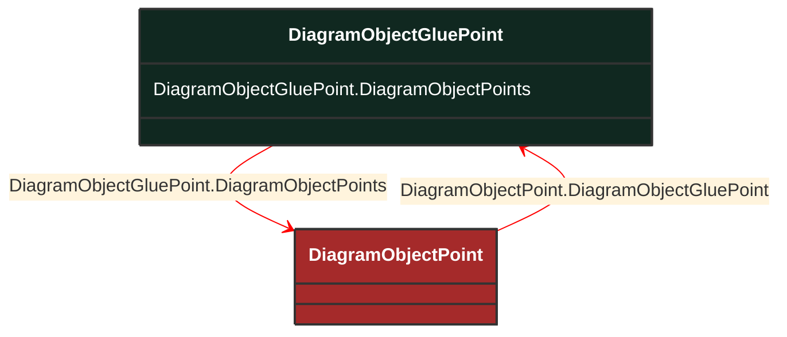

# DiagramObjectGluePoint

_This is used for grouping diagram object points from different diagram objects that are considered to be glued together in a diagram even if they are not at the exact same coordinates._

**URI**: [cim:DiagramObjectGluePoint](http://iec.ch/TC57/CIM100#DiagramObjectGluePoint) 
**Type**: Class

## Inheritance
* **DiagramObjectGluePoint**

## Attributes
| Name | URI | Cardinality and Range | Description | Inheritance |
| ---  | --- | --- | --- | --- |
| DiagramObjectPoints | [cim:DiagramObjectGluePoint.DiagramObjectPoints](http://iec.ch/TC57/CIM100#DiagramObjectGluePoint.DiagramObjectPoints) | No cardinality available DiagramObjectPoint | A diagram object glue point is associated with 2 or more object points that are considered to be 'glued' together. | direct |

### Schema Source
* from schema: [http://iec.ch/TC57/ns/CIM/DiagramLayout-EUPackage_DiagramLayoutProfile](http://iec.ch/TC57/ns/CIM/DiagramLayout-EUPackage_DiagramLayoutProfile)
