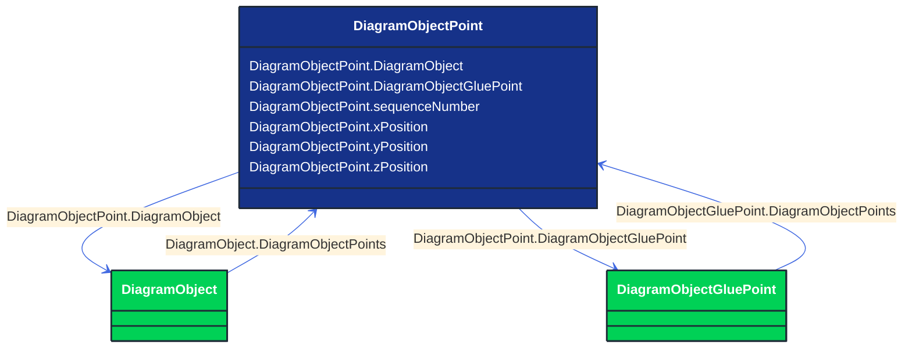

# DiagramObjectPoint

_A point in a given space defined by 3 coordinates and associated to a diagram object.  The coordinates may be positive or negative as the origin does not have to be in the corner of a diagram._

**URI**: [cim:DiagramObjectPoint](http://iec.ch/TC57/CIM100#DiagramObjectPoint) 
**Type**: Class

## Inheritance
* **DiagramObjectPoint**

## Attributes
| Name | URI | Cardinality and Range | Description | Inheritance |
| ---  | --- | --- | --- | --- |
| DiagramObject | [cim:DiagramObjectPoint.DiagramObject](http://iec.ch/TC57/CIM100#DiagramObjectPoint.DiagramObject) | No cardinality available DiagramObject | The diagram object with which the points are associated. | direct |
| DiagramObjectGluePoint | [cim:DiagramObjectPoint.DiagramObjectGluePoint](http://iec.ch/TC57/CIM100#DiagramObjectPoint.DiagramObjectGluePoint) | No cardinality available DiagramObjectGluePoint | The 'glue' point to which this point is associated. | direct |
| sequenceNumber | [cim:DiagramObjectPoint.sequenceNumber](http://iec.ch/TC57/CIM100#DiagramObjectPoint.sequenceNumber) | No cardinality available integer | The sequence position of the point, used for defining the order of points for diagram objects acting as a polyline or polygon with more than one point. The attribute shall be a positive value. | direct |
| xPosition | [cim:DiagramObjectPoint.xPosition](http://iec.ch/TC57/CIM100#DiagramObjectPoint.xPosition) | No cardinality available float | The X coordinate of this point. | direct |
| yPosition | [cim:DiagramObjectPoint.yPosition](http://iec.ch/TC57/CIM100#DiagramObjectPoint.yPosition) | No cardinality available float | The Y coordinate of this point. | direct |
| zPosition | [cim:DiagramObjectPoint.zPosition](http://iec.ch/TC57/CIM100#DiagramObjectPoint.zPosition) | No cardinality available float | The Z coordinate of this point. | direct |

### Schema Source
* from schema: [http://iec.ch/TC57/ns/CIM/DiagramLayout-EUPackage_DiagramLayoutProfile](http://iec.ch/TC57/ns/CIM/DiagramLayout-EUPackage_DiagramLayoutProfile)
