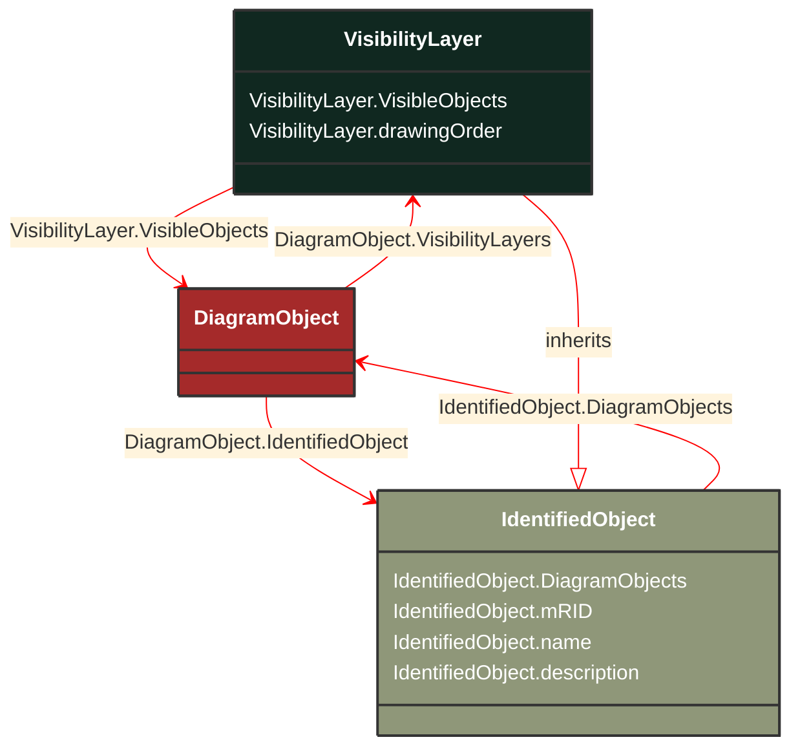

# VisibilityLayer

_Layers are typically used for grouping diagram objects according to themes and scales. Themes are used to display or hide certain information (e.g., lakes, borders), while scales are used for hiding or displaying information depending on the current zoom level (hide text when it is too small to be read, or when it exceeds the screen size). This is also called de-cluttering.
CIM based graphics exchange supports an m:n relationship between diagram objects and layers. The importing system shall convert an m:n case into an appropriate 1:n representation if the importing system does not support m:n._

**URI**: [cim:VisibilityLayer](http://iec.ch/TC57/CIM100#VisibilityLayer) 
**Type**: Class

## Inheritance
* [IdentifiedObject](/Models/Profiles/DiagramLayout/AbstractClasses/IdentifiedObject/)
    * **VisibilityLayer**

## Attributes
| Name | URI | Cardinality and Range | Description | Inheritance |
| ---  | --- | --- | --- | --- |
| VisibleObjects | [cim:VisibilityLayer.VisibleObjects](http://iec.ch/TC57/CIM100#VisibilityLayer.VisibleObjects) | No cardinality available DiagramObject | A visibility layer can contain one or more diagram objects. | direct |
| drawingOrder | [cim:VisibilityLayer.drawingOrder](http://iec.ch/TC57/CIM100#VisibilityLayer.drawingOrder) | No cardinality available integer | The drawing order for this layer.  The higher the number, the later the layer and the objects within it are rendered. | direct |
| DiagramObjects | [cim:IdentifiedObject.DiagramObjects](http://iec.ch/TC57/CIM100#IdentifiedObject.DiagramObjects) | No cardinality available DiagramObject | The diagram objects that are associated with the domain object. | IdentifiedObject |
| mRID | [cim:IdentifiedObject.mRID](http://iec.ch/TC57/CIM100#IdentifiedObject.mRID) | No cardinality available string | Master resource identifier issued by a model authority. The mRID is unique within an exchange context. Global uniqueness is easily achieved by using a UUID, as specified in RFC 4122, for the mRID. The use of UUID is strongly recommended.
For CIMXML data files in RDF syntax conforming to IEC 61970-552, the mRID is mapped to rdf:ID or rdf:about attributes that identify CIM object elements. | IdentifiedObject |
| name | [cim:IdentifiedObject.name](http://iec.ch/TC57/CIM100#IdentifiedObject.name) | No cardinality available string | The name is any free human readable and possibly non unique text naming the object. | IdentifiedObject |
| description | [cim:IdentifiedObject.description](http://iec.ch/TC57/CIM100#IdentifiedObject.description) | No cardinality available string | The description is a free human readable text describing or naming the object. It may be non unique and may not correlate to a naming hierarchy. | IdentifiedObject |

### Schema Source
* from schema: [http://iec.ch/TC57/ns/CIM/DiagramLayout-EUPackage_DiagramLayoutProfile](http://iec.ch/TC57/ns/CIM/DiagramLayout-EUPackage_DiagramLayoutProfile)
