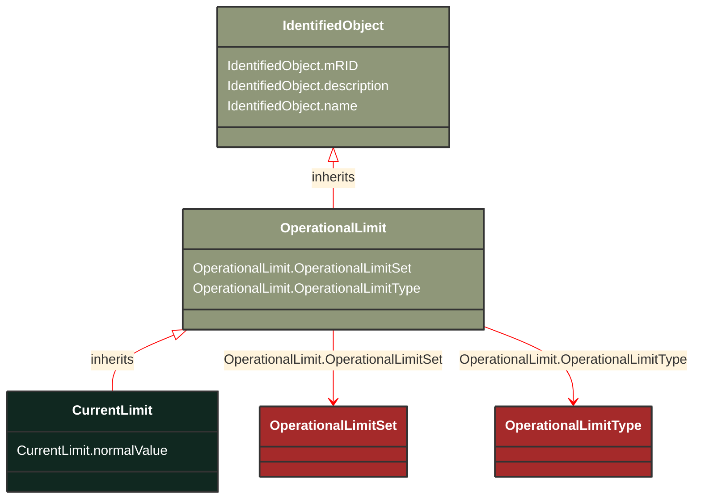

# CurrentLimit

_Operational limit on current._

**URI**: [cim:CurrentLimit](https://cim.ucaiug.io/ns#CurrentLimit) 
**Type**: Class

## Inheritance
* [IdentifiedObject](/Models/Profiles/Equipment/AbstractClasses/IdentifiedObject/)
    * [OperationalLimit](/Models/Profiles/Equipment/AbstractClasses/OperationalLimit/)
        * **CurrentLimit**

## Attributes
| Name | URI | Cardinality and Range | Description | Inheritance |
| ---  | --- | --- | --- | --- |
| normalValue | [cim:CurrentLimit.normalValue](https://cim.ucaiug.io/ns#CurrentLimit.normalValue) | 1..1 CurrentFlow | The normal value for limit on current flow. The attribute shall be a positive value or zero. | direct |
| OperationalLimitSet | [cim:OperationalLimit.OperationalLimitSet](https://cim.ucaiug.io/ns#OperationalLimit.OperationalLimitSet) | 0..1 OperationalLimitSet | The limit set to which the limit values belong. | OperationalLimit |
| OperationalLimitType | [cim:OperationalLimit.OperationalLimitType](https://cim.ucaiug.io/ns#OperationalLimit.OperationalLimitType) | 0..1 OperationalLimitType | The limit type associated with this limit. | OperationalLimit |
| mRID | [cim:IdentifiedObject.mRID](https://cim.ucaiug.io/ns#IdentifiedObject.mRID) | 0..1 string | Master resource identifier issued by a model authority. The mRID is unique within an exchange context. Global uniqueness is easily achieved by using a UUID, as specified in RFC 4122, for the mRID. The use of UUID is strongly recommended.For CIMXML data files in RDF syntax conforming to IEC 61970-552, the mRID is mapped to rdf:ID or rdf:about attributes that identify CIM object elements. | IdentifiedObject |
| description | [cim:IdentifiedObject.description](https://cim.ucaiug.io/ns#IdentifiedObject.description) | 0..1 string | The description is a free human readable text describing or naming the object. It may be non unique and may not correlate to a naming hierarchy. | IdentifiedObject |
| name | [cim:IdentifiedObject.name](https://cim.ucaiug.io/ns#IdentifiedObject.name) | 0..1 string | The name is any free human readable and possibly non unique text naming the object. | IdentifiedObject |

### Schema Source
* from schema: [https://ap-no.cim4.eu/Equipment/1.0](https://ap-no.cim4.eu/Equipment/1.0)
