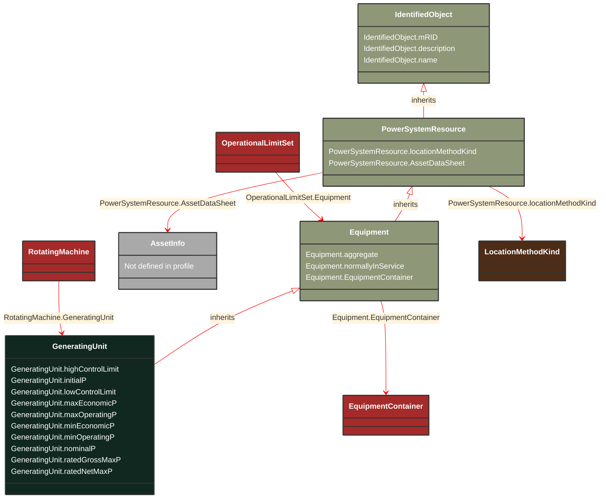

# GeneratingUnit

_A single or set of synchronous machines for converting mechanical power into alternating-current power. For example, individual machines within a set may be defined for scheduling purposes while a single control signal is derived for the set. In this case there would be a GeneratingUnit for each member of the set and an additional GeneratingUnit corresponding to the set._

**URI**: [cim:GeneratingUnit](https://cim.ucaiug.io/ns#GeneratingUnit) 
**Type**: Class

## Inheritance
* [IdentifiedObject](/Models/Profiles/Equipment/AbstractClasses/IdentifiedObject/)
    * [PowerSystemResource](/Models/Profiles/Equipment/AbstractClasses/PowerSystemResource/)
        * [Equipment](/Models/Profiles/Equipment/AbstractClasses/Equipment/)
            * **GeneratingUnit**

## Attributes
| Name | URI | Cardinality and Range | Description | Inheritance |
| ---  | --- | --- | --- | --- |
| highControlLimit | [cim:GeneratingUnit.highControlLimit](https://cim.ucaiug.io/ns#GeneratingUnit.highControlLimit) | 0..1 ActivePower | High limit for secondary (AGC) control. | direct |
| initialP | [cim:GeneratingUnit.initialP](https://cim.ucaiug.io/ns#GeneratingUnit.initialP) | 0..1 ActivePower | Default initial active power  which is used to store a powerflow result for the initial active power for this unit in this network configuration. | direct |
| lowControlLimit | [cim:GeneratingUnit.lowControlLimit](https://cim.ucaiug.io/ns#GeneratingUnit.lowControlLimit) | 0..1 ActivePower | Low limit for secondary (AGC) control. | direct |
| maxEconomicP | [cim:GeneratingUnit.maxEconomicP](https://cim.ucaiug.io/ns#GeneratingUnit.maxEconomicP) | 0..1 ActivePower | Maximum high economic active power limit, that should not exceed the maximum operating active power limit. | direct |
| maxOperatingP | [cim:GeneratingUnit.maxOperatingP](https://cim.ucaiug.io/ns#GeneratingUnit.maxOperatingP) | 0..1 ActivePower | This is the maximum operating active power limit the dispatcher can enter for this unit. | direct |
| minEconomicP | [cim:GeneratingUnit.minEconomicP](https://cim.ucaiug.io/ns#GeneratingUnit.minEconomicP) | 0..1 ActivePower | Low economic active power limit that shall be greater than or equal to the minimum operating active power limit. | direct |
| minOperatingP | [cim:GeneratingUnit.minOperatingP](https://cim.ucaiug.io/ns#GeneratingUnit.minOperatingP) | 1..1 ActivePower | This is the minimum operating active power limit the dispatcher can enter for this unit. | direct |
| nominalP | [cim:GeneratingUnit.nominalP](https://cim.ucaiug.io/ns#GeneratingUnit.nominalP) | 0..1 ActivePower | The nominal power of the generating unit.  Used to give precise meaning to percentage based attributes such as the governor speed change droop (governorSCD attribute).The attribute shall be a positive value equal to or less than RotatingMachine.ratedS. | direct |
| ratedGrossMaxP | [cim:GeneratingUnit.ratedGrossMaxP](https://cim.ucaiug.io/ns#GeneratingUnit.ratedGrossMaxP) | 0..1 ActivePower | The unit's gross rated maximum capacity (book value).The attribute shall be a positive value. | direct |
| ratedNetMaxP | [cim:GeneratingUnit.ratedNetMaxP](https://cim.ucaiug.io/ns#GeneratingUnit.ratedNetMaxP) | 0..1 ActivePower | The net rated maximum capacity determined by subtracting the auxiliary power used to operate the internal plant machinery from the rated gross maximum capacity.The attribute shall be a positive value. | direct |
| aggregate | [cim:Equipment.aggregate](https://cim.ucaiug.io/ns#Equipment.aggregate) | 0..1 boolean | The aggregate attribute is used to indicate that the object is an aggregate of other objects. The aggregate attribute is used to indicate that the object is an aggregate of other objects. The aggregate attribute is used to indicate that the object is an aggregate of other objects. | Equipment |
| normallyInService | [cim:Equipment.normallyInService](https://cim.ucaiug.io/ns#Equipment.normallyInService) | 0..1 boolean | The normallyInService attribute is used to indicate that the object is normally in service. The normallyInService attribute is used to indicate that the object is normally in service. The normallyInService attribute is used to indicate that the object is normally in service. | Equipment |
| EquipmentContainer | [cim:Equipment.EquipmentContainer](https://cim.ucaiug.io/ns#Equipment.EquipmentContainer) | 0..1 EquipmentContainer | Container of this equipment. | Equipment |
| locationMethodKind | [nc-no:PowerSystemResource.locationMethodKind](http://cim4.eu/ns/nc-no#PowerSystemResource.locationMethodKind) | 0..1 LocationMethodKind | Possible methods to derive geographical location. | PowerSystemResource |
| AssetDataSheet | [cim:PowerSystemResource.AssetDataSheet](https://cim.ucaiug.io/ns#PowerSystemResource.AssetDataSheet) | 0..1 AssetInfo | Datasheet information for this power system resource. | PowerSystemResource |
| mRID | [cim:IdentifiedObject.mRID](https://cim.ucaiug.io/ns#IdentifiedObject.mRID) | 0..1 string | Master resource identifier issued by a model authority. The mRID is unique within an exchange context. Global uniqueness is easily achieved by using a UUID, as specified in RFC 4122, for the mRID. The use of UUID is strongly recommended.For CIMXML data files in RDF syntax conforming to IEC 61970-552, the mRID is mapped to rdf:ID or rdf:about attributes that identify CIM object elements. | IdentifiedObject |
| description | [cim:IdentifiedObject.description](https://cim.ucaiug.io/ns#IdentifiedObject.description) | 0..1 string | The description is a free human readable text describing or naming the object. It may be non unique and may not correlate to a naming hierarchy. | IdentifiedObject |
| name | [cim:IdentifiedObject.name](https://cim.ucaiug.io/ns#IdentifiedObject.name) | 0..1 string | The name is any free human readable and possibly non unique text naming the object. | IdentifiedObject |

### Schema Source
* from schema: [https://ap-no.cim4.eu/Equipment/1.0](https://ap-no.cim4.eu/Equipment/1.0)
