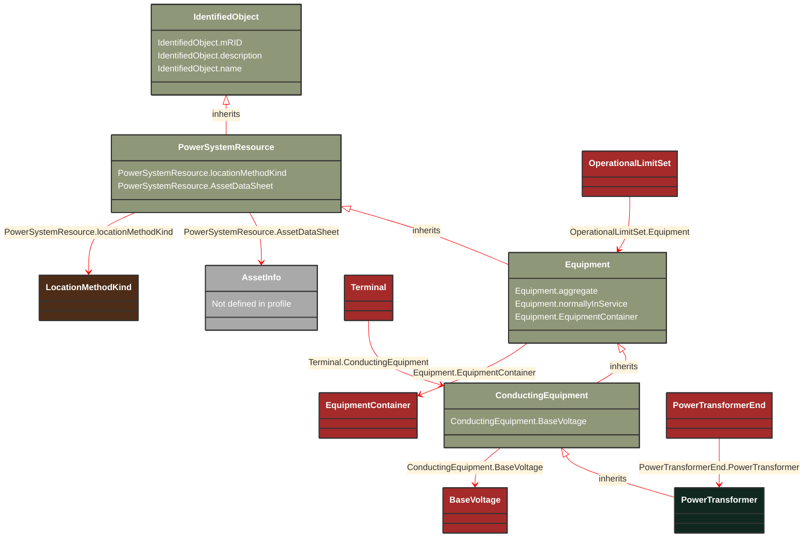

# PowerTransformer

_An electrical device consisting of  two or more coupled windings, with or without a magnetic core, for introducing mutual coupling between electric circuits. Transformers can be used to control voltage and phase shift (active power flow).A power transformer may be composed of separate transformer tanks that need not be identical.A power transformer can be modelled with or without tanks and is intended for use in both balanced and unbalanced representations.   A power transformer typically has two terminals, but may have one (grounding), three or more terminals.The inherited association ConductingEquipment.BaseVoltage should not be used.  The association from TransformerEnd to BaseVoltage should be used instead._

**URI**: [cim:PowerTransformer](https://cim.ucaiug.io/ns#PowerTransformer) 
**Type**: Class

## Inheritance
* [IdentifiedObject](/Models/Profiles/Equipment/AbstractClasses/IdentifiedObject/)
    * [PowerSystemResource](/Models/Profiles/Equipment/AbstractClasses/PowerSystemResource/)
        * [Equipment](/Models/Profiles/Equipment/AbstractClasses/Equipment/)
            * [ConductingEquipment](/Models/Profiles/Equipment/AbstractClasses/ConductingEquipment/)
                * **PowerTransformer**

## Attributes
| Name | URI | Cardinality and Range | Description | Inheritance |
| ---  | --- | --- | --- | --- |
| BaseVoltage | [cim:ConductingEquipment.BaseVoltage](https://cim.ucaiug.io/ns#ConductingEquipment.BaseVoltage) | 0..1 BaseVoltage | Base voltage of this conducting equipment.  Use only when there is no voltage level container used and only one base voltage applies.  For example, not used for transformers. | ConductingEquipment |
| aggregate | [cim:Equipment.aggregate](https://cim.ucaiug.io/ns#Equipment.aggregate) | 0..1 boolean | The aggregate attribute is used to indicate that the object is an aggregate of other objects. The aggregate attribute is used to indicate that the object is an aggregate of other objects. The aggregate attribute is used to indicate that the object is an aggregate of other objects. | Equipment |
| normallyInService | [cim:Equipment.normallyInService](https://cim.ucaiug.io/ns#Equipment.normallyInService) | 0..1 boolean | The normallyInService attribute is used to indicate that the object is normally in service. The normallyInService attribute is used to indicate that the object is normally in service. The normallyInService attribute is used to indicate that the object is normally in service. | Equipment |
| EquipmentContainer | [cim:Equipment.EquipmentContainer](https://cim.ucaiug.io/ns#Equipment.EquipmentContainer) | 0..1 EquipmentContainer | Container of this equipment. | Equipment |
| locationMethodKind | [nc-no:PowerSystemResource.locationMethodKind](http://cim4.eu/ns/nc-no#PowerSystemResource.locationMethodKind) | 0..1 LocationMethodKind | Possible methods to derive geographical location. | PowerSystemResource |
| AssetDataSheet | [cim:PowerSystemResource.AssetDataSheet](https://cim.ucaiug.io/ns#PowerSystemResource.AssetDataSheet) | 0..1 AssetInfo | Datasheet information for this power system resource. | PowerSystemResource |
| mRID | [cim:IdentifiedObject.mRID](https://cim.ucaiug.io/ns#IdentifiedObject.mRID) | 0..1 string | Master resource identifier issued by a model authority. The mRID is unique within an exchange context. Global uniqueness is easily achieved by using a UUID, as specified in RFC 4122, for the mRID. The use of UUID is strongly recommended.For CIMXML data files in RDF syntax conforming to IEC 61970-552, the mRID is mapped to rdf:ID or rdf:about attributes that identify CIM object elements. | IdentifiedObject |
| description | [cim:IdentifiedObject.description](https://cim.ucaiug.io/ns#IdentifiedObject.description) | 0..1 string | The description is a free human readable text describing or naming the object. It may be non unique and may not correlate to a naming hierarchy. | IdentifiedObject |
| name | [cim:IdentifiedObject.name](https://cim.ucaiug.io/ns#IdentifiedObject.name) | 0..1 string | The name is any free human readable and possibly non unique text naming the object. | IdentifiedObject |

### Schema Source
* from schema: [https://ap-no.cim4.eu/Equipment/1.0](https://ap-no.cim4.eu/Equipment/1.0)
