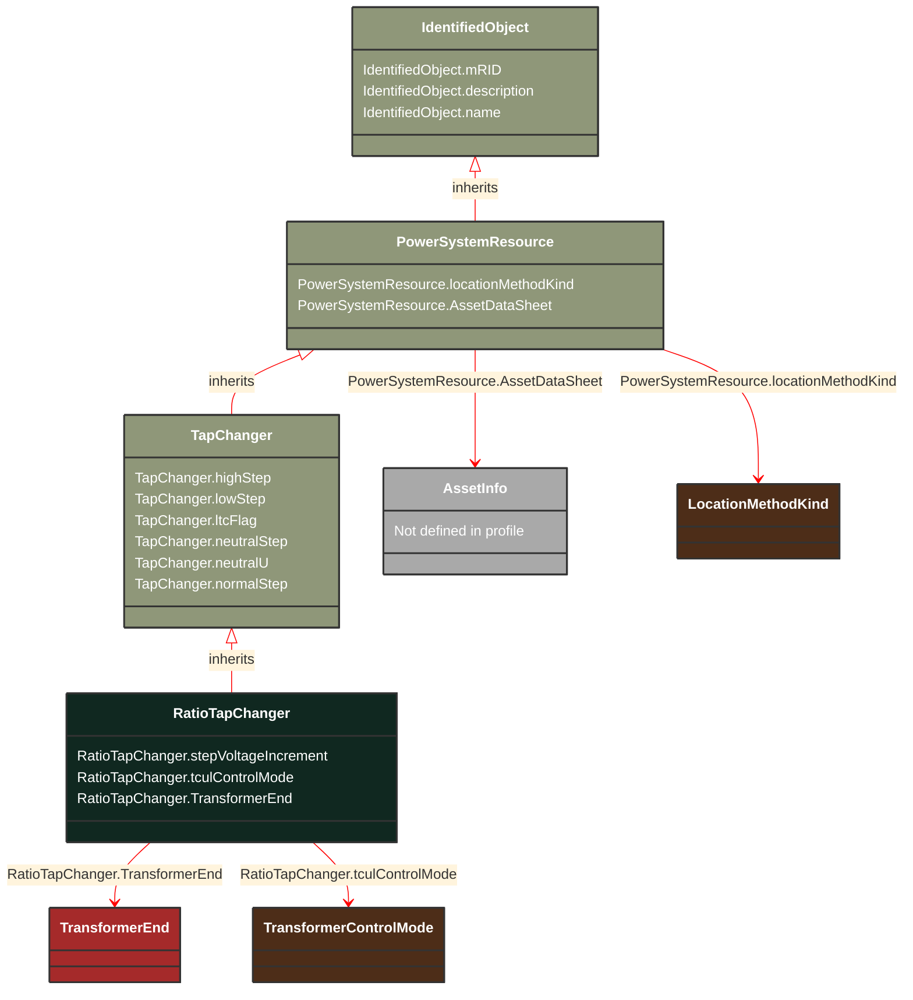

# RatioTapChanger

_A tap changer that changes the voltage ratio impacting the voltage magnitude but not the phase angle across the transformer.Angle sign convention (general): Positive value indicates a positive phase shift from the winding where the tap is located to the other winding (for a two-winding transformer)._

**URI**: [cim:RatioTapChanger](https://cim.ucaiug.io/ns#RatioTapChanger) 
**Type**: Class

## Inheritance
* [IdentifiedObject](/Models/Profiles/Equipment/AbstractClasses/IdentifiedObject/)
    * [PowerSystemResource](/Models/Profiles/Equipment/AbstractClasses/PowerSystemResource/)
        * [TapChanger](/Models/Profiles/Equipment/AbstractClasses/TapChanger/)
            * **RatioTapChanger**

## Attributes
| Name | URI | Cardinality and Range | Description | Inheritance |
| ---  | --- | --- | --- | --- |
| stepVoltageIncrement | [cim:RatioTapChanger.stepVoltageIncrement](https://cim.ucaiug.io/ns#RatioTapChanger.stepVoltageIncrement) | 0..1 PerCent | Tap step increment, in per cent of rated voltage of the power transformer end, per step position.When the increment is negative, the voltage decreases when the tap step increases. | direct |
| tculControlMode | [cim:RatioTapChanger.tculControlMode](https://cim.ucaiug.io/ns#RatioTapChanger.tculControlMode) | 0..1 TransformerControlMode | Specifies the regulation control mode (voltage or reactive) of the RatioTapChanger. | direct |
| TransformerEnd | [cim:RatioTapChanger.TransformerEnd](https://cim.ucaiug.io/ns#RatioTapChanger.TransformerEnd) | 0..1 TransformerEnd | Transformer end to which this ratio tap changer belongs. | direct |
| highStep | [cim:TapChanger.highStep](https://cim.ucaiug.io/ns#TapChanger.highStep) | 0..1 integer | Highest possible tap step position, advance from neutral.The attribute shall be greater than lowStep. | TapChanger |
| lowStep | [cim:TapChanger.lowStep](https://cim.ucaiug.io/ns#TapChanger.lowStep) | 0..1 integer | Lowest possible tap step position, retard from neutral. | TapChanger |
| ltcFlag | [cim:TapChanger.ltcFlag](https://cim.ucaiug.io/ns#TapChanger.ltcFlag) | 0..1 boolean | Specifies whether or not a TapChanger has load tap changing capabilities. | TapChanger |
| neutralStep | [cim:TapChanger.neutralStep](https://cim.ucaiug.io/ns#TapChanger.neutralStep) | 0..1 integer | The neutral tap step position for this winding.The attribute shall be equal to or greater than lowStep and equal or less than highStep.It is the step position where the voltage is neutralU when the other terminals of the transformer are at the ratedU.  If there are other tap changers on the transformer those taps are kept constant at their neutralStep. | TapChanger |
| neutralU | [cim:TapChanger.neutralU](https://cim.ucaiug.io/ns#TapChanger.neutralU) | 0..1 Voltage | Voltage at which the winding operates at the neutral tap setting. It is the voltage at the terminal of the PowerTransformerEnd associated with the tap changer when all tap changers on the transformer are at their neutralStep position.  Normally neutralU of the tap changer is the same as ratedU of the PowerTransformerEnd, but it can differ in special cases such as when the tapping mechanism is separate from the winding more common on lower voltage transformers.This attribute is not relevant for PhaseTapChangerAsymmetrical, PhaseTapChangerSymmetrical and PhaseTapChangerLinear. | TapChanger |
| normalStep | [cim:TapChanger.normalStep](https://cim.ucaiug.io/ns#TapChanger.normalStep) | 0..1 integer | The tap step position used in normal network operation for this winding. For a Fixed tap changer indicates the current physical tap setting.The attribute shall be equal to or greater than lowStep and equal to or less than highStep. | TapChanger |
| locationMethodKind | [nc-no:PowerSystemResource.locationMethodKind](http://cim4.eu/ns/nc-no#PowerSystemResource.locationMethodKind) | 0..1 LocationMethodKind | Possible methods to derive geographical location. | PowerSystemResource |
| AssetDataSheet | [cim:PowerSystemResource.AssetDataSheet](https://cim.ucaiug.io/ns#PowerSystemResource.AssetDataSheet) | 0..1 AssetInfo | Datasheet information for this power system resource. | PowerSystemResource |
| mRID | [cim:IdentifiedObject.mRID](https://cim.ucaiug.io/ns#IdentifiedObject.mRID) | 0..1 string | Master resource identifier issued by a model authority. The mRID is unique within an exchange context. Global uniqueness is easily achieved by using a UUID, as specified in RFC 4122, for the mRID. The use of UUID is strongly recommended.For CIMXML data files in RDF syntax conforming to IEC 61970-552, the mRID is mapped to rdf:ID or rdf:about attributes that identify CIM object elements. | IdentifiedObject |
| description | [cim:IdentifiedObject.description](https://cim.ucaiug.io/ns#IdentifiedObject.description) | 0..1 string | The description is a free human readable text describing or naming the object. It may be non unique and may not correlate to a naming hierarchy. | IdentifiedObject |
| name | [cim:IdentifiedObject.name](https://cim.ucaiug.io/ns#IdentifiedObject.name) | 0..1 string | The name is any free human readable and possibly non unique text naming the object. | IdentifiedObject |

### Schema Source
* from schema: [https://ap-no.cim4.eu/Equipment/1.0](https://ap-no.cim4.eu/Equipment/1.0)
