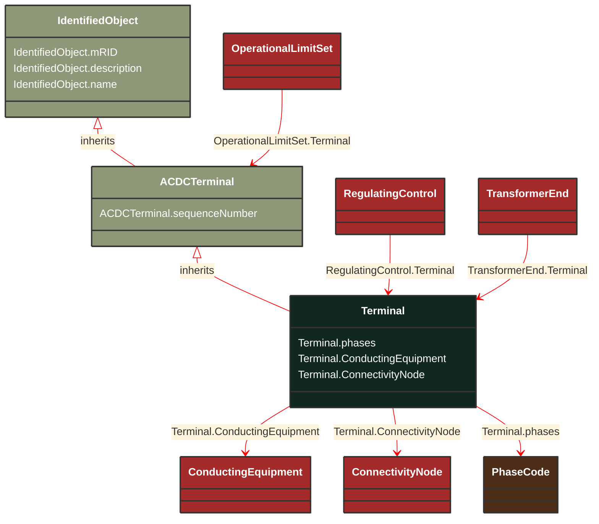

# Terminal

_An AC electrical connection point to a piece of conducting equipment. Terminals are connected at physical connection points called connectivity nodes._

**URI**: [cim:Terminal](https://cim.ucaiug.io/ns#Terminal) 
**Type**: Class

## Inheritance
* [IdentifiedObject](/Models/Profiles/Equipment/AbstractClasses/IdentifiedObject/)
    * [ACDCTerminal](/Models/Profiles/Equipment/AbstractClasses/ACDCTerminal/)
        * **Terminal**

## Attributes
| Name | URI | Cardinality and Range | Description | Inheritance |
| ---  | --- | --- | --- | --- |
| phases | [cim:Terminal.phases](https://cim.ucaiug.io/ns#Terminal.phases) | 0..1 PhaseCode | Represents the normal network phasing condition. If the attribute is missing, three phases (ABC) shall be assumed, except for terminals of grounding classes (specializations of EarthFaultCompensator, GroundDisconnector, and Ground) which will be assumed to be N. Therefore, phase code ABCN is explicitly declared when needed, e.g. for star point grounding equipment.The phase code on terminals connecting same ConnectivityNode or same TopologicalNode as well as for equipment between two terminals shall be consistent. | direct |
| ConductingEquipment | [cim:Terminal.ConductingEquipment](https://cim.ucaiug.io/ns#Terminal.ConductingEquipment) | 1..1 ConductingEquipment | The conducting equipment of the terminal.  Conducting equipment have  terminals that may be connected to other conducting equipment terminals via connectivity nodes or topological nodes. | direct |
| ConnectivityNode | [cim:Terminal.ConnectivityNode](https://cim.ucaiug.io/ns#Terminal.ConnectivityNode) | 0..1 ConnectivityNode | The connectivity node to which this terminal connects with zero impedance. | direct |
| sequenceNumber | [cim:ACDCTerminal.sequenceNumber](https://cim.ucaiug.io/ns#ACDCTerminal.sequenceNumber) | 0..1 integer | The orientation of the terminal connections for a multiple terminal conducting equipment.  The sequence numbering starts with 1 and additional terminals should follow in increasing order.   The first terminal is the starting point for a two terminal branch. | ACDCTerminal |
| mRID | [cim:IdentifiedObject.mRID](https://cim.ucaiug.io/ns#IdentifiedObject.mRID) | 0..1 string | Master resource identifier issued by a model authority. The mRID is unique within an exchange context. Global uniqueness is easily achieved by using a UUID, as specified in RFC 4122, for the mRID. The use of UUID is strongly recommended.For CIMXML data files in RDF syntax conforming to IEC 61970-552, the mRID is mapped to rdf:ID or rdf:about attributes that identify CIM object elements. | IdentifiedObject |
| description | [cim:IdentifiedObject.description](https://cim.ucaiug.io/ns#IdentifiedObject.description) | 0..1 string | The description is a free human readable text describing or naming the object. It may be non unique and may not correlate to a naming hierarchy. | IdentifiedObject |
| name | [cim:IdentifiedObject.name](https://cim.ucaiug.io/ns#IdentifiedObject.name) | 0..1 string | The name is any free human readable and possibly non unique text naming the object. | IdentifiedObject |

### Schema Source
* from schema: [https://ap-no.cim4.eu/Equipment/1.0](https://ap-no.cim4.eu/Equipment/1.0)
