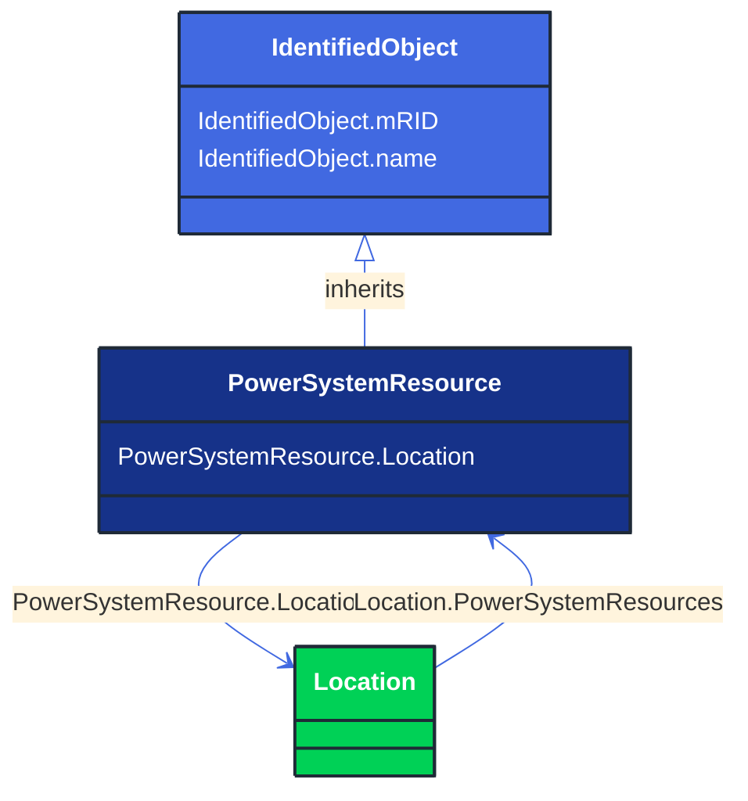

# PowerSystemResource

_A power system resource (PSR) can be an item of equipment such as a switch, an equipment container containing many individual items of equipment such as a substation, or an organisational entity such as sub-control area. Power system resources can have measurements associated._

*__NOTE__: this is an abstract class and should not be instantiated directly

**URI**: [cim:PowerSystemResource](http://iec.ch/TC57/CIM100#PowerSystemResource) 
**Type**: Class

## Inheritance
* [IdentifiedObject](/Models/Profiles/GeographicalLocation/AbstractClasses/IdentifiedObject/)
    * **PowerSystemResource**

## Attributes
| Name | URI | Cardinality and Range | Description | Inheritance |
| ---  | --- | --- | --- | --- |
| Location | [cim:PowerSystemResource.Location](http://iec.ch/TC57/CIM100#PowerSystemResource.Location) | No cardinality available Location | Location of this power system resource. | direct |
| mRID | [cim:IdentifiedObject.mRID](http://iec.ch/TC57/CIM100#IdentifiedObject.mRID) | No cardinality available string | Master resource identifier issued by a model authority. The mRID is unique within an exchange context. Global uniqueness is easily achieved by using a UUID, as specified in RFC 4122, for the mRID. The use of UUID is strongly recommended.
For CIMXML data files in RDF syntax conforming to IEC 61970-552, the mRID is mapped to rdf:ID or rdf:about attributes that identify CIM object elements. | IdentifiedObject |
| name | [cim:IdentifiedObject.name](http://iec.ch/TC57/CIM100#IdentifiedObject.name) | No cardinality available string | The name is any free human readable and possibly non unique text naming the object. | IdentifiedObject |

### Schema Source
* from schema: [http://iec.ch/TC57/ns/CIM/GeographicalLocation-EUPackage_GeographicalLocationProfile](http://iec.ch/TC57/ns/CIM/GeographicalLocation-EUPackage_GeographicalLocationProfile)
