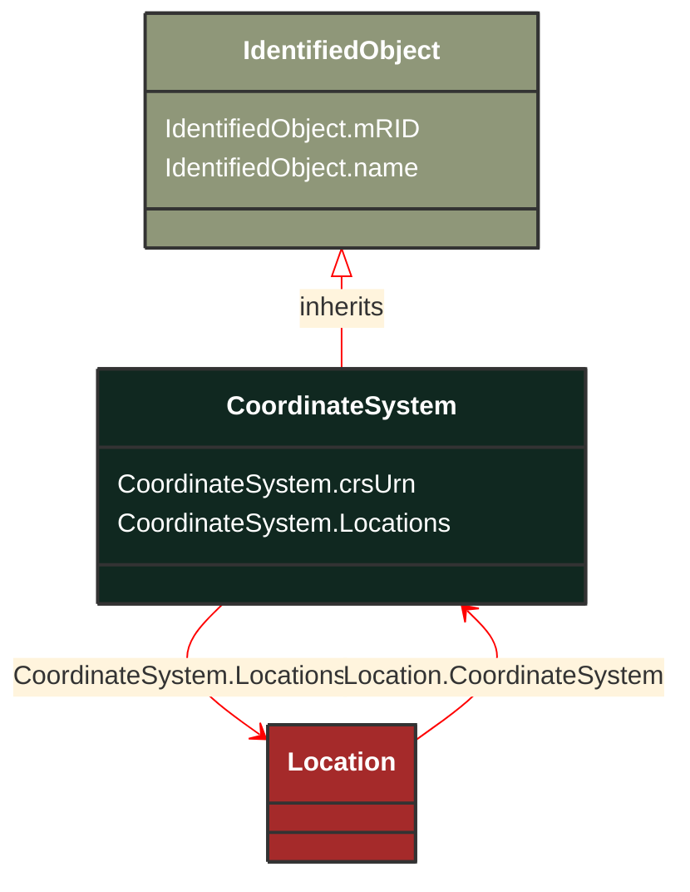

# CoordinateSystem

_Coordinate reference system._

**URI**: [cim:CoordinateSystem](http://iec.ch/TC57/CIM100#CoordinateSystem) 
**Type**: Class

## Inheritance
* [IdentifiedObject](/Models/Profiles/GeographicalLocation/AbstractClasses/IdentifiedObject/)
    * **CoordinateSystem**

## Attributes
| Name | URI | Cardinality and Range | Description | Inheritance |
| ---  | --- | --- | --- | --- |
| crsUrn | [cim:CoordinateSystem.crsUrn](http://iec.ch/TC57/CIM100#CoordinateSystem.crsUrn) | No cardinality available string | A Uniform Resource Name (URN) for the coordinate reference system (crs) used to define 'Location.PositionPoints'.
An example would be the European Petroleum Survey Group (EPSG) code for a coordinate reference system, defined in URN under the Open Geospatial Consortium (OGC) namespace as: urn:ogc:def:crs:EPSG::XXXX, where XXXX is an EPSG code (a full list of codes can be found at the EPSG Registry web site http://www.epsg-registry.org/). To define the coordinate system as being WGS84 (latitude, longitude) using an EPSG OGC, this attribute would be urn:ogc:def:crs:EPSG::4236.
A profile should limit this code to a set of allowed URNs agreed to by all sending and receiving parties. | direct |
| Locations | [cim:CoordinateSystem.Locations](http://iec.ch/TC57/CIM100#CoordinateSystem.Locations) | No cardinality available Location | All locations described with position points in this coordinate system. | direct |
| mRID | [cim:IdentifiedObject.mRID](http://iec.ch/TC57/CIM100#IdentifiedObject.mRID) | No cardinality available string | Master resource identifier issued by a model authority. The mRID is unique within an exchange context. Global uniqueness is easily achieved by using a UUID, as specified in RFC 4122, for the mRID. The use of UUID is strongly recommended.
For CIMXML data files in RDF syntax conforming to IEC 61970-552, the mRID is mapped to rdf:ID or rdf:about attributes that identify CIM object elements. | IdentifiedObject |
| name | [cim:IdentifiedObject.name](http://iec.ch/TC57/CIM100#IdentifiedObject.name) | No cardinality available string | The name is any free human readable and possibly non unique text naming the object. | IdentifiedObject |

### Schema Source
* from schema: [http://iec.ch/TC57/ns/CIM/GeographicalLocation-EUPackage_GeographicalLocationProfile](http://iec.ch/TC57/ns/CIM/GeographicalLocation-EUPackage_GeographicalLocationProfile)
