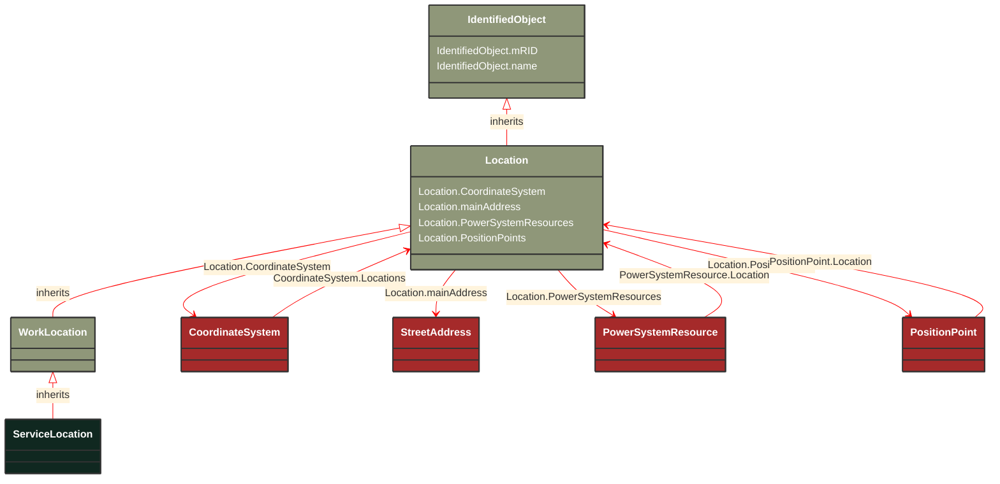

# ServiceLocation

_A real estate location, commonly referred to as premises._

**URI**: [cim:ServiceLocation](http://iec.ch/TC57/CIM100#ServiceLocation) 
**Type**: Class

## Inheritance
* [IdentifiedObject](/Models/Profiles/GeographicalLocation/ConcreteClasses/IdentifiedObject/)
    * [Location](/Models/Profiles/GeographicalLocation/ConcreteClasses/Location/)
        * [WorkLocation](/Models/Profiles/GeographicalLocation/ConcreteClasses/WorkLocation/)
            * **ServiceLocation**

## Attributes
| Name | URI | Cardinality and Range | Description | Inheritance |
| ---  | --- | --- | --- | --- |
| CoordinateSystem | [cim:Location.CoordinateSystem](http://iec.ch/TC57/CIM100#Location.CoordinateSystem) | No cardinality available CoordinateSystem | Coordinate system used to describe position points of this location. | Location |
| mainAddress | [cim:Location.mainAddress](http://iec.ch/TC57/CIM100#Location.mainAddress) | No cardinality available StreetAddress | Main address of the location. | Location |
| PowerSystemResources | [cim:Location.PowerSystemResources](http://iec.ch/TC57/CIM100#Location.PowerSystemResources) | No cardinality available PowerSystemResource | All power system resources at this location. | Location |
| PositionPoints | [cim:Location.PositionPoints](http://iec.ch/TC57/CIM100#Location.PositionPoints) | No cardinality available PositionPoint | Sequence of position points describing this location, expressed in coordinate system 'Location.CoordinateSystem'. | Location |
| mRID | [cim:IdentifiedObject.mRID](http://iec.ch/TC57/CIM100#IdentifiedObject.mRID) | No cardinality available string | Master resource identifier issued by a model authority. The mRID is unique within an exchange context. Global uniqueness is easily achieved by using a UUID, as specified in RFC 4122, for the mRID. The use of UUID is strongly recommended.
For CIMXML data files in RDF syntax conforming to IEC 61970-552, the mRID is mapped to rdf:ID or rdf:about attributes that identify CIM object elements. | IdentifiedObject |
| name | [cim:IdentifiedObject.name](http://iec.ch/TC57/CIM100#IdentifiedObject.name) | No cardinality available string | The name is any free human readable and possibly non unique text naming the object. | IdentifiedObject |

### Schema Source
* from schema: [http://iec.ch/TC57/ns/CIM/GeographicalLocation-EUPackage_GeographicalLocationProfile](http://iec.ch/TC57/ns/CIM/GeographicalLocation-EUPackage_GeographicalLocationProfile)
