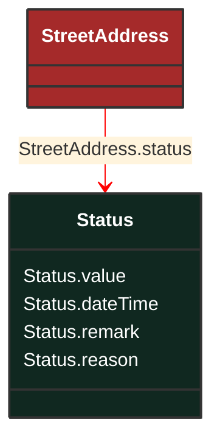

# Status

_Current status information relevant to an entity._

**URI**: [cim:Status](http://iec.ch/TC57/CIM100#Status) 
**Type**: Class

## Inheritance
* **Status**

## Attributes
| Name | URI | Cardinality and Range | Description | Inheritance |
| ---  | --- | --- | --- | --- |
| value | [cim:Status.value](http://iec.ch/TC57/CIM100#Status.value) | No cardinality available string | Status value at 'dateTime'; prior status changes may have been kept in instances of activity records associated with the object to which this status applies. | direct |
| dateTime | [cim:Status.dateTime](http://iec.ch/TC57/CIM100#Status.dateTime) | No cardinality available date | Date and time for which status 'value' applies. | direct |
| remark | [cim:Status.remark](http://iec.ch/TC57/CIM100#Status.remark) | No cardinality available string | Pertinent information regarding the current 'value', as free form text. | direct |
| reason | [cim:Status.reason](http://iec.ch/TC57/CIM100#Status.reason) | No cardinality available string | Reason code or explanation for why an object went to the current status 'value'. | direct |

### Schema Source
* from schema: [http://iec.ch/TC57/ns/CIM/GeographicalLocation-EUPackage_GeographicalLocationProfile](http://iec.ch/TC57/ns/CIM/GeographicalLocation-EUPackage_GeographicalLocationProfile)
