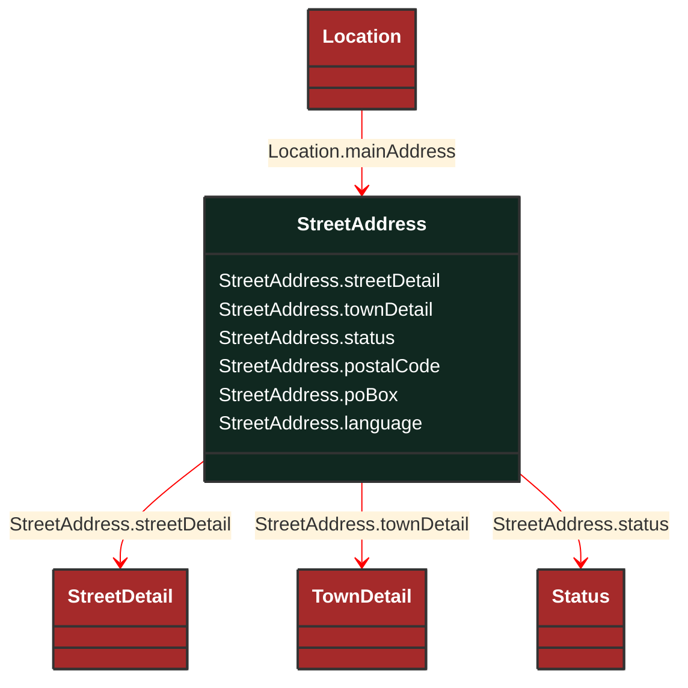

# StreetAddress

_General purpose street and postal address information._

**URI**: [cim:StreetAddress](http://iec.ch/TC57/CIM100#StreetAddress) 
**Type**: Class

## Inheritance
* **StreetAddress**

## Attributes
| Name | URI | Cardinality and Range | Description | Inheritance |
| ---  | --- | --- | --- | --- |
| streetDetail | [cim:StreetAddress.streetDetail](http://iec.ch/TC57/CIM100#StreetAddress.streetDetail) | No cardinality available StreetDetail | Street detail. | direct |
| townDetail | [cim:StreetAddress.townDetail](http://iec.ch/TC57/CIM100#StreetAddress.townDetail) | No cardinality available TownDetail | Town detail. | direct |
| status | [cim:StreetAddress.status](http://iec.ch/TC57/CIM100#StreetAddress.status) | No cardinality available Status | Status of this address. | direct |
| postalCode | [cim:StreetAddress.postalCode](http://iec.ch/TC57/CIM100#StreetAddress.postalCode) | No cardinality available string | Postal code for the address. | direct |
| poBox | [cim:StreetAddress.poBox](http://iec.ch/TC57/CIM100#StreetAddress.poBox) | No cardinality available string | Post office box. | direct |
| language | [cim:StreetAddress.language](http://iec.ch/TC57/CIM100#StreetAddress.language) | No cardinality available string | The language in which the address is specified, using ISO 639-1 two digit language code. | direct |

### Schema Source
* from schema: [http://iec.ch/TC57/ns/CIM/GeographicalLocation-EUPackage_GeographicalLocationProfile](http://iec.ch/TC57/ns/CIM/GeographicalLocation-EUPackage_GeographicalLocationProfile)
