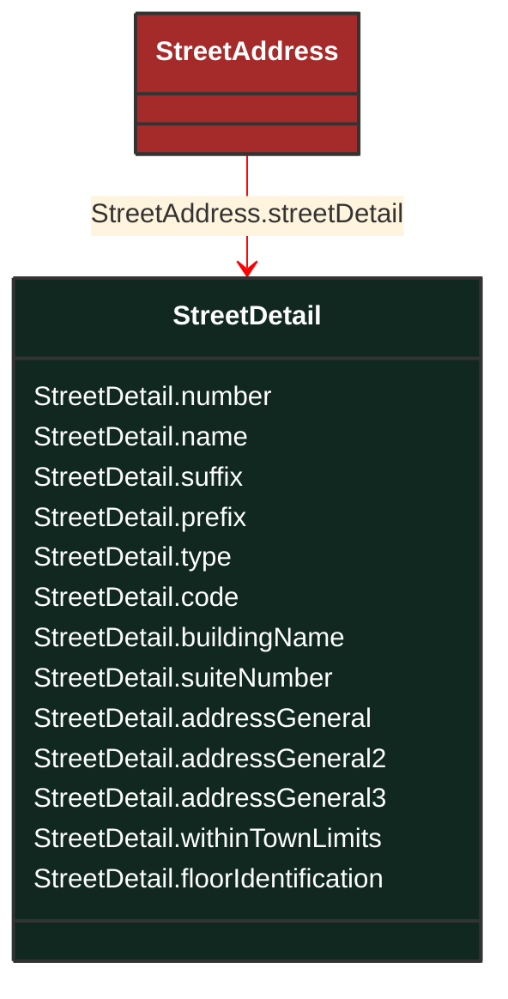

# StreetDetail

_Street details, in the context of address._

**URI**: [cim:StreetDetail](http://iec.ch/TC57/CIM100#StreetDetail) 
**Type**: Class

## Inheritance
* **StreetDetail**

## Attributes
| Name | URI | Cardinality and Range | Description | Inheritance |
| ---  | --- | --- | --- | --- |
| number | [cim:StreetDetail.number](http://iec.ch/TC57/CIM100#StreetDetail.number) | No cardinality available string | Designator of the specific location on the street. | direct |
| name | [cim:StreetDetail.name](http://iec.ch/TC57/CIM100#StreetDetail.name) | No cardinality available string | Name of the street. | direct |
| suffix | [cim:StreetDetail.suffix](http://iec.ch/TC57/CIM100#StreetDetail.suffix) | No cardinality available string | Suffix to the street name. For example: North, South, East, West. | direct |
| prefix | [cim:StreetDetail.prefix](http://iec.ch/TC57/CIM100#StreetDetail.prefix) | No cardinality available string | Prefix to the street name. For example: North, South, East, West. | direct |
| type | [cim:StreetDetail.type](http://iec.ch/TC57/CIM100#StreetDetail.type) | No cardinality available string | Type of street. Examples include: street, circle, boulevard, avenue, road, drive, etc. | direct |
| code | [cim:StreetDetail.code](http://iec.ch/TC57/CIM100#StreetDetail.code) | No cardinality available string | (if applicable) Utilities often make use of external reference systems, such as those of the town-planner's department or surveyor general's mapping system, that allocate global reference codes to streets. | direct |
| buildingName | [cim:StreetDetail.buildingName](http://iec.ch/TC57/CIM100#StreetDetail.buildingName) | No cardinality available string | (if applicable) In certain cases the physical location of the place of interest does not have a direct point of entry from the street, but may be located inside a larger structure such as a building, complex, office block, apartment, etc. | direct |
| suiteNumber | [cim:StreetDetail.suiteNumber](http://iec.ch/TC57/CIM100#StreetDetail.suiteNumber) | No cardinality available string | Number of the apartment or suite. | direct |
| addressGeneral | [cim:StreetDetail.addressGeneral](http://iec.ch/TC57/CIM100#StreetDetail.addressGeneral) | No cardinality available string | First line of a free form address or some additional address information (for example a mail stop). | direct |
| addressGeneral2 | [cim:StreetDetail.addressGeneral2](http://iec.ch/TC57/CIM100#StreetDetail.addressGeneral2) | No cardinality available string | (if applicable) Second line of a free form address. | direct |
| addressGeneral3 | [cim:StreetDetail.addressGeneral3](http://iec.ch/TC57/CIM100#StreetDetail.addressGeneral3) | No cardinality available string | (if applicable) Third line of a free form address. | direct |
| withinTownLimits | [cim:StreetDetail.withinTownLimits](http://iec.ch/TC57/CIM100#StreetDetail.withinTownLimits) | No cardinality available boolean | True if this street is within the legal geographical boundaries of the specified town (default). | direct |
| floorIdentification | [cim:StreetDetail.floorIdentification](http://iec.ch/TC57/CIM100#StreetDetail.floorIdentification) | No cardinality available string | The identification by name or number, expressed as text, of the floor in the building as part of this address. | direct |

### Schema Source
* from schema: [http://iec.ch/TC57/ns/CIM/GeographicalLocation-EUPackage_GeographicalLocationProfile](http://iec.ch/TC57/ns/CIM/GeographicalLocation-EUPackage_GeographicalLocationProfile)
