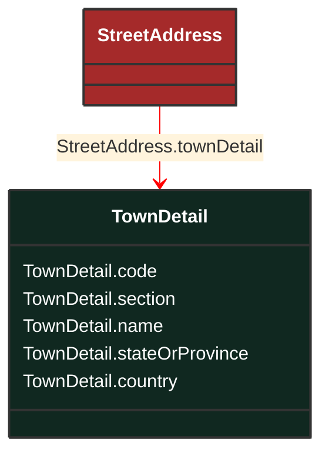

# TownDetail

_Town details, in the context of address._

**URI**: [cim:TownDetail](http://iec.ch/TC57/CIM100#TownDetail) 
**Type**: Class

## Inheritance
* **TownDetail**

## Attributes
| Name | URI | Cardinality and Range | Description | Inheritance |
| ---  | --- | --- | --- | --- |
| code | [cim:TownDetail.code](http://iec.ch/TC57/CIM100#TownDetail.code) | No cardinality available string | Town code. | direct |
| section | [cim:TownDetail.section](http://iec.ch/TC57/CIM100#TownDetail.section) | No cardinality available string | Town section. For example, it is common for there to be 36 sections per township. | direct |
| name | [cim:TownDetail.name](http://iec.ch/TC57/CIM100#TownDetail.name) | No cardinality available string | Town name. | direct |
| stateOrProvince | [cim:TownDetail.stateOrProvince](http://iec.ch/TC57/CIM100#TownDetail.stateOrProvince) | No cardinality available string | Name of the state or province. | direct |
| country | [cim:TownDetail.country](http://iec.ch/TC57/CIM100#TownDetail.country) | No cardinality available string | Name of the country. | direct |

### Schema Source
* from schema: [http://iec.ch/TC57/ns/CIM/GeographicalLocation-EUPackage_GeographicalLocationProfile](http://iec.ch/TC57/ns/CIM/GeographicalLocation-EUPackage_GeographicalLocationProfile)
