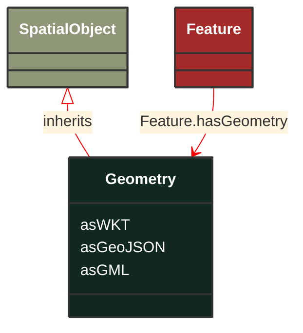

# Geometry

_Geometric representation details._

*__NOTE__: this is an abstract class and should not be instantiated directly

**URI**: [geo:Geometry](http://www.opengis.net/ont/geosparql#Geometry) 
**Type**: Class

## Inheritance
* [SpatialObject](/Models/Profiles/GridCapacity/AbstractClasses/SpatialObject/)
    * **Geometry**

## Attributes
| Name | URI | Cardinality and Range | Description | Inheritance |
| ---  | --- | --- | --- | --- |
| asWKT | [geo:asWKT](http://www.opengis.net/ont/geosparql#asWKT) | 0..1 string | Geometric representation of the spatial object in WKT format. | direct |
| asGeoJSON | [geo:asGeoJSON](http://www.opengis.net/ont/geosparql#asGeoJSON) | 0..1 string | Geometric representation of the spatial object in GeoJSON format. | direct |
| asGML | [geo:asGML](http://www.opengis.net/ont/geosparql#asGML) | 0..1 string | Geometric representation of the spatial object in GML format. | direct |

### Schema Source
* from schema: [https://ap-no.cim4.eu/GridCapacity/1.0](https://ap-no.cim4.eu/GridCapacity/1.0)
