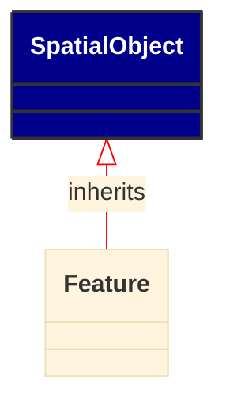

# SpatialObject

_A spatial object is a physical object that has a location in space. It may have a geometric representation to describe its shape and position._

**URI**: [geo:SpatialObject](http://www.opengis.net/ont/geosparql#SpatialObject) 
**Type**: Class

## Inheritance
* **SpatialObject**

## Attributes
| Name | URI | Cardinality and Range | Description | Inheritance |
| ---  | --- | --- | --- | --- |

### Schema Source
* from schema: [https://ap-no.cim4.eu/GridCapacity/1.0](https://ap-no.cim4.eu/GridCapacity/1.0)
