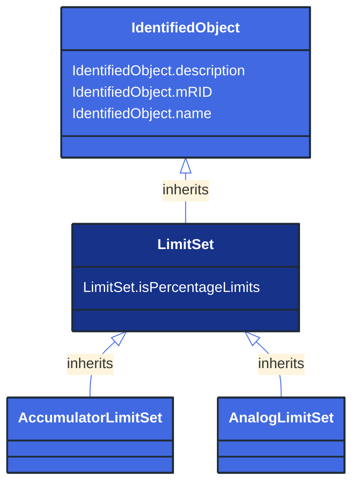

# LimitSet

_Specifies a set of Limits that are associated with a Measurement. A Measurement may have several LimitSets corresponding to seasonal or other changing conditions. The condition is captured in the name and description attributes. The same LimitSet may be used for several Measurements. In particular percentage limits are used this way._

*__NOTE__: this is an abstract class and should not be instantiated directly

**URI**: [cim:LimitSet](http://iec.ch/TC57/CIM100#LimitSet) 
**Type**: Class

## Inheritance
* [IdentifiedObject](/Models/Profiles/Operation/AbstractClasses/IdentifiedObject/)
    * **LimitSet**

## Attributes
| Name | URI | Cardinality and Range | Description | Inheritance |
| ---  | --- | --- | --- | --- |
| isPercentageLimits | [cim:LimitSet.isPercentageLimits](http://iec.ch/TC57/CIM100#LimitSet.isPercentageLimits) | No cardinality available boolean | Tells if the limit values are in percentage of normalValue or the specified Unit for Measurements and Controls. | direct |
| description | [cim:IdentifiedObject.description](http://iec.ch/TC57/CIM100#IdentifiedObject.description) | No cardinality available string | The description is a free human readable text describing or naming the object. It may be non unique and may not correlate to a naming hierarchy. | IdentifiedObject |
| mRID | [cim:IdentifiedObject.mRID](http://iec.ch/TC57/CIM100#IdentifiedObject.mRID) | No cardinality available string | Master resource identifier issued by a model authority. The mRID is unique within an exchange context. Global uniqueness is easily achieved by using a UUID, as specified in RFC 4122, for the mRID. The use of UUID is strongly recommended.
For CIMXML data files in RDF syntax conforming to IEC 61970-552, the mRID is mapped to rdf:ID or rdf:about attributes that identify CIM object elements. | IdentifiedObject |
| name | [cim:IdentifiedObject.name](http://iec.ch/TC57/CIM100#IdentifiedObject.name) | No cardinality available string | The name is any free human readable and possibly non unique text naming the object. | IdentifiedObject |

### Schema Source
* from schema: [http://iec.ch/TC57/ns/CIM/Operation-EUPackage_OperationProfile](http://iec.ch/TC57/ns/CIM/Operation-EUPackage_OperationProfile)
