# Accumulator

_Accumulator represents an accumulated (counted) Measurement, e.g. an energy value._

**URI**: [cim:Accumulator](http://iec.ch/TC57/CIM100#Accumulator) 
**Type**: Class

```mermaid
%%{init: {'theme':'base','themeVariables': {'lineColor': '#FF0000'}}}%%
classDiagram
    class Accumulator
    click Accumulator href "/Models/Profiles/Operation/ConcreteClasses/Accumulator/"
    style Accumulator fill:#102820,stroke:#333,stroke-width:2px,rx:10,ry:10,color:white
     
        Measurement <|-- Accumulator : inherits
            click Measurement href "/Models/Profiles/Operation/AbstractClasses/Measurement/"
            style Measurement fill:#8F9779,stroke:#333,stroke-width:2px,rx:10,ry:10,color:white
     
        IdentifiedObject <|-- Measurement : inherits
            click IdentifiedObject href "/Models/Profiles/Operation/AbstractClasses/IdentifiedObject/"
            style IdentifiedObject fill:#8F9779,stroke:#333,stroke-width:2px,rx:10,ry:10,color:white

        Accumulator --> AccumulatorValue : Accumulator.AccumulatorValues

        AccumulatorValue
            click AccumulatorValue href "/Models/Profiles/Operation/ConcreteClasses/AccumulatorValue/"
            style AccumulatorValue fill:#A52A2A,stroke:#333,stroke-width:2px,rx:10,ry:10,color:white
        Accumulator --> AccumulatorLimitSet : Accumulator.LimitSets

        AccumulatorLimitSet
            click AccumulatorLimitSet href "/Models/Profiles/Operation/ConcreteClasses/AccumulatorLimitSet/"
            style AccumulatorLimitSet fill:#A52A2A,stroke:#333,stroke-width:2px,rx:10,ry:10,color:white
        Measurement --> ACDCTerminal : Measurement.Terminal

        ACDCTerminal
            click ACDCTerminal href "/Models/Profiles/Operation/AbstractClasses/ACDCTerminal/"
            style ACDCTerminal fill:#A52A2A,stroke:#333,stroke-width:2px,rx:10,ry:10,color:white
        Measurement --> PowerSystemResource : Measurement.PowerSystemResource

        PowerSystemResource
            click PowerSystemResource href "/Models/Profiles/Operation/AbstractClasses/PowerSystemResource/"
            style PowerSystemResource fill:#A52A2A,stroke:#333,stroke-width:2px,rx:10,ry:10,color:white

        AccumulatorLimitSet --> Accumulator : AccumulatorLimitSet.Measurements

        AccumulatorLimitSet
            click AccumulatorLimitSet href "/Models/Profiles/Operation/ConcreteClasses/AccumulatorLimitSet/"
            style AccumulatorLimitSet fill:#A52A2A,stroke:#333,stroke-width:2px,rx:10,ry:10,color:white

        AccumulatorValue --> Accumulator : AccumulatorValue.Accumulator

        AccumulatorValue
            click AccumulatorValue href "/Models/Profiles/Operation/ConcreteClasses/AccumulatorValue/"
            style AccumulatorValue fill:#A52A2A,stroke:#333,stroke-width:2px,rx:10,ry:10,color:white

        ACDCTerminal --> Measurement : ACDCTerminal.Measurements

        ACDCTerminal
            click ACDCTerminal href "/Models/Profiles/Operation/AbstractClasses/ACDCTerminal/"
            style ACDCTerminal fill:#A52A2A,stroke:#333,stroke-width:2px,rx:10,ry:10,color:white

        PowerSystemResource --> Measurement : PowerSystemResource.Measurements

        PowerSystemResource
            click PowerSystemResource href "/Models/Profiles/Operation/AbstractClasses/PowerSystemResource/"
            style PowerSystemResource fill:#A52A2A,stroke:#333,stroke-width:2px,rx:10,ry:10,color:white

        Measurement --> PhaseCode : Measurement.phases

        PhaseCode
            click PhaseCode href "/Models/Profiles/Operation/Enumerations/PhaseCode/"
            style PhaseCode fill:#4D2D18,stroke:#333,stroke-width:2px,rx:10,ry:10,color:white
        Measurement --> UnitMultiplier : Measurement.unitMultiplier

        UnitMultiplier
            click UnitMultiplier href "/Models/Profiles/Operation/Enumerations/UnitMultiplier/"
            style UnitMultiplier fill:#4D2D18,stroke:#333,stroke-width:2px,rx:10,ry:10,color:white
        Measurement --> UnitSymbol : Measurement.unitSymbol

        UnitSymbol
            click UnitSymbol href "/Models/Profiles/Operation/Enumerations/UnitSymbol/"
            style UnitSymbol fill:#4D2D18,stroke:#333,stroke-width:2px,rx:10,ry:10,color:white

        Accumulator : Accumulator.AccumulatorValues
        Accumulator : Accumulator.LimitSets
        Measurement : Measurement.Terminal
        Measurement : Measurement.measurementType
        Measurement : Measurement.phases
        Measurement : Measurement.unitMultiplier
        Measurement : Measurement.unitSymbol
        Measurement : Measurement.PowerSystemResource
        IdentifiedObject : IdentifiedObject.description
        IdentifiedObject : IdentifiedObject.mRID
        IdentifiedObject : IdentifiedObject.name
```

## Inheritance
* [IdentifiedObject](/Models/Profiles/Operation/AbstractClasses/IdentifiedObject/)
    * [Measurement](/Models/Profiles/Operation/AbstractClasses/Measurement/)
        * **Accumulator**

## Attributes
| Name | URI | Cardinality and Range | Description | Inheritance |
| ---  | --- | --- | --- | --- |
| AccumulatorValues | [cim:Accumulator.AccumulatorValues](http://iec.ch/TC57/CIM100#Accumulator.AccumulatorValues) | No cardinality available AccumulatorValue | The values connected to this measurement. | direct |
| LimitSets | [cim:Accumulator.LimitSets](http://iec.ch/TC57/CIM100#Accumulator.LimitSets) | No cardinality available AccumulatorLimitSet | A measurement may have zero or more limit ranges defined for it. | direct |
| Terminal | [cim:Measurement.Terminal](http://iec.ch/TC57/CIM100#Measurement.Terminal) | No cardinality available ACDCTerminal | One or more measurements may be associated with a terminal in the network. | Measurement |
| measurementType | [cim:Measurement.measurementType](http://iec.ch/TC57/CIM100#Measurement.measurementType) | No cardinality available string | Specifies the type of measurement.  For example, this specifies if the measurement represents an indoor temperature, outdoor temperature, bus voltage, line flow, etc.
When the measurementType is set to "Specialization", the type of Measurement is defined in more detail by the specialized class which inherits from Measurement. | Measurement |
| phases | [cim:Measurement.phases](http://iec.ch/TC57/CIM100#Measurement.phases) | No cardinality available PhaseCode | Indicates to which phases the measurement applies and avoids the need to use 'measurementType' to also encode phase information (which would explode the types). The phase information in Measurement, along with 'measurementType' and 'phases' uniquely defines a Measurement for a device, based on normal network phase. Their meaning will not change when the computed energizing phasing is changed due to jumpers or other reasons.
If the attribute is missing three phases (ABC) shall be assumed. | Measurement |
| unitMultiplier | [cim:Measurement.unitMultiplier](http://iec.ch/TC57/CIM100#Measurement.unitMultiplier) | No cardinality available UnitMultiplier | The unit multiplier of the measured quantity. | Measurement |
| unitSymbol | [cim:Measurement.unitSymbol](http://iec.ch/TC57/CIM100#Measurement.unitSymbol) | No cardinality available UnitSymbol | The unit of measure of the measured quantity. | Measurement |
| PowerSystemResource | [cim:Measurement.PowerSystemResource](http://iec.ch/TC57/CIM100#Measurement.PowerSystemResource) | No cardinality available PowerSystemResource | The power system resource that contains the measurement. | Measurement |
| description | [cim:IdentifiedObject.description](http://iec.ch/TC57/CIM100#IdentifiedObject.description) | No cardinality available string | The description is a free human readable text describing or naming the object. It may be non unique and may not correlate to a naming hierarchy. | IdentifiedObject |
| mRID | [cim:IdentifiedObject.mRID](http://iec.ch/TC57/CIM100#IdentifiedObject.mRID) | No cardinality available string | Master resource identifier issued by a model authority. The mRID is unique within an exchange context. Global uniqueness is easily achieved by using a UUID, as specified in RFC 4122, for the mRID. The use of UUID is strongly recommended.
For CIMXML data files in RDF syntax conforming to IEC 61970-552, the mRID is mapped to rdf:ID or rdf:about attributes that identify CIM object elements. | IdentifiedObject |
| name | [cim:IdentifiedObject.name](http://iec.ch/TC57/CIM100#IdentifiedObject.name) | No cardinality available string | The name is any free human readable and possibly non unique text naming the object. | IdentifiedObject |

### Schema Source
* from schema: [http://iec.ch/TC57/ns/CIM/Operation-EUPackage_OperationProfile](http://iec.ch/TC57/ns/CIM/Operation-EUPackage_OperationProfile)
