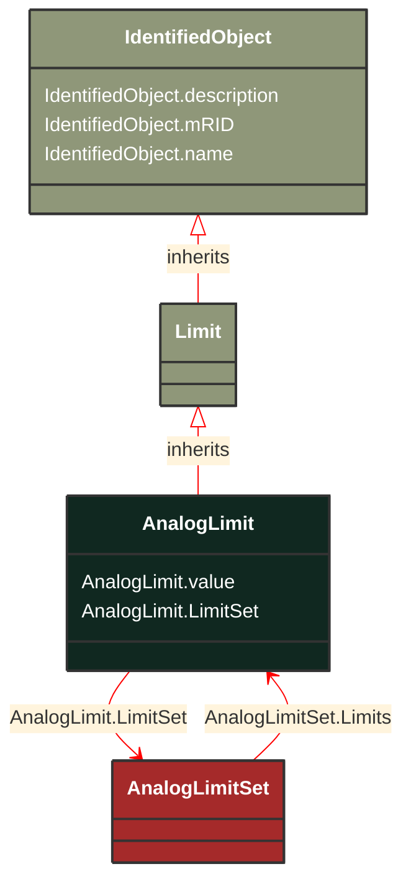

# AnalogLimit

_Limit values for Analog measurements._

**URI**: [cim:AnalogLimit](http://iec.ch/TC57/CIM100#AnalogLimit) 
**Type**: Class

## Inheritance
* [IdentifiedObject](/Models/Profiles/Operation/AbstractClasses/IdentifiedObject/)
    * [Limit](/Models/Profiles/Operation/AbstractClasses/Limit/)
        * **AnalogLimit**

## Attributes
| Name | URI | Cardinality and Range | Description | Inheritance |
| ---  | --- | --- | --- | --- |
| value | [cim:AnalogLimit.value](http://iec.ch/TC57/CIM100#AnalogLimit.value) | No cardinality available float | The value to supervise against. | direct |
| LimitSet | [cim:AnalogLimit.LimitSet](http://iec.ch/TC57/CIM100#AnalogLimit.LimitSet) | No cardinality available AnalogLimitSet | The set of limits. | direct |
| description | [cim:IdentifiedObject.description](http://iec.ch/TC57/CIM100#IdentifiedObject.description) | No cardinality available string | The description is a free human readable text describing or naming the object. It may be non unique and may not correlate to a naming hierarchy. | IdentifiedObject |
| mRID | [cim:IdentifiedObject.mRID](http://iec.ch/TC57/CIM100#IdentifiedObject.mRID) | No cardinality available string | Master resource identifier issued by a model authority. The mRID is unique within an exchange context. Global uniqueness is easily achieved by using a UUID, as specified in RFC 4122, for the mRID. The use of UUID is strongly recommended.
For CIMXML data files in RDF syntax conforming to IEC 61970-552, the mRID is mapped to rdf:ID or rdf:about attributes that identify CIM object elements. | IdentifiedObject |
| name | [cim:IdentifiedObject.name](http://iec.ch/TC57/CIM100#IdentifiedObject.name) | No cardinality available string | The name is any free human readable and possibly non unique text naming the object. | IdentifiedObject |

### Schema Source
* from schema: [http://iec.ch/TC57/ns/CIM/Operation-EUPackage_OperationProfile](http://iec.ch/TC57/ns/CIM/Operation-EUPackage_OperationProfile)
