# MeasurementValue

_The current state for a measurement. A state value is an instance of a measurement from a specific source. Measurements can be associated with many state values, each representing a different source for the measurement._

**URI**: [cim:MeasurementValue](http://iec.ch/TC57/CIM100#MeasurementValue) 
**Type**: Class

```mermaid
%%{init: {'theme':'base','themeVariables': {'lineColor': '#FF0000'}}}%%
classDiagram
    class MeasurementValue
    click MeasurementValue href "/Models/Profiles/Operation/ConcreteClasses/MeasurementValue/"
    style MeasurementValue fill:#102820,stroke:#333,stroke-width:2px,rx:10,ry:10,color:white

        MeasurementValue <|-- AccumulatorValue : inherits

        AccumulatorValue
            click AccumulatorValue href "/Models/Profiles/Operation/ConcreteClasses/AccumulatorValue/"
            style AccumulatorValue fill:#8F9779,stroke:#333,stroke-width:2px,rx:10,ry:10,color:white

        MeasurementValue <|-- AnalogValue : inherits

        AnalogValue
            click AnalogValue href "/Models/Profiles/Operation/ConcreteClasses/AnalogValue/"
            style AnalogValue fill:#8F9779,stroke:#333,stroke-width:2px,rx:10,ry:10,color:white

        MeasurementValue <|-- DiscreteValue : inherits

        DiscreteValue
            click DiscreteValue href "/Models/Profiles/Operation/ConcreteClasses/DiscreteValue/"
            style DiscreteValue fill:#8F9779,stroke:#333,stroke-width:2px,rx:10,ry:10,color:white

        MeasurementValue <|-- StringMeasurementValue : inherits

        StringMeasurementValue
            click StringMeasurementValue href "/Models/Profiles/Operation/ConcreteClasses/StringMeasurementValue/"
            style StringMeasurementValue fill:#8F9779,stroke:#333,stroke-width:2px,rx:10,ry:10,color:white
     
        IOPoint <|-- MeasurementValue : inherits
            click IOPoint href "/Models/Profiles/Operation/ConcreteClasses/IOPoint/"
            style IOPoint fill:#8F9779,stroke:#333,stroke-width:2px,rx:10,ry:10,color:white
     
        IdentifiedObject <|-- IOPoint : inherits
            click IdentifiedObject href "/Models/Profiles/Operation/ConcreteClasses/IdentifiedObject/"
            style IdentifiedObject fill:#8F9779,stroke:#333,stroke-width:2px,rx:10,ry:10,color:white

        MeasurementValue --> PerCent : MeasurementValue.sensorAccuracy

        PerCent
            click PerCent href "/Models/Profiles/Operation/ConcreteClasses/PerCent/"
            style PerCent fill:#A52A2A,stroke:#333,stroke-width:2px,rx:10,ry:10,color:white
        MeasurementValue --> MeasurementValueQuality : MeasurementValue.MeasurementValueQuality

        MeasurementValueQuality
            click MeasurementValueQuality href "/Models/Profiles/Operation/ConcreteClasses/MeasurementValueQuality/"
            style MeasurementValueQuality fill:#A52A2A,stroke:#333,stroke-width:2px,rx:10,ry:10,color:white
        MeasurementValue --> MeasurementValueSource : MeasurementValue.MeasurementValueSource

        MeasurementValueSource
            click MeasurementValueSource href "/Models/Profiles/Operation/ConcreteClasses/MeasurementValueSource/"
            style MeasurementValueSource fill:#A52A2A,stroke:#333,stroke-width:2px,rx:10,ry:10,color:white

        MeasurementValueQuality --> MeasurementValue : MeasurementValueQuality.MeasurementValue

        MeasurementValueQuality
            click MeasurementValueQuality href "/Models/Profiles/Operation/ConcreteClasses/MeasurementValueQuality/"
            style MeasurementValueQuality fill:#A52A2A,stroke:#333,stroke-width:2px,rx:10,ry:10,color:white

        MeasurementValueSource --> MeasurementValue : MeasurementValueSource.MeasurementValues

        MeasurementValueSource
            click MeasurementValueSource href "/Models/Profiles/Operation/ConcreteClasses/MeasurementValueSource/"
            style MeasurementValueSource fill:#A52A2A,stroke:#333,stroke-width:2px,rx:10,ry:10,color:white


        MeasurementValue : MeasurementValue.timeStamp
        MeasurementValue : MeasurementValue.sensorAccuracy
        MeasurementValue : MeasurementValue.MeasurementValueQuality
        MeasurementValue : MeasurementValue.MeasurementValueSource
        IdentifiedObject : IdentifiedObject.description
        IdentifiedObject : IdentifiedObject.mRID
        IdentifiedObject : IdentifiedObject.name
```

## Inheritance
* [IdentifiedObject](/Models/Profiles/Operation/ConcreteClasses/IdentifiedObject/)
    * [IOPoint](/Models/Profiles/Operation/ConcreteClasses/IOPoint/)
        * **MeasurementValue**

## Attributes
| Name | URI | Cardinality and Range | Description | Inheritance |
| ---  | --- | --- | --- | --- |
| timeStamp | [cim:MeasurementValue.timeStamp](http://iec.ch/TC57/CIM100#MeasurementValue.timeStamp) | No cardinality available date | The time when the value was last updated. | direct |
| sensorAccuracy | [cim:MeasurementValue.sensorAccuracy](http://iec.ch/TC57/CIM100#MeasurementValue.sensorAccuracy) | No cardinality available PerCent | The limit, expressed as a percentage of the sensor maximum, that errors will not exceed when the sensor is used under  reference conditions. | direct |
| MeasurementValueQuality | [cim:MeasurementValue.MeasurementValueQuality](http://iec.ch/TC57/CIM100#MeasurementValue.MeasurementValueQuality) | No cardinality available MeasurementValueQuality | A MeasurementValue has a MeasurementValueQuality associated with it. | direct |
| MeasurementValueSource | [cim:MeasurementValue.MeasurementValueSource](http://iec.ch/TC57/CIM100#MeasurementValue.MeasurementValueSource) | No cardinality available MeasurementValueSource | A reference to the type of source that updates the MeasurementValue, e.g. SCADA, CCLink, manual, etc. User conventions for the names of sources are contained in the introduction to IEC 61970-301. | direct |
| description | [cim:IdentifiedObject.description](http://iec.ch/TC57/CIM100#IdentifiedObject.description) | No cardinality available string | The description is a free human readable text describing or naming the object. It may be non unique and may not correlate to a naming hierarchy. | IdentifiedObject |
| mRID | [cim:IdentifiedObject.mRID](http://iec.ch/TC57/CIM100#IdentifiedObject.mRID) | No cardinality available string | Master resource identifier issued by a model authority. The mRID is unique within an exchange context. Global uniqueness is easily achieved by using a UUID, as specified in RFC 4122, for the mRID. The use of UUID is strongly recommended.
For CIMXML data files in RDF syntax conforming to IEC 61970-552, the mRID is mapped to rdf:ID or rdf:about attributes that identify CIM object elements. | IdentifiedObject |
| name | [cim:IdentifiedObject.name](http://iec.ch/TC57/CIM100#IdentifiedObject.name) | No cardinality available string | The name is any free human readable and possibly non unique text naming the object. | IdentifiedObject |

### Schema Source
* from schema: [http://iec.ch/TC57/ns/CIM/Operation-EUPackage_OperationProfile](http://iec.ch/TC57/ns/CIM/Operation-EUPackage_OperationProfile)
