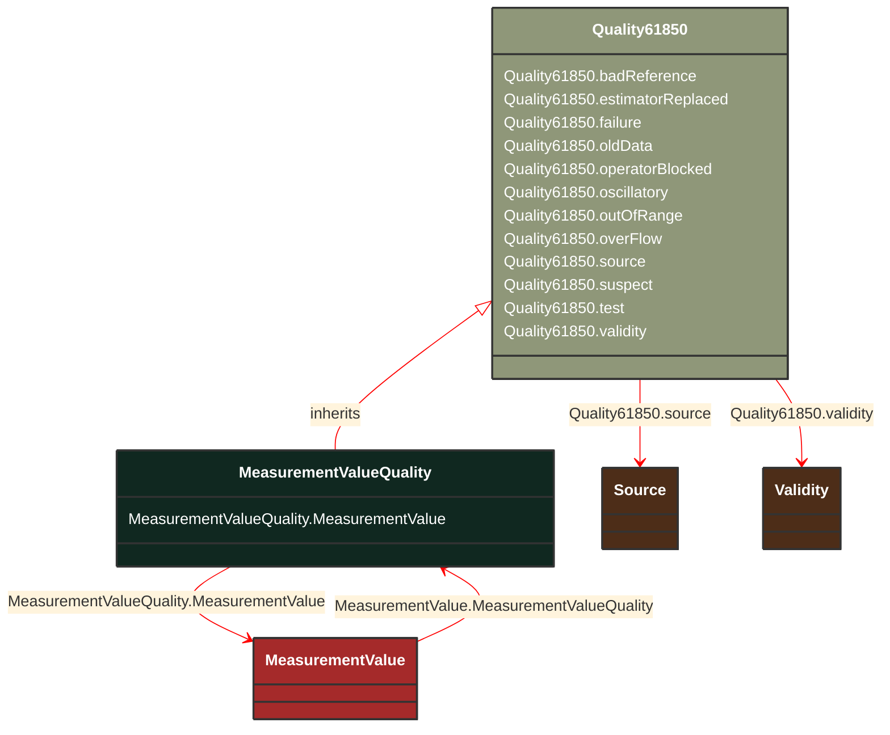

# MeasurementValueQuality

_Measurement quality flags. Bits 0-10 are defined for substation automation in IEC 61850-7-3. Bits 11-15 are reserved for future expansion by that document. Bits 16-31 are reserved for EMS applications._

**URI**: [cim:MeasurementValueQuality](http://iec.ch/TC57/CIM100#MeasurementValueQuality) 
**Type**: Class

## Inheritance
* [Quality61850](/Models/Profiles/Operation/ConcreteClasses/Quality61850/)
    * **MeasurementValueQuality**

## Attributes
| Name | URI | Cardinality and Range | Description | Inheritance |
| ---  | --- | --- | --- | --- |
| MeasurementValue | [cim:MeasurementValueQuality.MeasurementValue](http://iec.ch/TC57/CIM100#MeasurementValueQuality.MeasurementValue) | No cardinality available MeasurementValue | A MeasurementValue has a MeasurementValueQuality associated with it. | direct |
| badReference | [cim:Quality61850.badReference](http://iec.ch/TC57/CIM100#Quality61850.badReference) | No cardinality available boolean | Measurement value may be incorrect due to a reference being out of calibration. | Quality61850 |
| estimatorReplaced | [cim:Quality61850.estimatorReplaced](http://iec.ch/TC57/CIM100#Quality61850.estimatorReplaced) | No cardinality available boolean | Value has been replaced by State Estimator. estimatorReplaced is not an IEC61850 quality bit but has been put in this class for convenience. | Quality61850 |
| failure | [cim:Quality61850.failure](http://iec.ch/TC57/CIM100#Quality61850.failure) | No cardinality available boolean | This identifier indicates that a supervision function has detected an internal or external failure, e.g. communication failure. | Quality61850 |
| oldData | [cim:Quality61850.oldData](http://iec.ch/TC57/CIM100#Quality61850.oldData) | No cardinality available boolean | Measurement value is old and possibly invalid, as it has not been successfully updated during a specified time interval. | Quality61850 |
| operatorBlocked | [cim:Quality61850.operatorBlocked](http://iec.ch/TC57/CIM100#Quality61850.operatorBlocked) | No cardinality available boolean | Measurement value is blocked and hence unavailable for transmission. | Quality61850 |
| oscillatory | [cim:Quality61850.oscillatory](http://iec.ch/TC57/CIM100#Quality61850.oscillatory) | No cardinality available boolean | To prevent some overload of the communication it is sensible to detect and suppress oscillating (fast changing) binary inputs. If a signal changes in a defined time twice in the same direction (from 0 to 1 or from 1 to 0) then oscillation is detected and the detail quality identifier "oscillatory" is set. If it is detected a configured numbers of transient changes could be passed by. In this time the validity status "questionable" is set. If after this defined numbers of changes the signal is still in the oscillating state the value shall be set either to the opposite state of the previous stable value or to a defined default value. In this case the validity status "questionable" is reset and "invalid" is set as long as the signal is oscillating. If it is configured such that no transient changes should be passed by then the validity status "invalid" is set immediately in addition to the detail quality identifier "oscillatory" (used for status information only). | Quality61850 |
| outOfRange | [cim:Quality61850.outOfRange](http://iec.ch/TC57/CIM100#Quality61850.outOfRange) | No cardinality available boolean | Measurement value is beyond a predefined range of value. | Quality61850 |
| overFlow | [cim:Quality61850.overFlow](http://iec.ch/TC57/CIM100#Quality61850.overFlow) | No cardinality available boolean | Measurement value is beyond the capability of being  represented properly. For example, a counter value overflows from maximum count back to a value of zero. | Quality61850 |
| source | [cim:Quality61850.source](http://iec.ch/TC57/CIM100#Quality61850.source) | No cardinality available Source | Source gives information related to the origin of a value. The value may be acquired from the process, defaulted or substituted. | Quality61850 |
| suspect | [cim:Quality61850.suspect](http://iec.ch/TC57/CIM100#Quality61850.suspect) | No cardinality available boolean | A correlation function has detected that the value is not consistent with other values. Typically set by a network State Estimator. | Quality61850 |
| test | [cim:Quality61850.test](http://iec.ch/TC57/CIM100#Quality61850.test) | No cardinality available boolean | Measurement value is transmitted for test purposes. | Quality61850 |
| validity | [cim:Quality61850.validity](http://iec.ch/TC57/CIM100#Quality61850.validity) | No cardinality available Validity | Validity of the measurement value. | Quality61850 |

### Schema Source
* from schema: [http://iec.ch/TC57/ns/CIM/Operation-EUPackage_OperationProfile](http://iec.ch/TC57/ns/CIM/Operation-EUPackage_OperationProfile)
