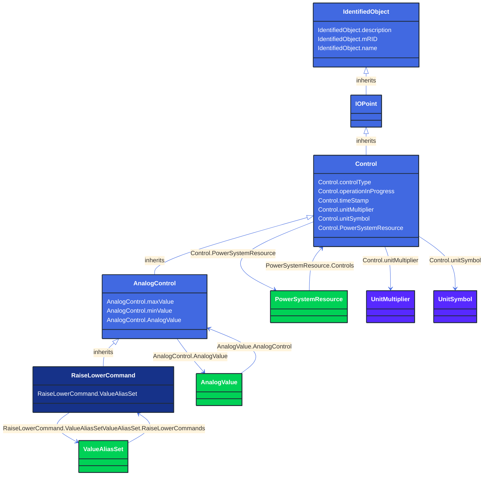

# RaiseLowerCommand

_An analog control that increases or decreases a set point value with pulses. Unless otherwise specified, one pulse moves the set point by one._

**URI**: [cim:RaiseLowerCommand](http://iec.ch/TC57/CIM100#RaiseLowerCommand) 
**Type**: Class

## Inheritance
* [IdentifiedObject](/Models/Profiles/Operation/AbstractClasses/IdentifiedObject/)
    * [IOPoint](/Models/Profiles/Operation/AbstractClasses/IOPoint/)
        * [Control](/Models/Profiles/Operation/AbstractClasses/Control/)
            * [AnalogControl](/Models/Profiles/Operation/AbstractClasses/AnalogControl/)
                * **RaiseLowerCommand**

## Attributes
| Name | URI | Cardinality and Range | Description | Inheritance |
| ---  | --- | --- | --- | --- |
| ValueAliasSet | [cim:RaiseLowerCommand.ValueAliasSet](http://iec.ch/TC57/CIM100#RaiseLowerCommand.ValueAliasSet) | No cardinality available ValueAliasSet | The ValueAliasSet used for translation of a Control value to a name. | direct |
| maxValue | [cim:AnalogControl.maxValue](http://iec.ch/TC57/CIM100#AnalogControl.maxValue) | No cardinality available float | Normal value range maximum for any of the Control.value. Used for scaling, e.g. in bar graphs. | AnalogControl |
| minValue | [cim:AnalogControl.minValue](http://iec.ch/TC57/CIM100#AnalogControl.minValue) | No cardinality available float | Normal value range minimum for any of the Control.value. Used for scaling, e.g. in bar graphs. | AnalogControl |
| AnalogValue | [cim:AnalogControl.AnalogValue](http://iec.ch/TC57/CIM100#AnalogControl.AnalogValue) | No cardinality available AnalogValue | The MeasurementValue that is controlled. | AnalogControl |
| controlType | [cim:Control.controlType](http://iec.ch/TC57/CIM100#Control.controlType) | No cardinality available string | Specifies the type of Control. For example, this specifies if the Control represents BreakerOpen, BreakerClose, GeneratorVoltageSetPoint, GeneratorRaise, GeneratorLower, etc. | Control |
| operationInProgress | [cim:Control.operationInProgress](http://iec.ch/TC57/CIM100#Control.operationInProgress) | No cardinality available boolean | Indicates that a client is currently sending control commands that has not completed. | Control |
| timeStamp | [cim:Control.timeStamp](http://iec.ch/TC57/CIM100#Control.timeStamp) | No cardinality available date | The last time a control output was sent. | Control |
| unitMultiplier | [cim:Control.unitMultiplier](http://iec.ch/TC57/CIM100#Control.unitMultiplier) | No cardinality available UnitMultiplier | The unit multiplier of the controlled quantity. | Control |
| unitSymbol | [cim:Control.unitSymbol](http://iec.ch/TC57/CIM100#Control.unitSymbol) | No cardinality available UnitSymbol | The unit of measure of the controlled quantity. | Control |
| PowerSystemResource | [cim:Control.PowerSystemResource](http://iec.ch/TC57/CIM100#Control.PowerSystemResource) | No cardinality available PowerSystemResource | Regulating device governed by this control output. | Control |
| description | [cim:IdentifiedObject.description](http://iec.ch/TC57/CIM100#IdentifiedObject.description) | No cardinality available string | The description is a free human readable text describing or naming the object. It may be non unique and may not correlate to a naming hierarchy. | IdentifiedObject |
| mRID | [cim:IdentifiedObject.mRID](http://iec.ch/TC57/CIM100#IdentifiedObject.mRID) | No cardinality available string | Master resource identifier issued by a model authority. The mRID is unique within an exchange context. Global uniqueness is easily achieved by using a UUID, as specified in RFC 4122, for the mRID. The use of UUID is strongly recommended.
For CIMXML data files in RDF syntax conforming to IEC 61970-552, the mRID is mapped to rdf:ID or rdf:about attributes that identify CIM object elements. | IdentifiedObject |
| name | [cim:IdentifiedObject.name](http://iec.ch/TC57/CIM100#IdentifiedObject.name) | No cardinality available string | The name is any free human readable and possibly non unique text naming the object. | IdentifiedObject |

### Schema Source
* from schema: [http://iec.ch/TC57/ns/CIM/Operation-EUPackage_OperationProfile](http://iec.ch/TC57/ns/CIM/Operation-EUPackage_OperationProfile)
