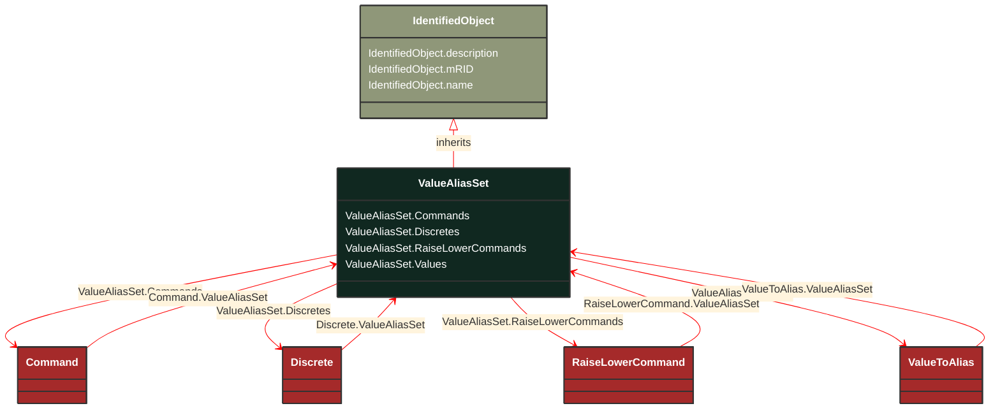

# ValueAliasSet

_Describes the translation of a set of values into a name and is intendend to facilitate custom translations. Each ValueAliasSet has a name, description etc. A specific Measurement may represent a discrete state like Open, Closed, Intermediate etc. This requires a translation from the MeasurementValue.value number to a string, e.g. 0-&gt;"Invalid", 1-&gt;"Open", 2-&gt;"Closed", 3-&gt;"Intermediate". Each ValueToAlias member in ValueAliasSet.Value describe a mapping for one particular value to a name._

**URI**: [cim:ValueAliasSet](http://iec.ch/TC57/CIM100#ValueAliasSet) 
**Type**: Class

## Inheritance
* [IdentifiedObject](/Models/Profiles/Operation/AbstractClasses/IdentifiedObject/)
    * **ValueAliasSet**

## Attributes
| Name | URI | Cardinality and Range | Description | Inheritance |
| ---  | --- | --- | --- | --- |
| Commands | [cim:ValueAliasSet.Commands](http://iec.ch/TC57/CIM100#ValueAliasSet.Commands) | No cardinality available Command | The Commands using the set for translation. | direct |
| Discretes | [cim:ValueAliasSet.Discretes](http://iec.ch/TC57/CIM100#ValueAliasSet.Discretes) | No cardinality available Discrete | The Measurements using the set for translation. | direct |
| RaiseLowerCommands | [cim:ValueAliasSet.RaiseLowerCommands](http://iec.ch/TC57/CIM100#ValueAliasSet.RaiseLowerCommands) | No cardinality available RaiseLowerCommand | The Commands using the set for translation. | direct |
| Values | [cim:ValueAliasSet.Values](http://iec.ch/TC57/CIM100#ValueAliasSet.Values) | No cardinality available ValueToAlias | The ValueToAlias mappings included in the set. | direct |
| description | [cim:IdentifiedObject.description](http://iec.ch/TC57/CIM100#IdentifiedObject.description) | No cardinality available string | The description is a free human readable text describing or naming the object. It may be non unique and may not correlate to a naming hierarchy. | IdentifiedObject |
| mRID | [cim:IdentifiedObject.mRID](http://iec.ch/TC57/CIM100#IdentifiedObject.mRID) | No cardinality available string | Master resource identifier issued by a model authority. The mRID is unique within an exchange context. Global uniqueness is easily achieved by using a UUID, as specified in RFC 4122, for the mRID. The use of UUID is strongly recommended.
For CIMXML data files in RDF syntax conforming to IEC 61970-552, the mRID is mapped to rdf:ID or rdf:about attributes that identify CIM object elements. | IdentifiedObject |
| name | [cim:IdentifiedObject.name](http://iec.ch/TC57/CIM100#IdentifiedObject.name) | No cardinality available string | The name is any free human readable and possibly non unique text naming the object. | IdentifiedObject |

### Schema Source
* from schema: [http://iec.ch/TC57/ns/CIM/Operation-EUPackage_OperationProfile](http://iec.ch/TC57/ns/CIM/Operation-EUPackage_OperationProfile)
