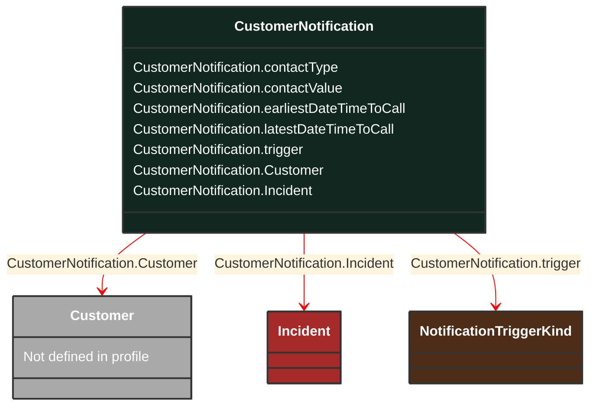

# CustomerNotification

_Conditions for notifying the customer about the changes in the status of their service (e.g., outage restore, estimated restoration time, tariff or service level change, etc.)_

*__NOTE__: this is an abstract class and should not be instantiated directly

**URI**: [cim:CustomerNotification](http://iec.ch/TC57/CIM100#CustomerNotification) 
**Type**: Class

## Inheritance
* **CustomerNotification**

## Attributes
| Name | URI | Cardinality and Range | Description | Inheritance |
| ---  | --- | --- | --- | --- |
| contactType | [cim:CustomerNotification.contactType](http://iec.ch/TC57/CIM100#CustomerNotification.contactType) | 0..1 string | Type of contact (e.g., phone, email, etc.). | direct |
| contactValue | [cim:CustomerNotification.contactValue](http://iec.ch/TC57/CIM100#CustomerNotification.contactValue) | 0..1 string | Value of contact type (e.g., phone number, email address, etc.). | direct |
| earliestDateTimeToCall | [cim:CustomerNotification.earliestDateTimeToCall](http://iec.ch/TC57/CIM100#CustomerNotification.earliestDateTimeToCall) | 0..1 datetime | Earliest date time to call the customer. | direct |
| latestDateTimeToCall | [cim:CustomerNotification.latestDateTimeToCall](http://iec.ch/TC57/CIM100#CustomerNotification.latestDateTimeToCall) | 0..1 datetime | Latest date time to call the customer. | direct |
| trigger | [cim:CustomerNotification.trigger](http://iec.ch/TC57/CIM100#CustomerNotification.trigger) | 0..1 NotificationTriggerKind | Trigger for this notification. | direct |
| Customer | [cim:CustomerNotification.Customer](http://iec.ch/TC57/CIM100#CustomerNotification.Customer) | 0..1 Customer | Customer requiring this notification. | direct |
| Incident | [cim:CustomerNotification.Incident](http://iec.ch/TC57/CIM100#CustomerNotification.Incident) | 0..1 Incident | Incident as a subject of this customer notification. | direct |

### Schema Source
* from schema: [http://iec.ch/TC57/2007/profile](http://iec.ch/TC57/2007/profile)
