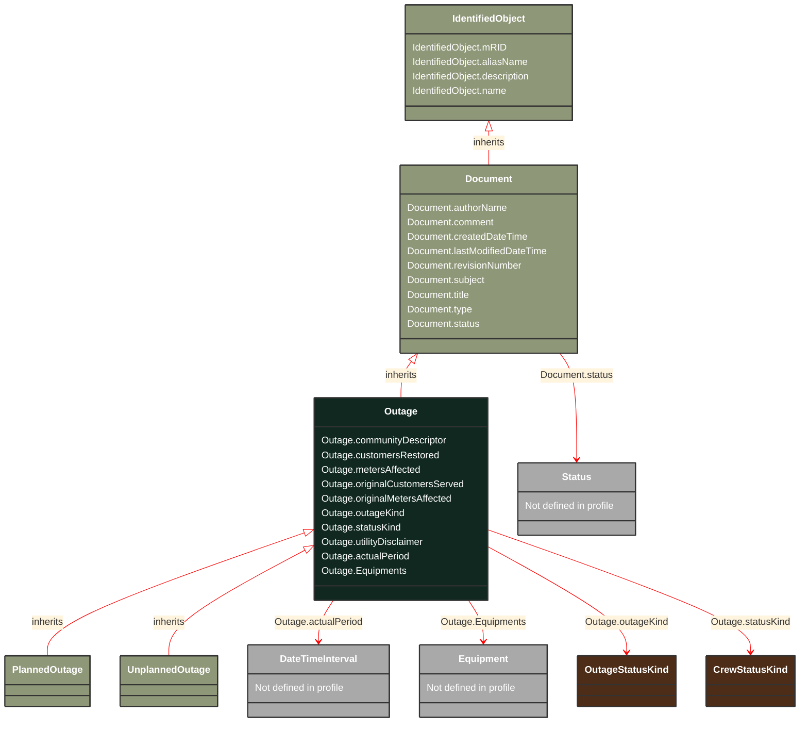

# Outage

_Document describing details of an active or planned outage in a part of the electrical network.A non-planned outage may be created upon:- a breaker trip,- a fault indicator status change,- a meter event indicating customer outage,- a reception of one or more customer trouble calls, or- an operator command, reflecting information obtained from the field crew.Outage restoration may be performed using a switching plan which complements the outage information with detailed switching activities, including the relationship to the crew and work.A planned outage may be created upon:- a request for service, maintenance or construction work in the field, or- an operator-defined outage for what-if/contingency network analysis._

*__NOTE__: this is an abstract class and should not be instantiated directly

**URI**: [cim:Outage](http://iec.ch/TC57/CIM100#Outage) 
**Type**: Class

## Inheritance
* [IdentifiedObject](/Models/Profiles/Outage/AbstractClasses/IdentifiedObject/)
    * [Document](/Models/Profiles/Outage/AbstractClasses/Document/)
        * **Outage**

## Attributes
| Name | URI | Cardinality and Range | Description | Inheritance |
| ---  | --- | --- | --- | --- |
| communityDescriptor | [cim:Outage.communityDescriptor](http://iec.ch/TC57/CIM100#Outage.communityDescriptor) | 0..1 string | a name to denote the community - this could be a name or a code of some kind. | direct |
| customersRestored | [cim:Outage.customersRestored](http://iec.ch/TC57/CIM100#Outage.customersRestored) | 0..1 integer | number of customers that have been restored in the area. | direct |
| metersAffected | [cim:Outage.metersAffected](http://iec.ch/TC57/CIM100#Outage.metersAffected) | 0..1 integer | The updated number of meters affected by the outage as reported by the OMS within the utility.  It is assumed this number will be updated repeatedly until the full outage is resolved. | direct |
| originalCustomersServed | [cim:Outage.originalCustomersServed](http://iec.ch/TC57/CIM100#Outage.originalCustomersServed) | 0..1 integer | the total number of customers that are served in the area (both outaged and not outaged). | direct |
| originalMetersAffected | [cim:Outage.originalMetersAffected](http://iec.ch/TC57/CIM100#Outage.originalMetersAffected) | 0..1 integer | The original number of meters that were affected as reported by the OMS within the utility. That is, this is the total number of meters that were out at the beginning of the outage. | direct |
| outageKind | [cim:Outage.outageKind](http://iec.ch/TC57/CIM100#Outage.outageKind) | 0..1 OutageStatusKind | Defines if the outage has been verified or is only estimated | direct |
| statusKind | [cim:Outage.statusKind](http://iec.ch/TC57/CIM100#Outage.statusKind) | 0..1 CrewStatusKind | defines the status of the crew as in dispatched or arrived, etc. | direct |
| utilityDisclaimer | [cim:Outage.utilityDisclaimer](http://iec.ch/TC57/CIM100#Outage.utilityDisclaimer) | 0..1 string | This contains an disclaimers the utility would like to place on the data provided to any stakeholder.  This may be different for different stakeholders.  This should possibly be an attribute under the Organization class but it is placed here for now. | direct |
| actualPeriod | [cim:Outage.actualPeriod](http://iec.ch/TC57/CIM100#Outage.actualPeriod) | 0..1 DateTimeInterval | Actual outage period; end of the period corresponds to the actual restoration time. | direct |
| Equipments | [cim:Outage.Equipments](http://iec.ch/TC57/CIM100#Outage.Equipments) | 0..* Equipment | All equipments associated with this outage. | direct |
| authorName | [cim:Document.authorName](http://iec.ch/TC57/CIM100#Document.authorName) | 0..1 string | Name of the author of this document. | Document |
| comment | [cim:Document.comment](http://iec.ch/TC57/CIM100#Document.comment) | 0..1 string | Free text comment. | Document |
| createdDateTime | [cim:Document.createdDateTime](http://iec.ch/TC57/CIM100#Document.createdDateTime) | 0..1 datetime | Date and time that this document was created. | Document |
| lastModifiedDateTime | [cim:Document.lastModifiedDateTime](http://iec.ch/TC57/CIM100#Document.lastModifiedDateTime) | 0..1 datetime | Date and time this document was last modified. Documents may potentially be modified many times during their lifetime. | Document |
| revisionNumber | [cim:Document.revisionNumber](http://iec.ch/TC57/CIM100#Document.revisionNumber) | 0..1 string | Revision number for this document. | Document |
| subject | [cim:Document.subject](http://iec.ch/TC57/CIM100#Document.subject) | 0..1 string | Document subject. | Document |
| title | [cim:Document.title](http://iec.ch/TC57/CIM100#Document.title) | 0..1 string | Document title. | Document |
| type | [cim:Document.type](http://iec.ch/TC57/CIM100#Document.type) | 0..1 string | Utility-specific classification of this document, according to its corporate standards, practices, and existing IT systems (e.g., for management of assets, maintenance, work, outage, customers, etc.). | Document |
| status | [cim:Document.status](http://iec.ch/TC57/CIM100#Document.status) | 0..1 Status | Status of subject matter (e.g., Agreement, Work) this document represents. For status of the document itself, use 'docStatus' attribute. | Document |
| mRID | [cim:IdentifiedObject.mRID](http://iec.ch/TC57/CIM100#IdentifiedObject.mRID) | 0..1 string | Master resource identifier issued by a model authority. The mRID is unique within an exchange context. Global uniqueness is easily achieved by using a UUID, as specified in RFC 4122, for the mRID. The use of UUID is strongly recommended.For CIMXML data files in RDF syntax conforming to IEC 61970-552, the mRID is mapped to rdf:ID or rdf:about attributes that identify CIM object elements. | IdentifiedObject |
| aliasName | [cim:IdentifiedObject.aliasName](http://iec.ch/TC57/CIM100#IdentifiedObject.aliasName) | 0..1 string | The aliasName is free text human readable name of the object alternative to IdentifiedObject.name. It may be non unique and may not correlate to a naming hierarchy.The attribute aliasName is retained because of backwards compatibility between CIM relases. It is however recommended to replace aliasName with the Name class as aliasName is planned for retirement at a future time. | IdentifiedObject |
| description | [cim:IdentifiedObject.description](http://iec.ch/TC57/CIM100#IdentifiedObject.description) | 0..1 string | The description is a free human readable text describing or naming the object. It may be non unique and may not correlate to a naming hierarchy. | IdentifiedObject |
| name | [cim:IdentifiedObject.name](http://iec.ch/TC57/CIM100#IdentifiedObject.name) | 0..1 string | The name is any free human readable and possibly non unique text naming the object. | IdentifiedObject |

### Schema Source
* from schema: [http://iec.ch/TC57/2007/profile](http://iec.ch/TC57/2007/profile)
