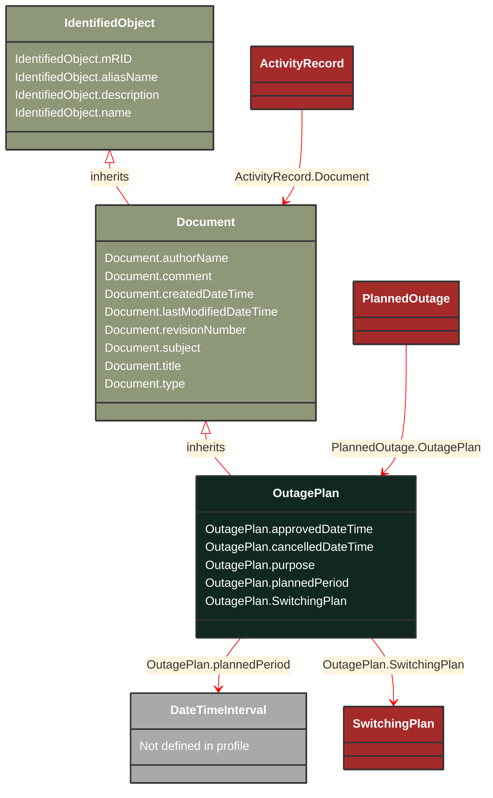

# OutagePlan

_Document containing the definition of planned outages of equipment and/or usage points. It will reference switching plans that are used to execute the planned outage._

*__NOTE__: this is an abstract class and should not be instantiated directly

**URI**: [cim:OutagePlan](http://iec.ch/TC57/CIM100#OutagePlan) 
**Type**: Class

## Inheritance
* [IdentifiedObject](/Models/Profiles/Outage/AbstractClasses/IdentifiedObject/)
    * [Document](/Models/Profiles/Outage/AbstractClasses/Document/)
        * **OutagePlan**

## Attributes
| Name | URI | Cardinality and Range | Description | Inheritance |
| ---  | --- | --- | --- | --- |
| approvedDateTime | [cim:OutagePlan.approvedDateTime](http://iec.ch/TC57/CIM100#OutagePlan.approvedDateTime) | 0..1 datetime | The date and time the outage plan was approved | direct |
| cancelledDateTime | [cim:OutagePlan.cancelledDateTime](http://iec.ch/TC57/CIM100#OutagePlan.cancelledDateTime) | 0..1 datetime | Date and Time the planned outage was canceled. | direct |
| purpose | [cim:OutagePlan.purpose](http://iec.ch/TC57/CIM100#OutagePlan.purpose) | 0..1 string | Purpose of  this outage plan, such as whether it is to replace equipment or perform maintenance or repairs or to reconfigure network topology. | direct |
| plannedPeriod | [cim:OutagePlan.plannedPeriod](http://iec.ch/TC57/CIM100#OutagePlan.plannedPeriod) | 0..1 DateTimeInterval | planned start and end time of the planned outage. | direct |
| SwitchingPlan | [cim:OutagePlan.SwitchingPlan](http://iec.ch/TC57/CIM100#OutagePlan.SwitchingPlan) | 0..1 SwitchingPlan | The swiching plan that is associated with the outage plan. | direct |
| authorName | [cim:Document.authorName](http://iec.ch/TC57/CIM100#Document.authorName) | 0..1 string | Name of the author of this document. | Document |
| comment | [cim:Document.comment](http://iec.ch/TC57/CIM100#Document.comment) | 0..1 string | Free text comment. | Document |
| createdDateTime | [cim:Document.createdDateTime](http://iec.ch/TC57/CIM100#Document.createdDateTime) | 0..1 datetime | Date and time that this document was created. | Document |
| lastModifiedDateTime | [cim:Document.lastModifiedDateTime](http://iec.ch/TC57/CIM100#Document.lastModifiedDateTime) | 0..1 datetime | Date and time this document was last modified. Documents may potentially be modified many times during their lifetime. | Document |
| revisionNumber | [cim:Document.revisionNumber](http://iec.ch/TC57/CIM100#Document.revisionNumber) | 0..1 string | Revision number for this document. | Document |
| subject | [cim:Document.subject](http://iec.ch/TC57/CIM100#Document.subject) | 0..1 string | Document subject. | Document |
| title | [cim:Document.title](http://iec.ch/TC57/CIM100#Document.title) | 0..1 string | Document title. | Document |
| type | [cim:Document.type](http://iec.ch/TC57/CIM100#Document.type) | 0..1 string | Utility-specific classification of this document, according to its corporate standards, practices, and existing IT systems (e.g., for management of assets, maintenance, work, outage, customers, etc.). | Document |
| mRID | [cim:IdentifiedObject.mRID](http://iec.ch/TC57/CIM100#IdentifiedObject.mRID) | 0..1 string | Master resource identifier issued by a model authority. The mRID is unique within an exchange context. Global uniqueness is easily achieved by using a UUID, as specified in RFC 4122, for the mRID. The use of UUID is strongly recommended.For CIMXML data files in RDF syntax conforming to IEC 61970-552, the mRID is mapped to rdf:ID or rdf:about attributes that identify CIM object elements. | IdentifiedObject |
| aliasName | [cim:IdentifiedObject.aliasName](http://iec.ch/TC57/CIM100#IdentifiedObject.aliasName) | 0..1 string | The aliasName is free text human readable name of the object alternative to IdentifiedObject.name. It may be non unique and may not correlate to a naming hierarchy.The attribute aliasName is retained because of backwards compatibility between CIM relases. It is however recommended to replace aliasName with the Name class as aliasName is planned for retirement at a future time. | IdentifiedObject |
| description | [cim:IdentifiedObject.description](http://iec.ch/TC57/CIM100#IdentifiedObject.description) | 0..1 string | The description is a free human readable text describing or naming the object. It may be non unique and may not correlate to a naming hierarchy. | IdentifiedObject |
| name | [cim:IdentifiedObject.name](http://iec.ch/TC57/CIM100#IdentifiedObject.name) | 0..1 string | The name is any free human readable and possibly non unique text naming the object. | IdentifiedObject |

### Schema Source
* from schema: [http://iec.ch/TC57/2007/profile](http://iec.ch/TC57/2007/profile)
