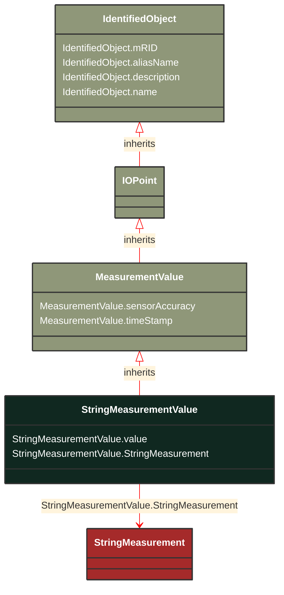

# StringMeasurementValue

_StringMeasurementValue represents a measurement value of type string._

*__NOTE__: this is an abstract class and should not be instantiated directly

**URI**: [cim:StringMeasurementValue](http://iec.ch/TC57/CIM100#StringMeasurementValue) 
**Type**: Class

## Inheritance
* [IdentifiedObject](/Models/Profiles/Outage/AbstractClasses/IdentifiedObject/)
    * [IOPoint](/Models/Profiles/Outage/AbstractClasses/IOPoint/)
        * [MeasurementValue](/Models/Profiles/Outage/AbstractClasses/MeasurementValue/)
            * **StringMeasurementValue**

## Attributes
| Name | URI | Cardinality and Range | Description | Inheritance |
| ---  | --- | --- | --- | --- |
| value | [cim:StringMeasurementValue.value](http://iec.ch/TC57/CIM100#StringMeasurementValue.value) | 0..1 string | The value to supervise. | direct |
| StringMeasurement | [cim:StringMeasurementValue.StringMeasurement](http://iec.ch/TC57/CIM100#StringMeasurementValue.StringMeasurement) | 0..1 StringMeasurement | Measurement to which this value is connected. | direct |
| sensorAccuracy | [cim:MeasurementValue.sensorAccuracy](http://iec.ch/TC57/CIM100#MeasurementValue.sensorAccuracy) | 0..1 PerCent | The limit, expressed as a percentage of the sensor maximum, that errors will not exceed when the sensor is used under  reference conditions. | MeasurementValue |
| timeStamp | [cim:MeasurementValue.timeStamp](http://iec.ch/TC57/CIM100#MeasurementValue.timeStamp) | 0..1 datetime | The time when the value was last updated. | MeasurementValue |
| mRID | [cim:IdentifiedObject.mRID](http://iec.ch/TC57/CIM100#IdentifiedObject.mRID) | 0..1 string | Master resource identifier issued by a model authority. The mRID is unique within an exchange context. Global uniqueness is easily achieved by using a UUID, as specified in RFC 4122, for the mRID. The use of UUID is strongly recommended.For CIMXML data files in RDF syntax conforming to IEC 61970-552, the mRID is mapped to rdf:ID or rdf:about attributes that identify CIM object elements. | IdentifiedObject |
| aliasName | [cim:IdentifiedObject.aliasName](http://iec.ch/TC57/CIM100#IdentifiedObject.aliasName) | 0..1 string | The aliasName is free text human readable name of the object alternative to IdentifiedObject.name. It may be non unique and may not correlate to a naming hierarchy.The attribute aliasName is retained because of backwards compatibility between CIM relases. It is however recommended to replace aliasName with the Name class as aliasName is planned for retirement at a future time. | IdentifiedObject |
| description | [cim:IdentifiedObject.description](http://iec.ch/TC57/CIM100#IdentifiedObject.description) | 0..1 string | The description is a free human readable text describing or naming the object. It may be non unique and may not correlate to a naming hierarchy. | IdentifiedObject |
| name | [cim:IdentifiedObject.name](http://iec.ch/TC57/CIM100#IdentifiedObject.name) | 0..1 string | The name is any free human readable and possibly non unique text naming the object. | IdentifiedObject |

### Schema Source
* from schema: [http://iec.ch/TC57/2007/profile](http://iec.ch/TC57/2007/profile)
