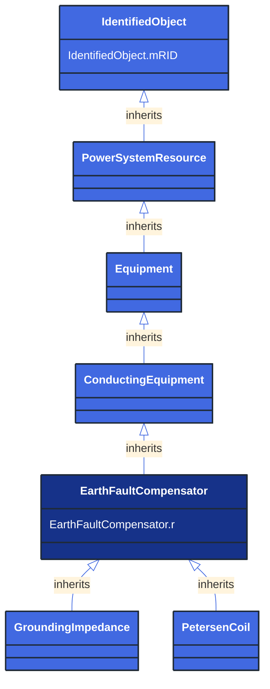

# EarthFaultCompensator

_A conducting equipment used to represent a connection to ground which is typically used to compensate earth faults.   An earth fault compensator device modelled with a single terminal implies a second terminal solidly connected to ground.  If two terminals are modelled, the ground is not assumed and normal connection rules apply._

*__NOTE__: this is an abstract class and should not be instantiated directly

**URI**: [cim:EarthFaultCompensator](http://iec.ch/TC57/CIM100#EarthFaultCompensator) 
**Type**: Class

## Inheritance
* [IdentifiedObject](/Models/Profiles/ShortCircuit/AbstractClasses/IdentifiedObject/)
    * [PowerSystemResource](/Models/Profiles/ShortCircuit/AbstractClasses/PowerSystemResource/)
        * [Equipment](/Models/Profiles/ShortCircuit/AbstractClasses/Equipment/)
            * [ConductingEquipment](/Models/Profiles/ShortCircuit/AbstractClasses/ConductingEquipment/)
                * **EarthFaultCompensator**

## Attributes
| Name | URI | Cardinality and Range | Description | Inheritance |
| ---  | --- | --- | --- | --- |
| r | [cim:EarthFaultCompensator.r](http://iec.ch/TC57/CIM100#EarthFaultCompensator.r) | No cardinality available Resistance | Nominal resistance of device. | direct |
| mRID | [cim:IdentifiedObject.mRID](http://iec.ch/TC57/CIM100#IdentifiedObject.mRID) | No cardinality available string | Master resource identifier issued by a model authority. The mRID is unique within an exchange context. Global uniqueness is easily achieved by using a UUID, as specified in RFC 4122, for the mRID. The use of UUID is strongly recommended.
For CIMXML data files in RDF syntax conforming to IEC 61970-552, the mRID is mapped to rdf:ID or rdf:about attributes that identify CIM object elements. | IdentifiedObject |

### Schema Source
* from schema: [http://iec.ch/TC57/ns/CIM/ShortCircuit-EUPackage_ShortCircuitProfile](http://iec.ch/TC57/ns/CIM/ShortCircuit-EUPackage_ShortCircuitProfile)
