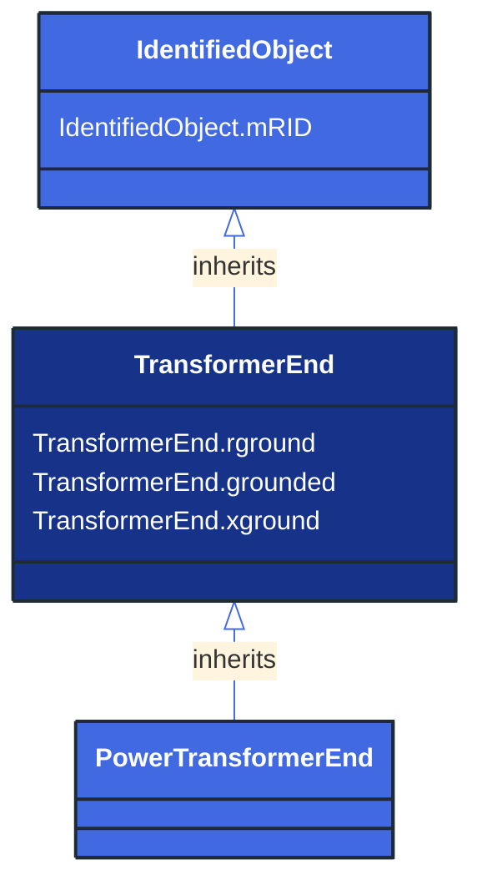

# TransformerEnd

_A conducting connection point of a power transformer. It corresponds to a physical transformer winding terminal.  In earlier CIM versions, the TransformerWinding class served a similar purpose, but this class is more flexible because it associates to terminal but is not a specialization of ConductingEquipment._

*__NOTE__: this is an abstract class and should not be instantiated directly

**URI**: [cim:TransformerEnd](http://iec.ch/TC57/CIM100#TransformerEnd) 
**Type**: Class

## Inheritance
* [IdentifiedObject](/Models/Profiles/ShortCircuit/AbstractClasses/IdentifiedObject/)
    * **TransformerEnd**

## Attributes
| Name | URI | Cardinality and Range | Description | Inheritance |
| ---  | --- | --- | --- | --- |
| rground | [cim:TransformerEnd.rground](http://iec.ch/TC57/CIM100#TransformerEnd.rground) | No cardinality available Resistance | (for Yn and Zn connections) Resistance part of neutral impedance where 'grounded' is true. | direct |
| grounded | [cim:TransformerEnd.grounded](http://iec.ch/TC57/CIM100#TransformerEnd.grounded) | No cardinality available boolean | (for Yn and Zn connections) True if the neutral is solidly grounded. | direct |
| xground | [cim:TransformerEnd.xground](http://iec.ch/TC57/CIM100#TransformerEnd.xground) | No cardinality available Reactance | (for Yn and Zn connections) Reactive part of neutral impedance where 'grounded' is true. | direct |
| mRID | [cim:IdentifiedObject.mRID](http://iec.ch/TC57/CIM100#IdentifiedObject.mRID) | No cardinality available string | Master resource identifier issued by a model authority. The mRID is unique within an exchange context. Global uniqueness is easily achieved by using a UUID, as specified in RFC 4122, for the mRID. The use of UUID is strongly recommended.
For CIMXML data files in RDF syntax conforming to IEC 61970-552, the mRID is mapped to rdf:ID or rdf:about attributes that identify CIM object elements. | IdentifiedObject |

### Schema Source
* from schema: [http://iec.ch/TC57/ns/CIM/ShortCircuit-EUPackage_ShortCircuitProfile](http://iec.ch/TC57/ns/CIM/ShortCircuit-EUPackage_ShortCircuitProfile)
