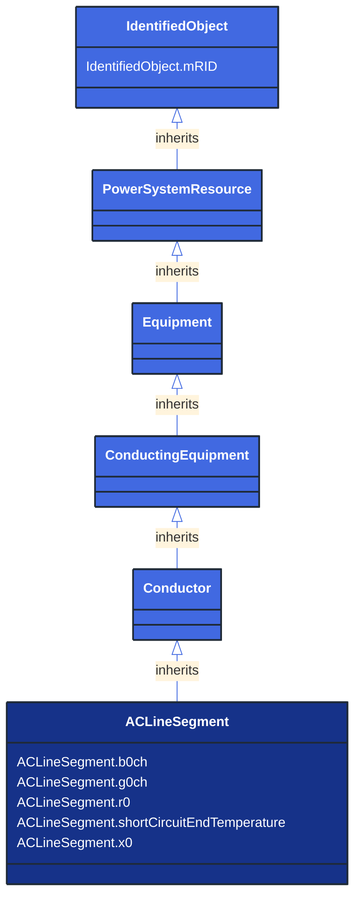

# ACLineSegment

_A wire or combination of wires, with consistent electrical characteristics, building a single electrical system, used to carry alternating current between points in the power system.
For symmetrical, transposed three phase lines, it is sufficient to use attributes of the line segment, which describe impedances and admittances for the entire length of the segment.  Additionally impedances can be computed by using length and associated per length impedances.
The BaseVoltage at the two ends of ACLineSegments in a Line shall have the same BaseVoltage.nominalVoltage. However, boundary lines may have slightly different BaseVoltage.nominalVoltages and variation is allowed. Larger voltage difference in general requires use of an equivalent branch._

**URI**: [cim:ACLineSegment](http://iec.ch/TC57/CIM100#ACLineSegment) 
**Type**: Class

## Inheritance
* [IdentifiedObject](/Models/Profiles/ShortCircuit/AbstractClasses/IdentifiedObject/)
    * [PowerSystemResource](/Models/Profiles/ShortCircuit/AbstractClasses/PowerSystemResource/)
        * [Equipment](/Models/Profiles/ShortCircuit/AbstractClasses/Equipment/)
            * [ConductingEquipment](/Models/Profiles/ShortCircuit/AbstractClasses/ConductingEquipment/)
                * [Conductor](/Models/Profiles/ShortCircuit/AbstractClasses/Conductor/)
                    * **ACLineSegment**

## Attributes
| Name | URI | Cardinality and Range | Description | Inheritance |
| ---  | --- | --- | --- | --- |
| b0ch | [cim:ACLineSegment.b0ch](http://iec.ch/TC57/CIM100#ACLineSegment.b0ch) | No cardinality available Susceptance | Zero sequence shunt (charging) susceptance, uniformly distributed, of the entire line section. | direct |
| g0ch | [cim:ACLineSegment.g0ch](http://iec.ch/TC57/CIM100#ACLineSegment.g0ch) | No cardinality available Conductance | Zero sequence shunt (charging) conductance, uniformly distributed, of the entire line section. | direct |
| r0 | [cim:ACLineSegment.r0](http://iec.ch/TC57/CIM100#ACLineSegment.r0) | No cardinality available Resistance | Zero sequence series resistance of the entire line section. | direct |
| shortCircuitEndTemperature | [cim:ACLineSegment.shortCircuitEndTemperature](http://iec.ch/TC57/CIM100#ACLineSegment.shortCircuitEndTemperature) | No cardinality available Temperature | Maximum permitted temperature at the end of SC for the calculation of minimum short-circuit currents. Used for short circuit data exchange according to IEC 60909. | direct |
| x0 | [cim:ACLineSegment.x0](http://iec.ch/TC57/CIM100#ACLineSegment.x0) | No cardinality available Reactance | Zero sequence series reactance of the entire line section. | direct |
| mRID | [cim:IdentifiedObject.mRID](http://iec.ch/TC57/CIM100#IdentifiedObject.mRID) | No cardinality available string | Master resource identifier issued by a model authority. The mRID is unique within an exchange context. Global uniqueness is easily achieved by using a UUID, as specified in RFC 4122, for the mRID. The use of UUID is strongly recommended.
For CIMXML data files in RDF syntax conforming to IEC 61970-552, the mRID is mapped to rdf:ID or rdf:about attributes that identify CIM object elements. | IdentifiedObject |

### Schema Source
* from schema: [http://iec.ch/TC57/ns/CIM/ShortCircuit-EUPackage_ShortCircuitProfile](http://iec.ch/TC57/ns/CIM/ShortCircuit-EUPackage_ShortCircuitProfile)
