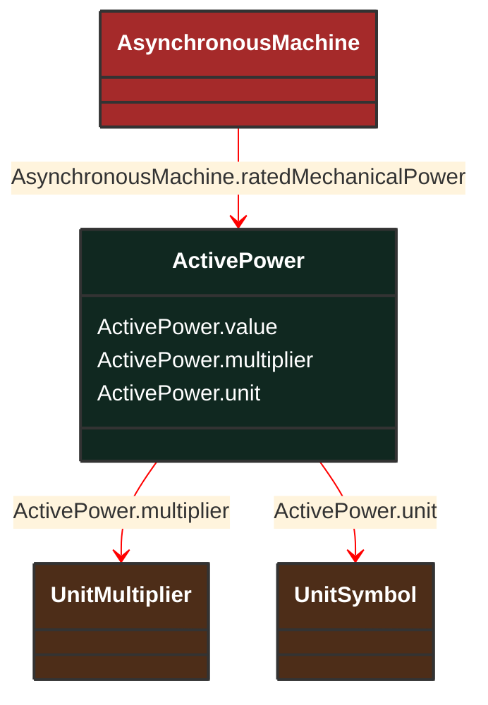

# ActivePower

_Product of RMS value of the voltage and the RMS value of the in-phase component of the current._

**URI**: [cim:ActivePower](http://iec.ch/TC57/CIM100#ActivePower) 
**Type**: Class

## Inheritance
* **ActivePower**

## Attributes
| Name | URI | Cardinality and Range | Description | Inheritance |
| ---  | --- | --- | --- | --- |
| value | [cim:ActivePower.value](http://iec.ch/TC57/CIM100#ActivePower.value) | No cardinality available float | No description available | direct |
| multiplier | [cim:ActivePower.multiplier](http://iec.ch/TC57/CIM100#ActivePower.multiplier) | No cardinality available UnitMultiplier | No description available | direct |
| unit | [cim:ActivePower.unit](http://iec.ch/TC57/CIM100#ActivePower.unit) | No cardinality available UnitSymbol | No description available | direct |

### Schema Source
* from schema: [http://iec.ch/TC57/ns/CIM/ShortCircuit-EUPackage_ShortCircuitProfile](http://iec.ch/TC57/ns/CIM/ShortCircuit-EUPackage_ShortCircuitProfile)
