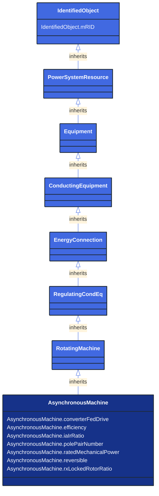

# AsynchronousMachine

_A rotating machine whose shaft rotates asynchronously with the electrical field.  Also known as an induction machine with no external connection to the rotor windings, e.g. squirrel-cage induction machine._

**URI**: [cim:AsynchronousMachine](http://iec.ch/TC57/CIM100#AsynchronousMachine) 
**Type**: Class

## Inheritance
* [IdentifiedObject](/Models/Profiles/ShortCircuit/AbstractClasses/IdentifiedObject/)
    * [PowerSystemResource](/Models/Profiles/ShortCircuit/AbstractClasses/PowerSystemResource/)
        * [Equipment](/Models/Profiles/ShortCircuit/AbstractClasses/Equipment/)
            * [ConductingEquipment](/Models/Profiles/ShortCircuit/AbstractClasses/ConductingEquipment/)
                * [EnergyConnection](/Models/Profiles/ShortCircuit/AbstractClasses/EnergyConnection/)
                    * [RegulatingCondEq](/Models/Profiles/ShortCircuit/AbstractClasses/RegulatingCondEq/)
                        * [RotatingMachine](/Models/Profiles/ShortCircuit/AbstractClasses/RotatingMachine/)
                            * **AsynchronousMachine**

## Attributes
| Name | URI | Cardinality and Range | Description | Inheritance |
| ---  | --- | --- | --- | --- |
| converterFedDrive | [cim:AsynchronousMachine.converterFedDrive](http://iec.ch/TC57/CIM100#AsynchronousMachine.converterFedDrive) | No cardinality available boolean | Indicates whether the machine is a converter fed drive. Used for short circuit data exchange according to IEC 60909. | direct |
| efficiency | [cim:AsynchronousMachine.efficiency](http://iec.ch/TC57/CIM100#AsynchronousMachine.efficiency) | No cardinality available PerCent | Efficiency of the asynchronous machine at nominal operation as a percentage. Indicator for converter drive motors. Used for short circuit data exchange according to IEC 60909. | direct |
| iaIrRatio | [cim:AsynchronousMachine.iaIrRatio](http://iec.ch/TC57/CIM100#AsynchronousMachine.iaIrRatio) | No cardinality available float | Ratio of locked-rotor current to the rated current of the motor (Ia/Ir). Used for short circuit data exchange according to IEC 60909. | direct |
| polePairNumber | [cim:AsynchronousMachine.polePairNumber](http://iec.ch/TC57/CIM100#AsynchronousMachine.polePairNumber) | No cardinality available integer | Number of pole pairs of stator. Used for short circuit data exchange according to IEC 60909. | direct |
| ratedMechanicalPower | [cim:AsynchronousMachine.ratedMechanicalPower](http://iec.ch/TC57/CIM100#AsynchronousMachine.ratedMechanicalPower) | No cardinality available ActivePower | Rated mechanical power (Pr in IEC 60909-0). Used for short circuit data exchange according to IEC 60909. | direct |
| reversible | [cim:AsynchronousMachine.reversible](http://iec.ch/TC57/CIM100#AsynchronousMachine.reversible) | No cardinality available boolean | Indicates for converter drive motors if the power can be reversible. Used for short circuit data exchange according to IEC 60909. | direct |
| rxLockedRotorRatio | [cim:AsynchronousMachine.rxLockedRotorRatio](http://iec.ch/TC57/CIM100#AsynchronousMachine.rxLockedRotorRatio) | No cardinality available float | Locked rotor ratio (R/X). Used for short circuit data exchange according to IEC 60909. | direct |
| mRID | [cim:IdentifiedObject.mRID](http://iec.ch/TC57/CIM100#IdentifiedObject.mRID) | No cardinality available string | Master resource identifier issued by a model authority. The mRID is unique within an exchange context. Global uniqueness is easily achieved by using a UUID, as specified in RFC 4122, for the mRID. The use of UUID is strongly recommended.
For CIMXML data files in RDF syntax conforming to IEC 61970-552, the mRID is mapped to rdf:ID or rdf:about attributes that identify CIM object elements. | IdentifiedObject |

### Schema Source
* from schema: [http://iec.ch/TC57/ns/CIM/ShortCircuit-EUPackage_ShortCircuitProfile](http://iec.ch/TC57/ns/CIM/ShortCircuit-EUPackage_ShortCircuitProfile)
