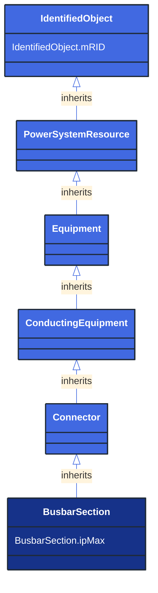

# BusbarSection

_A conductor, or group of conductors, with negligible impedance, that serve to connect other conducting equipment within a single substation. 
Voltage measurements are typically obtained from voltage transformers that are connected to busbar sections. A bus bar section may have many physical terminals but for analysis is modelled with exactly one logical terminal._

**URI**: [cim:BusbarSection](http://iec.ch/TC57/CIM100#BusbarSection) 
**Type**: Class

## Inheritance
* [IdentifiedObject](/Models/Profiles/ShortCircuit/AbstractClasses/IdentifiedObject/)
    * [PowerSystemResource](/Models/Profiles/ShortCircuit/AbstractClasses/PowerSystemResource/)
        * [Equipment](/Models/Profiles/ShortCircuit/AbstractClasses/Equipment/)
            * [ConductingEquipment](/Models/Profiles/ShortCircuit/AbstractClasses/ConductingEquipment/)
                * [Connector](/Models/Profiles/ShortCircuit/AbstractClasses/Connector/)
                    * **BusbarSection**

## Attributes
| Name | URI | Cardinality and Range | Description | Inheritance |
| ---  | --- | --- | --- | --- |
| ipMax | [cim:BusbarSection.ipMax](http://iec.ch/TC57/CIM100#BusbarSection.ipMax) | No cardinality available CurrentFlow | Maximum allowable peak short-circuit current of busbar (Ipmax in IEC 60909-0). 
Mechanical limit of the busbar in the substation itself. Used for short circuit data exchange according to IEC 60909. | direct |
| mRID | [cim:IdentifiedObject.mRID](http://iec.ch/TC57/CIM100#IdentifiedObject.mRID) | No cardinality available string | Master resource identifier issued by a model authority. The mRID is unique within an exchange context. Global uniqueness is easily achieved by using a UUID, as specified in RFC 4122, for the mRID. The use of UUID is strongly recommended.
For CIMXML data files in RDF syntax conforming to IEC 61970-552, the mRID is mapped to rdf:ID or rdf:about attributes that identify CIM object elements. | IdentifiedObject |

### Schema Source
* from schema: [http://iec.ch/TC57/ns/CIM/ShortCircuit-EUPackage_ShortCircuitProfile](http://iec.ch/TC57/ns/CIM/ShortCircuit-EUPackage_ShortCircuitProfile)
