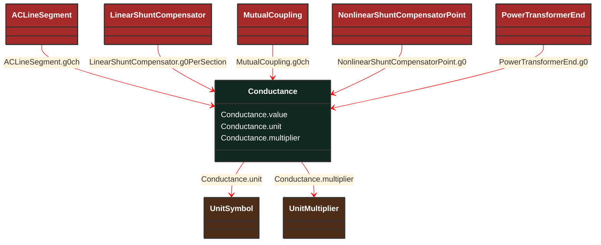

# Conductance

_Factor by which voltage must be multiplied to give corresponding power lost from a circuit. Real part of admittance._

**URI**: [cim:Conductance](http://iec.ch/TC57/CIM100#Conductance) 
**Type**: Class

## Inheritance
* **Conductance**

## Attributes
| Name | URI | Cardinality and Range | Description | Inheritance |
| ---  | --- | --- | --- | --- |
| value | [cim:Conductance.value](http://iec.ch/TC57/CIM100#Conductance.value) | No cardinality available float | No description available | direct |
| unit | [cim:Conductance.unit](http://iec.ch/TC57/CIM100#Conductance.unit) | No cardinality available UnitSymbol | No description available | direct |
| multiplier | [cim:Conductance.multiplier](http://iec.ch/TC57/CIM100#Conductance.multiplier) | No cardinality available UnitMultiplier | No description available | direct |

### Schema Source
* from schema: [http://iec.ch/TC57/ns/CIM/ShortCircuit-EUPackage_ShortCircuitProfile](http://iec.ch/TC57/ns/CIM/ShortCircuit-EUPackage_ShortCircuitProfile)
