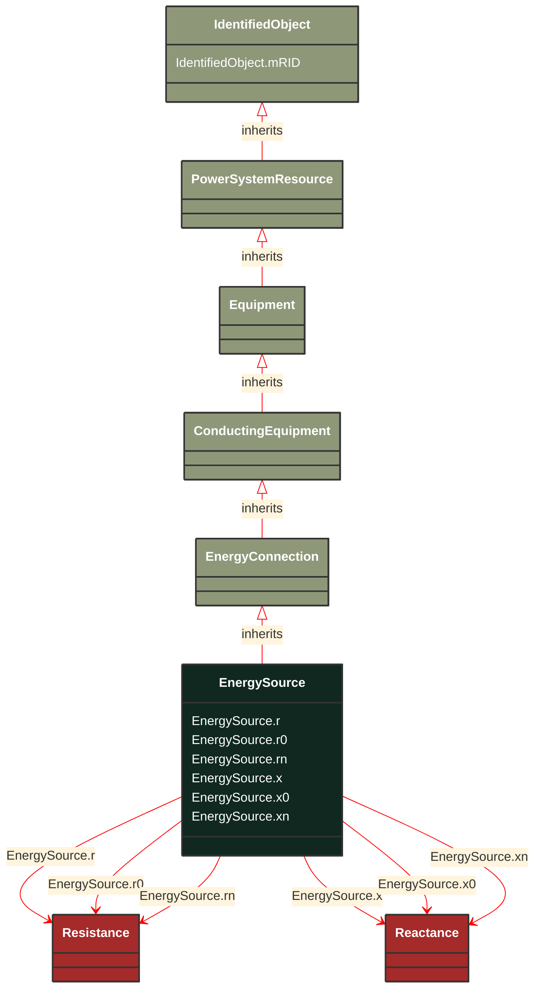

# EnergySource

_A generic equivalent for an energy supplier on a transmission or distribution voltage level._

**URI**: [cim:EnergySource](http://iec.ch/TC57/CIM100#EnergySource) 
**Type**: Class

## Inheritance
* [IdentifiedObject](/Models/Profiles/ShortCircuit/ConcreteClasses/IdentifiedObject/)
    * [PowerSystemResource](/Models/Profiles/ShortCircuit/ConcreteClasses/PowerSystemResource/)
        * [Equipment](/Models/Profiles/ShortCircuit/ConcreteClasses/Equipment/)
            * [ConductingEquipment](/Models/Profiles/ShortCircuit/ConcreteClasses/ConductingEquipment/)
                * [EnergyConnection](/Models/Profiles/ShortCircuit/ConcreteClasses/EnergyConnection/)
                    * **EnergySource**

## Attributes
| Name | URI | Cardinality and Range | Description | Inheritance |
| ---  | --- | --- | --- | --- |
| r | [cim:EnergySource.r](http://iec.ch/TC57/CIM100#EnergySource.r) | No cardinality available Resistance | Positive sequence Thevenin resistance. | direct |
| r0 | [cim:EnergySource.r0](http://iec.ch/TC57/CIM100#EnergySource.r0) | No cardinality available Resistance | Zero sequence Thevenin resistance. | direct |
| rn | [cim:EnergySource.rn](http://iec.ch/TC57/CIM100#EnergySource.rn) | No cardinality available Resistance | Negative sequence Thevenin resistance. | direct |
| x | [cim:EnergySource.x](http://iec.ch/TC57/CIM100#EnergySource.x) | No cardinality available Reactance | Positive sequence Thevenin reactance. | direct |
| x0 | [cim:EnergySource.x0](http://iec.ch/TC57/CIM100#EnergySource.x0) | No cardinality available Reactance | Zero sequence Thevenin reactance. | direct |
| xn | [cim:EnergySource.xn](http://iec.ch/TC57/CIM100#EnergySource.xn) | No cardinality available Reactance | Negative sequence Thevenin reactance. | direct |
| mRID | [cim:IdentifiedObject.mRID](http://iec.ch/TC57/CIM100#IdentifiedObject.mRID) | No cardinality available string | Master resource identifier issued by a model authority. The mRID is unique within an exchange context. Global uniqueness is easily achieved by using a UUID, as specified in RFC 4122, for the mRID. The use of UUID is strongly recommended.
For CIMXML data files in RDF syntax conforming to IEC 61970-552, the mRID is mapped to rdf:ID or rdf:about attributes that identify CIM object elements. | IdentifiedObject |

### Schema Source
* from schema: [http://iec.ch/TC57/ns/CIM/ShortCircuit-EUPackage_ShortCircuitProfile](http://iec.ch/TC57/ns/CIM/ShortCircuit-EUPackage_ShortCircuitProfile)
