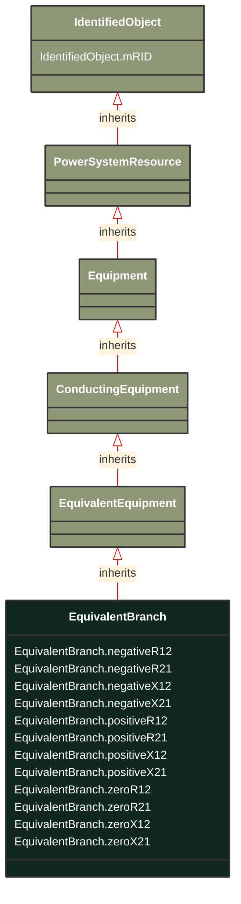

# EquivalentBranch

_The class represents equivalent branches. In cases where a transformer phase shift is modelled and the EquivalentBranch is spanning the same nodes, the impedance quantities for the EquivalentBranch shall consider the needed phase shift._

**URI**: [cim:EquivalentBranch](http://iec.ch/TC57/CIM100#EquivalentBranch) 
**Type**: Class

## Inheritance
* [IdentifiedObject](/Models/Profiles/ShortCircuit/AbstractClasses/IdentifiedObject/)
    * [PowerSystemResource](/Models/Profiles/ShortCircuit/AbstractClasses/PowerSystemResource/)
        * [Equipment](/Models/Profiles/ShortCircuit/AbstractClasses/Equipment/)
            * [ConductingEquipment](/Models/Profiles/ShortCircuit/AbstractClasses/ConductingEquipment/)
                * [EquivalentEquipment](/Models/Profiles/ShortCircuit/AbstractClasses/EquivalentEquipment/)
                    * **EquivalentBranch**

## Attributes
| Name | URI | Cardinality and Range | Description | Inheritance |
| ---  | --- | --- | --- | --- |
| negativeR12 | [cim:EquivalentBranch.negativeR12](http://iec.ch/TC57/CIM100#EquivalentBranch.negativeR12) | No cardinality available Resistance | Negative sequence series resistance from terminal sequence  1 to terminal sequence 2. Used for short circuit data exchange according to IEC 60909.
EquivalentBranch is a result of network reduction prior to the data exchange. | direct |
| negativeR21 | [cim:EquivalentBranch.negativeR21](http://iec.ch/TC57/CIM100#EquivalentBranch.negativeR21) | No cardinality available Resistance | Negative sequence series resistance from terminal sequence 2 to terminal sequence 1. Used for short circuit data exchange according to IEC 60909.
EquivalentBranch is a result of network reduction prior to the data exchange. | direct |
| negativeX12 | [cim:EquivalentBranch.negativeX12](http://iec.ch/TC57/CIM100#EquivalentBranch.negativeX12) | No cardinality available Reactance | Negative sequence series reactance from terminal sequence  1 to terminal sequence 2. Used for short circuit data exchange according to IEC 60909.
Usage : EquivalentBranch is a result of network reduction prior to the data exchange. | direct |
| negativeX21 | [cim:EquivalentBranch.negativeX21](http://iec.ch/TC57/CIM100#EquivalentBranch.negativeX21) | No cardinality available Reactance | Negative sequence series reactance from terminal sequence 2 to terminal sequence 1. Used for short circuit data exchange according to IEC 60909.
Usage: EquivalentBranch is a result of network reduction prior to the data exchange. | direct |
| positiveR12 | [cim:EquivalentBranch.positiveR12](http://iec.ch/TC57/CIM100#EquivalentBranch.positiveR12) | No cardinality available Resistance | Positive sequence series resistance from terminal sequence  1 to terminal sequence 2 . Used for short circuit data exchange according to IEC 60909. 
EquivalentBranch is a result of network reduction prior to the data exchange. | direct |
| positiveR21 | [cim:EquivalentBranch.positiveR21](http://iec.ch/TC57/CIM100#EquivalentBranch.positiveR21) | No cardinality available Resistance | Positive sequence series resistance from terminal sequence 2 to terminal sequence 1. Used for short circuit data exchange according to IEC 60909.
EquivalentBranch is a result of network reduction prior to the data exchange. | direct |
| positiveX12 | [cim:EquivalentBranch.positiveX12](http://iec.ch/TC57/CIM100#EquivalentBranch.positiveX12) | No cardinality available Reactance | Positive sequence series reactance from terminal sequence  1 to terminal sequence 2. Used for short circuit data exchange according to IEC 60909.
Usage : EquivalentBranch is a result of network reduction prior to the data exchange. | direct |
| positiveX21 | [cim:EquivalentBranch.positiveX21](http://iec.ch/TC57/CIM100#EquivalentBranch.positiveX21) | No cardinality available Reactance | Positive sequence series reactance from terminal sequence 2 to terminal sequence 1. Used for short circuit data exchange according to IEC 60909.
Usage : EquivalentBranch is a result of network reduction prior to the data exchange. | direct |
| zeroR12 | [cim:EquivalentBranch.zeroR12](http://iec.ch/TC57/CIM100#EquivalentBranch.zeroR12) | No cardinality available Resistance | Zero sequence series resistance from terminal sequence  1 to terminal sequence 2. Used for short circuit data exchange according to IEC 60909.
EquivalentBranch is a result of network reduction prior to the data exchange. | direct |
| zeroR21 | [cim:EquivalentBranch.zeroR21](http://iec.ch/TC57/CIM100#EquivalentBranch.zeroR21) | No cardinality available Resistance | Zero sequence series resistance from terminal sequence  2 to terminal sequence 1. Used for short circuit data exchange according to IEC 60909.
Usage : EquivalentBranch is a result of network reduction prior to the data exchange. | direct |
| zeroX12 | [cim:EquivalentBranch.zeroX12](http://iec.ch/TC57/CIM100#EquivalentBranch.zeroX12) | No cardinality available Reactance | Zero sequence series reactance from terminal sequence  1 to terminal sequence 2. Used for short circuit data exchange according to IEC 60909.
Usage : EquivalentBranch is a result of network reduction prior to the data exchange. | direct |
| zeroX21 | [cim:EquivalentBranch.zeroX21](http://iec.ch/TC57/CIM100#EquivalentBranch.zeroX21) | No cardinality available Reactance | Zero sequence series reactance from terminal sequence 2 to terminal sequence 1. Used for short circuit data exchange according to IEC 60909.
Usage : EquivalentBranch is a result of network reduction prior to the data exchange. | direct |
| mRID | [cim:IdentifiedObject.mRID](http://iec.ch/TC57/CIM100#IdentifiedObject.mRID) | No cardinality available string | Master resource identifier issued by a model authority. The mRID is unique within an exchange context. Global uniqueness is easily achieved by using a UUID, as specified in RFC 4122, for the mRID. The use of UUID is strongly recommended.
For CIMXML data files in RDF syntax conforming to IEC 61970-552, the mRID is mapped to rdf:ID or rdf:about attributes that identify CIM object elements. | IdentifiedObject |

### Schema Source
* from schema: [http://iec.ch/TC57/ns/CIM/ShortCircuit-EUPackage_ShortCircuitProfile](http://iec.ch/TC57/ns/CIM/ShortCircuit-EUPackage_ShortCircuitProfile)
