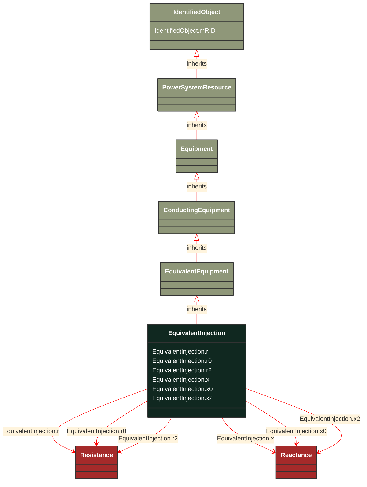

# EquivalentInjection

_This class represents equivalent injections (generation or load).  Voltage regulation is allowed only at the point of connection._

**URI**: [cim:EquivalentInjection](http://iec.ch/TC57/CIM100#EquivalentInjection) 
**Type**: Class

## Inheritance
* [IdentifiedObject](/Models/Profiles/ShortCircuit/ConcreteClasses/IdentifiedObject/)
    * [PowerSystemResource](/Models/Profiles/ShortCircuit/ConcreteClasses/PowerSystemResource/)
        * [Equipment](/Models/Profiles/ShortCircuit/ConcreteClasses/Equipment/)
            * [ConductingEquipment](/Models/Profiles/ShortCircuit/ConcreteClasses/ConductingEquipment/)
                * [EquivalentEquipment](/Models/Profiles/ShortCircuit/ConcreteClasses/EquivalentEquipment/)
                    * **EquivalentInjection**

## Attributes
| Name | URI | Cardinality and Range | Description | Inheritance |
| ---  | --- | --- | --- | --- |
| r | [cim:EquivalentInjection.r](http://iec.ch/TC57/CIM100#EquivalentInjection.r) | No cardinality available Resistance | Positive sequence resistance. Used to represent Extended-Ward (IEC 60909).
Usage : Extended-Ward is a result of network reduction prior to the data exchange. | direct |
| r0 | [cim:EquivalentInjection.r0](http://iec.ch/TC57/CIM100#EquivalentInjection.r0) | No cardinality available Resistance | Zero sequence resistance. Used to represent Extended-Ward (IEC 60909).
Usage : Extended-Ward is a result of network reduction prior to the data exchange. | direct |
| r2 | [cim:EquivalentInjection.r2](http://iec.ch/TC57/CIM100#EquivalentInjection.r2) | No cardinality available Resistance | Negative sequence resistance. Used to represent Extended-Ward (IEC 60909).
Usage : Extended-Ward is a result of network reduction prior to the data exchange. | direct |
| x | [cim:EquivalentInjection.x](http://iec.ch/TC57/CIM100#EquivalentInjection.x) | No cardinality available Reactance | Positive sequence reactance. Used to represent Extended-Ward (IEC 60909).
Usage : Extended-Ward is a result of network reduction prior to the data exchange. | direct |
| x0 | [cim:EquivalentInjection.x0](http://iec.ch/TC57/CIM100#EquivalentInjection.x0) | No cardinality available Reactance | Zero sequence reactance. Used to represent Extended-Ward (IEC 60909).
Usage : Extended-Ward is a result of network reduction prior to the data exchange. | direct |
| x2 | [cim:EquivalentInjection.x2](http://iec.ch/TC57/CIM100#EquivalentInjection.x2) | No cardinality available Reactance | Negative sequence reactance. Used to represent Extended-Ward (IEC 60909).
Usage : Extended-Ward is a result of network reduction prior to the data exchange. | direct |
| mRID | [cim:IdentifiedObject.mRID](http://iec.ch/TC57/CIM100#IdentifiedObject.mRID) | No cardinality available string | Master resource identifier issued by a model authority. The mRID is unique within an exchange context. Global uniqueness is easily achieved by using a UUID, as specified in RFC 4122, for the mRID. The use of UUID is strongly recommended.
For CIMXML data files in RDF syntax conforming to IEC 61970-552, the mRID is mapped to rdf:ID or rdf:about attributes that identify CIM object elements. | IdentifiedObject |

### Schema Source
* from schema: [http://iec.ch/TC57/ns/CIM/ShortCircuit-EUPackage_ShortCircuitProfile](http://iec.ch/TC57/ns/CIM/ShortCircuit-EUPackage_ShortCircuitProfile)
