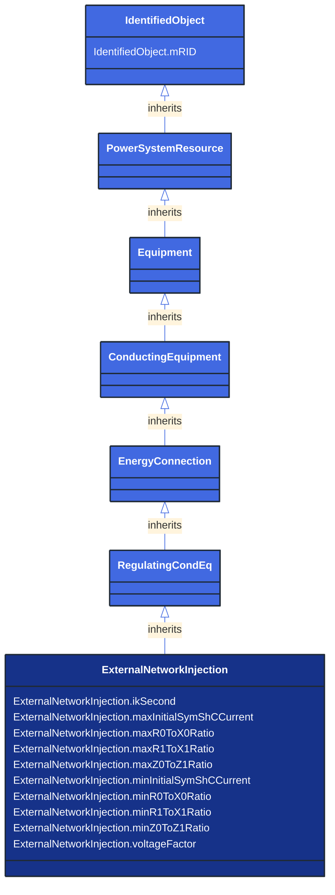

# ExternalNetworkInjection

_This class represents the external network and it is used for IEC 60909 calculations._

**URI**: [cim:ExternalNetworkInjection](http://iec.ch/TC57/CIM100#ExternalNetworkInjection) 
**Type**: Class

## Inheritance
* [IdentifiedObject](/Models/Profiles/ShortCircuit/AbstractClasses/IdentifiedObject/)
    * [PowerSystemResource](/Models/Profiles/ShortCircuit/AbstractClasses/PowerSystemResource/)
        * [Equipment](/Models/Profiles/ShortCircuit/AbstractClasses/Equipment/)
            * [ConductingEquipment](/Models/Profiles/ShortCircuit/AbstractClasses/ConductingEquipment/)
                * [EnergyConnection](/Models/Profiles/ShortCircuit/AbstractClasses/EnergyConnection/)
                    * [RegulatingCondEq](/Models/Profiles/ShortCircuit/AbstractClasses/RegulatingCondEq/)
                        * **ExternalNetworkInjection**

## Attributes
| Name | URI | Cardinality and Range | Description | Inheritance |
| ---  | --- | --- | --- | --- |
| ikSecond | [cim:ExternalNetworkInjection.ikSecond](http://iec.ch/TC57/CIM100#ExternalNetworkInjection.ikSecond) | No cardinality available boolean | Indicates whether initial symmetrical short-circuit current and power have been calculated according to IEC (Ik").  Used only if short circuit calculations are done according to superposition method. | direct |
| maxInitialSymShCCurrent | [cim:ExternalNetworkInjection.maxInitialSymShCCurrent](http://iec.ch/TC57/CIM100#ExternalNetworkInjection.maxInitialSymShCCurrent) | No cardinality available CurrentFlow | Maximum initial symmetrical short-circuit currents (Ik" max) in A (Ik" = Sk"/(SQRT(3) Un)). Used for short circuit data exchange according to IEC 60909. | direct |
| maxR0ToX0Ratio | [cim:ExternalNetworkInjection.maxR0ToX0Ratio](http://iec.ch/TC57/CIM100#ExternalNetworkInjection.maxR0ToX0Ratio) | No cardinality available float | Maximum ratio of zero sequence resistance of Network Feeder to its zero sequence reactance (R(0)/X(0) max). Used for short circuit data exchange according to IEC 60909. | direct |
| maxR1ToX1Ratio | [cim:ExternalNetworkInjection.maxR1ToX1Ratio](http://iec.ch/TC57/CIM100#ExternalNetworkInjection.maxR1ToX1Ratio) | No cardinality available float | Maximum ratio of positive sequence resistance of Network Feeder to its positive sequence reactance (R(1)/X(1) max). Used for short circuit data exchange according to IEC 60909. | direct |
| maxZ0ToZ1Ratio | [cim:ExternalNetworkInjection.maxZ0ToZ1Ratio](http://iec.ch/TC57/CIM100#ExternalNetworkInjection.maxZ0ToZ1Ratio) | No cardinality available float | Maximum ratio of zero sequence impedance to its positive sequence impedance (Z(0)/Z(1) max). Used for short circuit data exchange according to IEC 60909. | direct |
| minInitialSymShCCurrent | [cim:ExternalNetworkInjection.minInitialSymShCCurrent](http://iec.ch/TC57/CIM100#ExternalNetworkInjection.minInitialSymShCCurrent) | No cardinality available CurrentFlow | Minimum initial symmetrical short-circuit currents (Ik" min) in A (Ik" = Sk"/(SQRT(3) Un)). Used for short circuit data exchange according to IEC 60909. | direct |
| minR0ToX0Ratio | [cim:ExternalNetworkInjection.minR0ToX0Ratio](http://iec.ch/TC57/CIM100#ExternalNetworkInjection.minR0ToX0Ratio) | No cardinality available float | Indicates whether initial symmetrical short-circuit current and power have been calculated according to IEC (Ik"). Used for short circuit data exchange according to IEC 6090. | direct |
| minR1ToX1Ratio | [cim:ExternalNetworkInjection.minR1ToX1Ratio](http://iec.ch/TC57/CIM100#ExternalNetworkInjection.minR1ToX1Ratio) | No cardinality available float | Minimum ratio of positive sequence resistance of Network Feeder to its positive sequence reactance (R(1)/X(1) min). Used for short circuit data exchange according to IEC 60909. | direct |
| minZ0ToZ1Ratio | [cim:ExternalNetworkInjection.minZ0ToZ1Ratio](http://iec.ch/TC57/CIM100#ExternalNetworkInjection.minZ0ToZ1Ratio) | No cardinality available float | Minimum ratio of zero sequence impedance to its positive sequence impedance (Z(0)/Z(1) min). Used for short circuit data exchange according to IEC 60909. | direct |
| voltageFactor | [cim:ExternalNetworkInjection.voltageFactor](http://iec.ch/TC57/CIM100#ExternalNetworkInjection.voltageFactor) | No cardinality available PU | Voltage factor in pu, which was used to calculate short-circuit current Ik" and power Sk".  Used only if short circuit calculations are done according to superposition method. | direct |
| mRID | [cim:IdentifiedObject.mRID](http://iec.ch/TC57/CIM100#IdentifiedObject.mRID) | No cardinality available string | Master resource identifier issued by a model authority. The mRID is unique within an exchange context. Global uniqueness is easily achieved by using a UUID, as specified in RFC 4122, for the mRID. The use of UUID is strongly recommended.
For CIMXML data files in RDF syntax conforming to IEC 61970-552, the mRID is mapped to rdf:ID or rdf:about attributes that identify CIM object elements. | IdentifiedObject |

### Schema Source
* from schema: [http://iec.ch/TC57/ns/CIM/ShortCircuit-EUPackage_ShortCircuitProfile](http://iec.ch/TC57/ns/CIM/ShortCircuit-EUPackage_ShortCircuitProfile)
