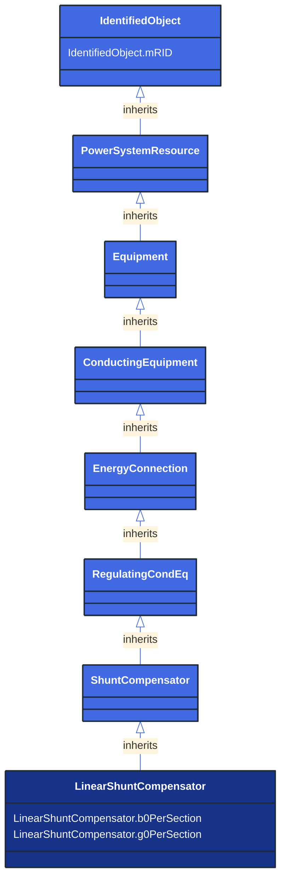

# LinearShuntCompensator

_A linear shunt compensator has banks or sections with equal admittance values._

**URI**: [cim:LinearShuntCompensator](http://iec.ch/TC57/CIM100#LinearShuntCompensator) 
**Type**: Class

## Inheritance
* [IdentifiedObject](/Models/Profiles/ShortCircuit/AbstractClasses/IdentifiedObject/)
    * [PowerSystemResource](/Models/Profiles/ShortCircuit/AbstractClasses/PowerSystemResource/)
        * [Equipment](/Models/Profiles/ShortCircuit/AbstractClasses/Equipment/)
            * [ConductingEquipment](/Models/Profiles/ShortCircuit/AbstractClasses/ConductingEquipment/)
                * [EnergyConnection](/Models/Profiles/ShortCircuit/AbstractClasses/EnergyConnection/)
                    * [RegulatingCondEq](/Models/Profiles/ShortCircuit/AbstractClasses/RegulatingCondEq/)
                        * [ShuntCompensator](/Models/Profiles/ShortCircuit/AbstractClasses/ShuntCompensator/)
                            * **LinearShuntCompensator**

## Attributes
| Name | URI | Cardinality and Range | Description | Inheritance |
| ---  | --- | --- | --- | --- |
| b0PerSection | [cim:LinearShuntCompensator.b0PerSection](http://iec.ch/TC57/CIM100#LinearShuntCompensator.b0PerSection) | No cardinality available Susceptance | Zero sequence shunt (charging) susceptance per section. | direct |
| g0PerSection | [cim:LinearShuntCompensator.g0PerSection](http://iec.ch/TC57/CIM100#LinearShuntCompensator.g0PerSection) | No cardinality available Conductance | Zero sequence shunt (charging) conductance per section. | direct |
| mRID | [cim:IdentifiedObject.mRID](http://iec.ch/TC57/CIM100#IdentifiedObject.mRID) | No cardinality available string | Master resource identifier issued by a model authority. The mRID is unique within an exchange context. Global uniqueness is easily achieved by using a UUID, as specified in RFC 4122, for the mRID. The use of UUID is strongly recommended.
For CIMXML data files in RDF syntax conforming to IEC 61970-552, the mRID is mapped to rdf:ID or rdf:about attributes that identify CIM object elements. | IdentifiedObject |

### Schema Source
* from schema: [http://iec.ch/TC57/ns/CIM/ShortCircuit-EUPackage_ShortCircuitProfile](http://iec.ch/TC57/ns/CIM/ShortCircuit-EUPackage_ShortCircuitProfile)
