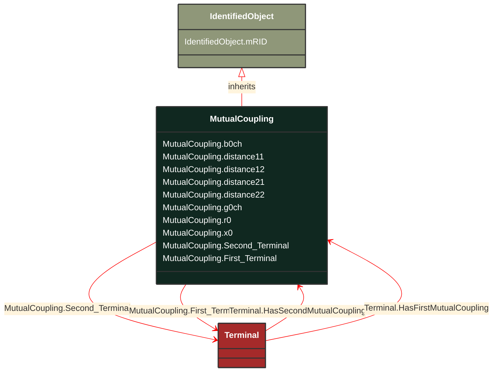

# MutualCoupling

_This class represents the zero sequence line mutual coupling._

**URI**: [cim:MutualCoupling](http://iec.ch/TC57/CIM100#MutualCoupling) 
**Type**: Class

## Inheritance
* [IdentifiedObject](/Models/Profiles/ShortCircuit/AbstractClasses/IdentifiedObject/)
    * **MutualCoupling**

## Attributes
| Name | URI | Cardinality and Range | Description | Inheritance |
| ---  | --- | --- | --- | --- |
| b0ch | [cim:MutualCoupling.b0ch](http://iec.ch/TC57/CIM100#MutualCoupling.b0ch) | No cardinality available Susceptance | Zero sequence mutual coupling shunt (charging) susceptance, uniformly distributed, of the entire line section. | direct |
| distance11 | [cim:MutualCoupling.distance11](http://iec.ch/TC57/CIM100#MutualCoupling.distance11) | No cardinality available Length | Distance to the start of the coupled region from the first line's terminal having sequence number equal to 1. | direct |
| distance12 | [cim:MutualCoupling.distance12](http://iec.ch/TC57/CIM100#MutualCoupling.distance12) | No cardinality available Length | Distance to the end of the coupled region from the first line's terminal with sequence number equal to 1. | direct |
| distance21 | [cim:MutualCoupling.distance21](http://iec.ch/TC57/CIM100#MutualCoupling.distance21) | No cardinality available Length | Distance to the start of coupled region from the second line's terminal with sequence number equal to 1. | direct |
| distance22 | [cim:MutualCoupling.distance22](http://iec.ch/TC57/CIM100#MutualCoupling.distance22) | No cardinality available Length | Distance to the end of coupled region from the second line's terminal with sequence number equal to 1. | direct |
| g0ch | [cim:MutualCoupling.g0ch](http://iec.ch/TC57/CIM100#MutualCoupling.g0ch) | No cardinality available Conductance | Zero sequence mutual coupling shunt (charging) conductance, uniformly distributed, of the entire line section. | direct |
| r0 | [cim:MutualCoupling.r0](http://iec.ch/TC57/CIM100#MutualCoupling.r0) | No cardinality available Resistance | Zero sequence branch-to-branch mutual impedance coupling, resistance. | direct |
| x0 | [cim:MutualCoupling.x0](http://iec.ch/TC57/CIM100#MutualCoupling.x0) | No cardinality available Reactance | Zero sequence branch-to-branch mutual impedance coupling, reactance. | direct |
| Second_Terminal | [cim:MutualCoupling.Second_Terminal](http://iec.ch/TC57/CIM100#MutualCoupling.Second_Terminal) | No cardinality available Terminal | The starting terminal for the calculation of distances along the second branch of the mutual coupling. | direct |
| First_Terminal | [cim:MutualCoupling.First_Terminal](http://iec.ch/TC57/CIM100#MutualCoupling.First_Terminal) | No cardinality available Terminal | The starting terminal for the calculation of distances along the first branch of the mutual coupling.  Normally MutualCoupling would only be used for terminals of AC line segments.  The first and second terminals of a mutual coupling should point to different AC line segments. | direct |
| mRID | [cim:IdentifiedObject.mRID](http://iec.ch/TC57/CIM100#IdentifiedObject.mRID) | No cardinality available string | Master resource identifier issued by a model authority. The mRID is unique within an exchange context. Global uniqueness is easily achieved by using a UUID, as specified in RFC 4122, for the mRID. The use of UUID is strongly recommended.
For CIMXML data files in RDF syntax conforming to IEC 61970-552, the mRID is mapped to rdf:ID or rdf:about attributes that identify CIM object elements. | IdentifiedObject |

### Schema Source
* from schema: [http://iec.ch/TC57/ns/CIM/ShortCircuit-EUPackage_ShortCircuitProfile](http://iec.ch/TC57/ns/CIM/ShortCircuit-EUPackage_ShortCircuitProfile)
