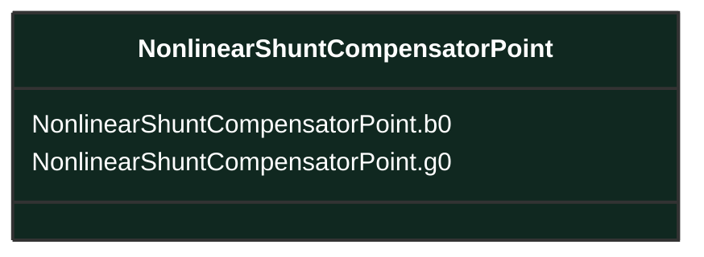

# NonlinearShuntCompensatorPoint

_A non linear shunt compensator bank or section admittance value. The number of NonlinearShuntCompenstorPoint instances associated with a NonlinearShuntCompensator shall be equal to ShuntCompensator.maximumSections. ShuntCompensator.sections shall only be set to one of the NonlinearShuntCompenstorPoint.sectionNumber. There is no interpolation between NonlinearShuntCompenstorPoint-s._

**URI**: [cim:NonlinearShuntCompensatorPoint](http://iec.ch/TC57/CIM100#NonlinearShuntCompensatorPoint) 
**Type**: Class

## Inheritance
* **NonlinearShuntCompensatorPoint**

## Attributes
| Name | URI | Cardinality and Range | Description | Inheritance |
| ---  | --- | --- | --- | --- |
| b0 | [cim:NonlinearShuntCompensatorPoint.b0](http://iec.ch/TC57/CIM100#NonlinearShuntCompensatorPoint.b0) | No cardinality available Susceptance | Zero sequence shunt (charging) susceptance per section. | direct |
| g0 | [cim:NonlinearShuntCompensatorPoint.g0](http://iec.ch/TC57/CIM100#NonlinearShuntCompensatorPoint.g0) | No cardinality available Conductance | Zero sequence shunt (charging) conductance per section. | direct |

### Schema Source
* from schema: [http://iec.ch/TC57/ns/CIM/ShortCircuit-EUPackage_ShortCircuitProfile](http://iec.ch/TC57/ns/CIM/ShortCircuit-EUPackage_ShortCircuitProfile)
