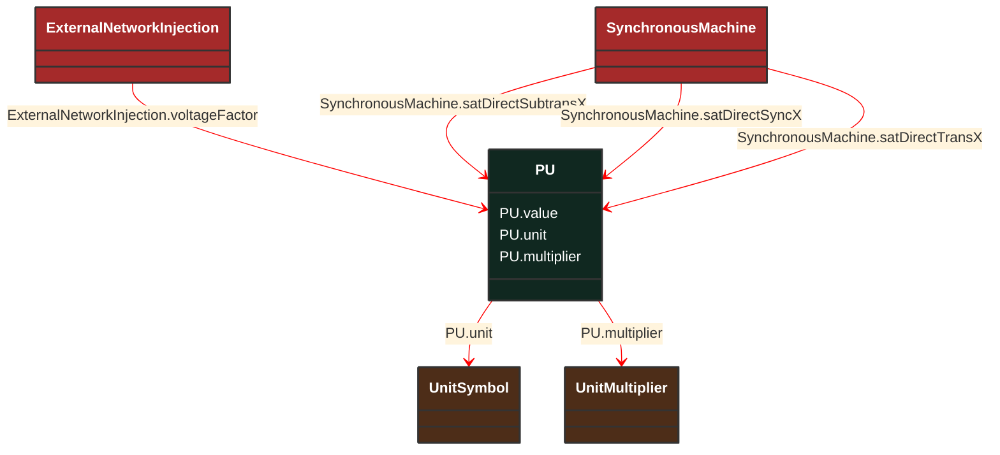

# PU

_Per Unit - a positive or negative value referred to a defined base. Values typically range from -10 to +10._

**URI**: [cim:PU](http://iec.ch/TC57/CIM100#PU) 
**Type**: Class

## Inheritance
* **PU**

## Attributes
| Name | URI | Cardinality and Range | Description | Inheritance |
| ---  | --- | --- | --- | --- |
| value | [cim:PU.value](http://iec.ch/TC57/CIM100#PU.value) | No cardinality available float | No description available | direct |
| unit | [cim:PU.unit](http://iec.ch/TC57/CIM100#PU.unit) | No cardinality available UnitSymbol | No description available | direct |
| multiplier | [cim:PU.multiplier](http://iec.ch/TC57/CIM100#PU.multiplier) | No cardinality available UnitMultiplier | No description available | direct |

### Schema Source
* from schema: [http://iec.ch/TC57/ns/CIM/ShortCircuit-EUPackage_ShortCircuitProfile](http://iec.ch/TC57/ns/CIM/ShortCircuit-EUPackage_ShortCircuitProfile)
