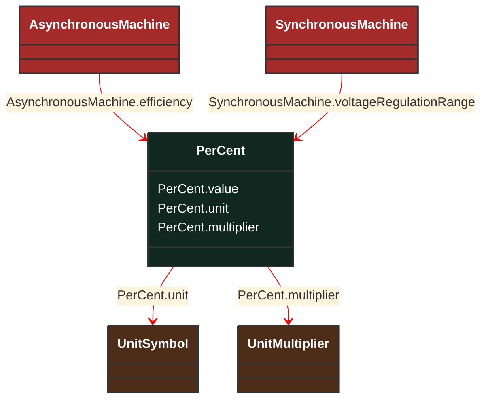

# PerCent

_Percentage on a defined base.   For example, specify as 100 to indicate at the defined base._

**URI**: [cim:PerCent](http://iec.ch/TC57/CIM100#PerCent) 
**Type**: Class

## Inheritance
* **PerCent**

## Attributes
| Name | URI | Cardinality and Range | Description | Inheritance |
| ---  | --- | --- | --- | --- |
| value | [cim:PerCent.value](http://iec.ch/TC57/CIM100#PerCent.value) | No cardinality available float | Normally 0 to 100 on a defined base. | direct |
| unit | [cim:PerCent.unit](http://iec.ch/TC57/CIM100#PerCent.unit) | No cardinality available UnitSymbol | No description available | direct |
| multiplier | [cim:PerCent.multiplier](http://iec.ch/TC57/CIM100#PerCent.multiplier) | No cardinality available UnitMultiplier | No description available | direct |

### Schema Source
* from schema: [http://iec.ch/TC57/ns/CIM/ShortCircuit-EUPackage_ShortCircuitProfile](http://iec.ch/TC57/ns/CIM/ShortCircuit-EUPackage_ShortCircuitProfile)
