# PetersenCoil

_A variable impedance device normally used to offset line charging during single line faults in an ungrounded section of network._

**URI**: [cim:PetersenCoil](http://iec.ch/TC57/CIM100#PetersenCoil) 
**Type**: Class

```mermaid
%%{init: {'theme':'base','themeVariables': {'lineColor': '#4169E1'}}}%%
classDiagram
    class PetersenCoil
    click PetersenCoil href "/Models/Profiles/ShortCircuit/ConcreteClasses/PetersenCoil/"
    style PetersenCoil fill:#163289,stroke:#1F2A37,stroke-width:2px,rx:10,ry:10,color:white
     
        EarthFaultCompensator <|-- PetersenCoil : inherits
            click EarthFaultCompensator href "/Models/Profiles/ShortCircuit/AbstractClasses/EarthFaultCompensator/"
            style EarthFaultCompensator fill:#4169E1,stroke:#1F2A37,stroke-width:2px,rx:10,ry:10,color:white
     
        ConductingEquipment <|-- EarthFaultCompensator : inherits
            click ConductingEquipment href "/Models/Profiles/ShortCircuit/AbstractClasses/ConductingEquipment/"
            style ConductingEquipment fill:#4169E1,stroke:#1F2A37,stroke-width:2px,rx:10,ry:10,color:white
     
        Equipment <|-- ConductingEquipment : inherits
            click Equipment href "/Models/Profiles/ShortCircuit/AbstractClasses/Equipment/"
            style Equipment fill:#4169E1,stroke:#1F2A37,stroke-width:2px,rx:10,ry:10,color:white
     
        PowerSystemResource <|-- Equipment : inherits
            click PowerSystemResource href "/Models/Profiles/ShortCircuit/AbstractClasses/PowerSystemResource/"
            style PowerSystemResource fill:#4169E1,stroke:#1F2A37,stroke-width:2px,rx:10,ry:10,color:white
     
        IdentifiedObject <|-- PowerSystemResource : inherits
            click IdentifiedObject href "/Models/Profiles/ShortCircuit/AbstractClasses/IdentifiedObject/"
            style IdentifiedObject fill:#4169E1,stroke:#1F2A37,stroke-width:2px,rx:10,ry:10,color:white


        PetersenCoil --> PetersenCoilModeKind : PetersenCoil.mode

        PetersenCoilModeKind
            click PetersenCoilModeKind href "/Models/Profiles/ShortCircuit/Enumerations/PetersenCoilModeKind/"
            style PetersenCoilModeKind fill:#5729FF,stroke:#1F2A37,stroke-width:2px,rx:10,ry:10,color:white

        PetersenCoil : PetersenCoil.mode
        PetersenCoil : PetersenCoil.nominalU
        PetersenCoil : PetersenCoil.offsetCurrent
        PetersenCoil : PetersenCoil.positionCurrent
        PetersenCoil : PetersenCoil.xGroundMax
        PetersenCoil : PetersenCoil.xGroundMin
        PetersenCoil : PetersenCoil.xGroundNominal
        EarthFaultCompensator : EarthFaultCompensator.r
        IdentifiedObject : IdentifiedObject.mRID
```

## Inheritance
* [IdentifiedObject](/Models/Profiles/ShortCircuit/AbstractClasses/IdentifiedObject/)
    * [PowerSystemResource](/Models/Profiles/ShortCircuit/AbstractClasses/PowerSystemResource/)
        * [Equipment](/Models/Profiles/ShortCircuit/AbstractClasses/Equipment/)
            * [ConductingEquipment](/Models/Profiles/ShortCircuit/AbstractClasses/ConductingEquipment/)
                * [EarthFaultCompensator](/Models/Profiles/ShortCircuit/AbstractClasses/EarthFaultCompensator/)
                    * **PetersenCoil**

## Attributes
| Name | URI | Cardinality and Range | Description | Inheritance |
| ---  | --- | --- | --- | --- |
| mode | [cim:PetersenCoil.mode](http://iec.ch/TC57/CIM100#PetersenCoil.mode) | No cardinality available PetersenCoilModeKind | The mode of operation of the Petersen coil. | direct |
| nominalU | [cim:PetersenCoil.nominalU](http://iec.ch/TC57/CIM100#PetersenCoil.nominalU) | No cardinality available Voltage | The nominal voltage for which the coil is designed. | direct |
| offsetCurrent | [cim:PetersenCoil.offsetCurrent](http://iec.ch/TC57/CIM100#PetersenCoil.offsetCurrent) | No cardinality available CurrentFlow | The offset current that the Petersen coil controller is operating from the resonant point.  This is normally a fixed amount for which the controller is configured and could be positive or negative.  Typically 0 to 60 A depending on voltage and resonance conditions. | direct |
| positionCurrent | [cim:PetersenCoil.positionCurrent](http://iec.ch/TC57/CIM100#PetersenCoil.positionCurrent) | No cardinality available CurrentFlow | The control current used to control the Petersen coil also known as the position current.  Typically in the range of 20 mA to 200 mA. | direct |
| xGroundMax | [cim:PetersenCoil.xGroundMax](http://iec.ch/TC57/CIM100#PetersenCoil.xGroundMax) | No cardinality available Reactance | The maximum reactance. | direct |
| xGroundMin | [cim:PetersenCoil.xGroundMin](http://iec.ch/TC57/CIM100#PetersenCoil.xGroundMin) | No cardinality available Reactance | The minimum reactance. | direct |
| xGroundNominal | [cim:PetersenCoil.xGroundNominal](http://iec.ch/TC57/CIM100#PetersenCoil.xGroundNominal) | No cardinality available Reactance | The nominal reactance.  This is the operating point (normally over compensation) that is defined based on the resonance point in the healthy network condition.  The impedance is calculated based on nominal voltage divided by position current. | direct |
| r | [cim:EarthFaultCompensator.r](http://iec.ch/TC57/CIM100#EarthFaultCompensator.r) | No cardinality available Resistance | Nominal resistance of device. | EarthFaultCompensator |
| mRID | [cim:IdentifiedObject.mRID](http://iec.ch/TC57/CIM100#IdentifiedObject.mRID) | No cardinality available string | Master resource identifier issued by a model authority. The mRID is unique within an exchange context. Global uniqueness is easily achieved by using a UUID, as specified in RFC 4122, for the mRID. The use of UUID is strongly recommended.
For CIMXML data files in RDF syntax conforming to IEC 61970-552, the mRID is mapped to rdf:ID or rdf:about attributes that identify CIM object elements. | IdentifiedObject |

### Schema Source
* from schema: [http://iec.ch/TC57/ns/CIM/ShortCircuit-EUPackage_ShortCircuitProfile](http://iec.ch/TC57/ns/CIM/ShortCircuit-EUPackage_ShortCircuitProfile)
