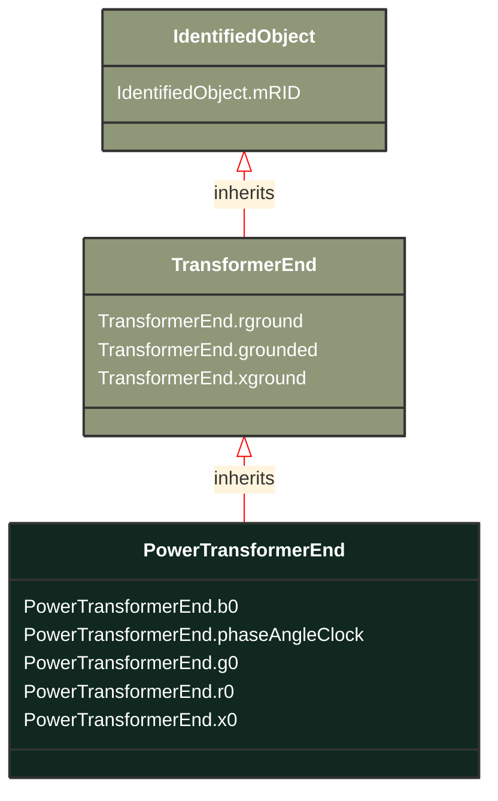

# PowerTransformerEnd

_A PowerTransformerEnd is associated with each Terminal of a PowerTransformer.
The impedance values r, r0, x, and x0 of a PowerTransformerEnd represents a star equivalent as follows.
1) for a two Terminal PowerTransformer the high voltage (TransformerEnd.endNumber=1) PowerTransformerEnd has non zero values on r, r0, x, and x0 while the low voltage (TransformerEnd.endNumber=2) PowerTransformerEnd has zero values for r, r0, x, and x0.  Parameters are always provided, even if the PowerTransformerEnds have the same rated voltage.  In this case, the parameters are provided at the PowerTransformerEnd which has TransformerEnd.endNumber equal to 1.
2) for a three Terminal PowerTransformer the three PowerTransformerEnds represent a star equivalent with each leg in the star represented by r, r0, x, and x0 values.
3) For a three Terminal transformer each PowerTransformerEnd shall have g, g0, b and b0 values corresponding to the no load losses distributed on the three PowerTransformerEnds. The total no load loss shunt impedances may also be placed at one of the PowerTransformerEnds, preferably the end numbered 1, having the shunt values on end 1.  This is the preferred way.
4) for a PowerTransformer with more than three Terminals the PowerTransformerEnd impedance values cannot be used. Instead use the TransformerMeshImpedance or split the transformer into multiple PowerTransformers.
Each PowerTransformerEnd must be contained by a PowerTransformer. Because a PowerTransformerEnd (or any other object) can not be contained by more than one parent, a PowerTransformerEnd can not have an association to an EquipmentContainer (Substation, VoltageLevel, etc)._

**URI**: [cim:PowerTransformerEnd](http://iec.ch/TC57/CIM100#PowerTransformerEnd) 
**Type**: Class

## Inheritance
* [IdentifiedObject](/Models/Profiles/ShortCircuit/AbstractClasses/IdentifiedObject/)
    * [TransformerEnd](/Models/Profiles/ShortCircuit/AbstractClasses/TransformerEnd/)
        * **PowerTransformerEnd**

## Attributes
| Name | URI | Cardinality and Range | Description | Inheritance |
| ---  | --- | --- | --- | --- |
| b0 | [cim:PowerTransformerEnd.b0](http://iec.ch/TC57/CIM100#PowerTransformerEnd.b0) | No cardinality available Susceptance | Zero sequence magnetizing branch susceptance. | direct |
| phaseAngleClock | [cim:PowerTransformerEnd.phaseAngleClock](http://iec.ch/TC57/CIM100#PowerTransformerEnd.phaseAngleClock) | No cardinality available integer | Terminal voltage phase angle displacement where 360 degrees are represented with clock hours. The valid values are 0 to 11. For example, for the secondary side end of a transformer with vector group code of 'Dyn11', specify the connection kind as wye with neutral and specify the phase angle of the clock as 11.  The clock value of the transformer end number specified as 1, is assumed to be zero.  Note the transformer end number is not assumed to be the same as the terminal sequence number. | direct |
| g0 | [cim:PowerTransformerEnd.g0](http://iec.ch/TC57/CIM100#PowerTransformerEnd.g0) | No cardinality available Conductance | Zero sequence magnetizing branch conductance (star-model). | direct |
| r0 | [cim:PowerTransformerEnd.r0](http://iec.ch/TC57/CIM100#PowerTransformerEnd.r0) | No cardinality available Resistance | Zero sequence series resistance (star-model) of the transformer end. | direct |
| x0 | [cim:PowerTransformerEnd.x0](http://iec.ch/TC57/CIM100#PowerTransformerEnd.x0) | No cardinality available Reactance | Zero sequence series reactance of the transformer end. | direct |
| rground | [cim:TransformerEnd.rground](http://iec.ch/TC57/CIM100#TransformerEnd.rground) | No cardinality available Resistance | (for Yn and Zn connections) Resistance part of neutral impedance where 'grounded' is true. | TransformerEnd |
| grounded | [cim:TransformerEnd.grounded](http://iec.ch/TC57/CIM100#TransformerEnd.grounded) | No cardinality available boolean | (for Yn and Zn connections) True if the neutral is solidly grounded. | TransformerEnd |
| xground | [cim:TransformerEnd.xground](http://iec.ch/TC57/CIM100#TransformerEnd.xground) | No cardinality available Reactance | (for Yn and Zn connections) Reactive part of neutral impedance where 'grounded' is true. | TransformerEnd |
| mRID | [cim:IdentifiedObject.mRID](http://iec.ch/TC57/CIM100#IdentifiedObject.mRID) | No cardinality available string | Master resource identifier issued by a model authority. The mRID is unique within an exchange context. Global uniqueness is easily achieved by using a UUID, as specified in RFC 4122, for the mRID. The use of UUID is strongly recommended.
For CIMXML data files in RDF syntax conforming to IEC 61970-552, the mRID is mapped to rdf:ID or rdf:about attributes that identify CIM object elements. | IdentifiedObject |

### Schema Source
* from schema: [http://iec.ch/TC57/ns/CIM/ShortCircuit-EUPackage_ShortCircuitProfile](http://iec.ch/TC57/ns/CIM/ShortCircuit-EUPackage_ShortCircuitProfile)
