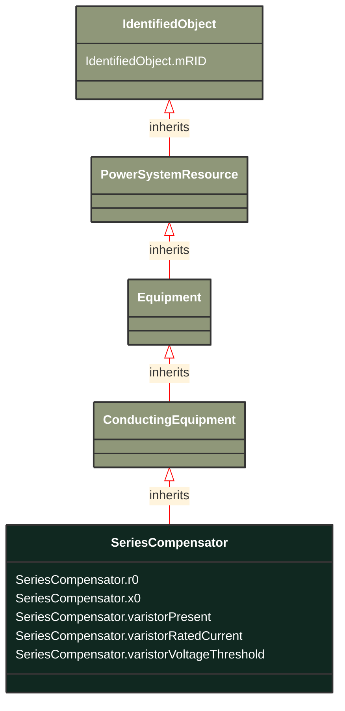

# SeriesCompensator

_A Series Compensator is a series capacitor or reactor or an AC transmission line without charging susceptance.  It is a two terminal device._

**URI**: [cim:SeriesCompensator](http://iec.ch/TC57/CIM100#SeriesCompensator) 
**Type**: Class

## Inheritance
* [IdentifiedObject](/Models/Profiles/ShortCircuit/AbstractClasses/IdentifiedObject/)
    * [PowerSystemResource](/Models/Profiles/ShortCircuit/AbstractClasses/PowerSystemResource/)
        * [Equipment](/Models/Profiles/ShortCircuit/AbstractClasses/Equipment/)
            * [ConductingEquipment](/Models/Profiles/ShortCircuit/AbstractClasses/ConductingEquipment/)
                * **SeriesCompensator**

## Attributes
| Name | URI | Cardinality and Range | Description | Inheritance |
| ---  | --- | --- | --- | --- |
| r0 | [cim:SeriesCompensator.r0](http://iec.ch/TC57/CIM100#SeriesCompensator.r0) | No cardinality available Resistance | Zero sequence resistance. | direct |
| x0 | [cim:SeriesCompensator.x0](http://iec.ch/TC57/CIM100#SeriesCompensator.x0) | No cardinality available Reactance | Zero sequence reactance. | direct |
| varistorPresent | [cim:SeriesCompensator.varistorPresent](http://iec.ch/TC57/CIM100#SeriesCompensator.varistorPresent) | No cardinality available boolean | Describe if a metal oxide varistor (mov) for over voltage protection is configured in parallel with the series compensator. It is used for short circuit calculations. | direct |
| varistorRatedCurrent | [cim:SeriesCompensator.varistorRatedCurrent](http://iec.ch/TC57/CIM100#SeriesCompensator.varistorRatedCurrent) | No cardinality available CurrentFlow | The maximum current the varistor is designed to handle at specified duration. It is used for short circuit calculations and exchanged only if SeriesCompensator.varistorPresent is true.
The attribute shall be a positive value. | direct |
| varistorVoltageThreshold | [cim:SeriesCompensator.varistorVoltageThreshold](http://iec.ch/TC57/CIM100#SeriesCompensator.varistorVoltageThreshold) | No cardinality available Voltage | The dc voltage at which the varistor starts conducting. It is used for short circuit calculations and exchanged only if SeriesCompensator.varistorPresent is true. | direct |
| mRID | [cim:IdentifiedObject.mRID](http://iec.ch/TC57/CIM100#IdentifiedObject.mRID) | No cardinality available string | Master resource identifier issued by a model authority. The mRID is unique within an exchange context. Global uniqueness is easily achieved by using a UUID, as specified in RFC 4122, for the mRID. The use of UUID is strongly recommended.
For CIMXML data files in RDF syntax conforming to IEC 61970-552, the mRID is mapped to rdf:ID or rdf:about attributes that identify CIM object elements. | IdentifiedObject |

### Schema Source
* from schema: [http://iec.ch/TC57/ns/CIM/ShortCircuit-EUPackage_ShortCircuitProfile](http://iec.ch/TC57/ns/CIM/ShortCircuit-EUPackage_ShortCircuitProfile)
