# SynchronousMachine

_An electromechanical device that operates with shaft rotating synchronously with the network. It is a single machine operating either as a generator or synchronous condenser or pump._

**URI**: [cim:SynchronousMachine](http://iec.ch/TC57/CIM100#SynchronousMachine) 
**Type**: Class

```mermaid
%%{init: {'theme':'base','themeVariables': {'lineColor': '#4169E1'}}}%%
classDiagram
    class SynchronousMachine
    click SynchronousMachine href "/Models/Profiles/ShortCircuit/ConcreteClasses/SynchronousMachine/"
    style SynchronousMachine fill:#163289,stroke:#1F2A37,stroke-width:2px,rx:10,ry:10,color:white
     
        RotatingMachine <|-- SynchronousMachine : inherits
            click RotatingMachine href "/Models/Profiles/ShortCircuit/AbstractClasses/RotatingMachine/"
            style RotatingMachine fill:#4169E1,stroke:#1F2A37,stroke-width:2px,rx:10,ry:10,color:white
     
        RegulatingCondEq <|-- RotatingMachine : inherits
            click RegulatingCondEq href "/Models/Profiles/ShortCircuit/AbstractClasses/RegulatingCondEq/"
            style RegulatingCondEq fill:#4169E1,stroke:#1F2A37,stroke-width:2px,rx:10,ry:10,color:white
     
        EnergyConnection <|-- RegulatingCondEq : inherits
            click EnergyConnection href "/Models/Profiles/ShortCircuit/AbstractClasses/EnergyConnection/"
            style EnergyConnection fill:#4169E1,stroke:#1F2A37,stroke-width:2px,rx:10,ry:10,color:white
     
        ConductingEquipment <|-- EnergyConnection : inherits
            click ConductingEquipment href "/Models/Profiles/ShortCircuit/AbstractClasses/ConductingEquipment/"
            style ConductingEquipment fill:#4169E1,stroke:#1F2A37,stroke-width:2px,rx:10,ry:10,color:white
     
        Equipment <|-- ConductingEquipment : inherits
            click Equipment href "/Models/Profiles/ShortCircuit/AbstractClasses/Equipment/"
            style Equipment fill:#4169E1,stroke:#1F2A37,stroke-width:2px,rx:10,ry:10,color:white
     
        PowerSystemResource <|-- Equipment : inherits
            click PowerSystemResource href "/Models/Profiles/ShortCircuit/AbstractClasses/PowerSystemResource/"
            style PowerSystemResource fill:#4169E1,stroke:#1F2A37,stroke-width:2px,rx:10,ry:10,color:white
     
        IdentifiedObject <|-- PowerSystemResource : inherits
            click IdentifiedObject href "/Models/Profiles/ShortCircuit/AbstractClasses/IdentifiedObject/"
            style IdentifiedObject fill:#4169E1,stroke:#1F2A37,stroke-width:2px,rx:10,ry:10,color:white


        SynchronousMachine --> ShortCircuitRotorKind : SynchronousMachine.shortCircuitRotorType

        ShortCircuitRotorKind
            click ShortCircuitRotorKind href "/Models/Profiles/ShortCircuit/Enumerations/ShortCircuitRotorKind/"
            style ShortCircuitRotorKind fill:#5729FF,stroke:#1F2A37,stroke-width:2px,rx:10,ry:10,color:white

        SynchronousMachine : SynchronousMachine.earthing
        SynchronousMachine : SynchronousMachine.earthingStarPointR
        SynchronousMachine : SynchronousMachine.earthingStarPointX
        SynchronousMachine : SynchronousMachine.ikk
        SynchronousMachine : SynchronousMachine.mu
        SynchronousMachine : SynchronousMachine.x0
        SynchronousMachine : SynchronousMachine.r0
        SynchronousMachine : SynchronousMachine.x2
        SynchronousMachine : SynchronousMachine.r2
        SynchronousMachine : SynchronousMachine.r
        SynchronousMachine : SynchronousMachine.satDirectSubtransX
        SynchronousMachine : SynchronousMachine.satDirectSyncX
        SynchronousMachine : SynchronousMachine.satDirectTransX
        SynchronousMachine : SynchronousMachine.shortCircuitRotorType
        SynchronousMachine : SynchronousMachine.voltageRegulationRange
        IdentifiedObject : IdentifiedObject.mRID
```

## Inheritance
* [IdentifiedObject](/Models/Profiles/ShortCircuit/AbstractClasses/IdentifiedObject/)
    * [PowerSystemResource](/Models/Profiles/ShortCircuit/AbstractClasses/PowerSystemResource/)
        * [Equipment](/Models/Profiles/ShortCircuit/AbstractClasses/Equipment/)
            * [ConductingEquipment](/Models/Profiles/ShortCircuit/AbstractClasses/ConductingEquipment/)
                * [EnergyConnection](/Models/Profiles/ShortCircuit/AbstractClasses/EnergyConnection/)
                    * [RegulatingCondEq](/Models/Profiles/ShortCircuit/AbstractClasses/RegulatingCondEq/)
                        * [RotatingMachine](/Models/Profiles/ShortCircuit/AbstractClasses/RotatingMachine/)
                            * **SynchronousMachine**

## Attributes
| Name | URI | Cardinality and Range | Description | Inheritance |
| ---  | --- | --- | --- | --- |
| earthing | [cim:SynchronousMachine.earthing](http://iec.ch/TC57/CIM100#SynchronousMachine.earthing) | No cardinality available boolean | Indicates whether or not the generator is earthed. Used for short circuit data exchange according to IEC 60909. | direct |
| earthingStarPointR | [cim:SynchronousMachine.earthingStarPointR](http://iec.ch/TC57/CIM100#SynchronousMachine.earthingStarPointR) | No cardinality available Resistance | Generator star point earthing resistance (Re). Used for short circuit data exchange according to IEC 60909. | direct |
| earthingStarPointX | [cim:SynchronousMachine.earthingStarPointX](http://iec.ch/TC57/CIM100#SynchronousMachine.earthingStarPointX) | No cardinality available Reactance | Generator star point earthing reactance (Xe). Used for short circuit data exchange according to IEC 60909. | direct |
| ikk | [cim:SynchronousMachine.ikk](http://iec.ch/TC57/CIM100#SynchronousMachine.ikk) | No cardinality available CurrentFlow | Steady-state short-circuit current (in A for the profile) of generator with compound excitation during 3-phase short circuit.
- Ikk=0: Generator with no compound excitation.
- Ikk&lt;&gt;0: Generator with compound excitation.
Ikk is used to calculate the minimum steady-state short-circuit current for generators with compound excitation.
(4.6.1.2 in IEC 60909-0:2001).
Used only for single fed short circuit on a generator. (4.3.4.2. in IEC 60909-0:2001). | direct |
| mu | [cim:SynchronousMachine.mu](http://iec.ch/TC57/CIM100#SynchronousMachine.mu) | No cardinality available float | Factor to calculate the breaking current (Section 4.5.2.1 in IEC 60909-0).
Used only for single fed short circuit on a generator (Section 4.3.4.2. in IEC 60909-0). | direct |
| x0 | [cim:SynchronousMachine.x0](http://iec.ch/TC57/CIM100#SynchronousMachine.x0) | No cardinality available Reactance | Zero sequence reactance of the synchronous machine. | direct |
| r0 | [cim:SynchronousMachine.r0](http://iec.ch/TC57/CIM100#SynchronousMachine.r0) | No cardinality available Resistance | Zero sequence resistance of the synchronous machine. | direct |
| x2 | [cim:SynchronousMachine.x2](http://iec.ch/TC57/CIM100#SynchronousMachine.x2) | No cardinality available Reactance | Negative sequence reactance. | direct |
| r2 | [cim:SynchronousMachine.r2](http://iec.ch/TC57/CIM100#SynchronousMachine.r2) | No cardinality available Resistance | Negative sequence resistance. | direct |
| r | [cim:SynchronousMachine.r](http://iec.ch/TC57/CIM100#SynchronousMachine.r) | No cardinality available Resistance | Equivalent resistance (RG) of generator. RG is considered for the calculation of all currents, except for the calculation of the peak current ip. Used for short circuit data exchange according to IEC 60909. | direct |
| satDirectSubtransX | [cim:SynchronousMachine.satDirectSubtransX](http://iec.ch/TC57/CIM100#SynchronousMachine.satDirectSubtransX) | No cardinality available PU | Direct-axis subtransient reactance saturated, also known as Xd"sat. | direct |
| satDirectSyncX | [cim:SynchronousMachine.satDirectSyncX](http://iec.ch/TC57/CIM100#SynchronousMachine.satDirectSyncX) | No cardinality available PU | Direct-axes saturated synchronous reactance (xdsat); reciprocal of short-circuit ration. Used for short circuit data exchange, only for single fed short circuit on a generator. (4.3.4.2. in IEC 60909-0:2001). | direct |
| satDirectTransX | [cim:SynchronousMachine.satDirectTransX](http://iec.ch/TC57/CIM100#SynchronousMachine.satDirectTransX) | No cardinality available PU | Saturated Direct-axis transient reactance. The attribute is primarily used for short circuit calculations according to ANSI. | direct |
| shortCircuitRotorType | [cim:SynchronousMachine.shortCircuitRotorType](http://iec.ch/TC57/CIM100#SynchronousMachine.shortCircuitRotorType) | No cardinality available ShortCircuitRotorKind | Type of rotor, used by short circuit applications, only for single fed short circuit according to IEC 60909. | direct |
| voltageRegulationRange | [cim:SynchronousMachine.voltageRegulationRange](http://iec.ch/TC57/CIM100#SynchronousMachine.voltageRegulationRange) | No cardinality available PerCent | Range of generator voltage regulation (PG in IEC 60909-0) used for calculation of the impedance correction factor KG defined in IEC 60909-0.
This attribute is used to describe the operating voltage of the generating unit. | direct |
| mRID | [cim:IdentifiedObject.mRID](http://iec.ch/TC57/CIM100#IdentifiedObject.mRID) | No cardinality available string | Master resource identifier issued by a model authority. The mRID is unique within an exchange context. Global uniqueness is easily achieved by using a UUID, as specified in RFC 4122, for the mRID. The use of UUID is strongly recommended.
For CIMXML data files in RDF syntax conforming to IEC 61970-552, the mRID is mapped to rdf:ID or rdf:about attributes that identify CIM object elements. | IdentifiedObject |

### Schema Source
* from schema: [http://iec.ch/TC57/ns/CIM/ShortCircuit-EUPackage_ShortCircuitProfile](http://iec.ch/TC57/ns/CIM/ShortCircuit-EUPackage_ShortCircuitProfile)
