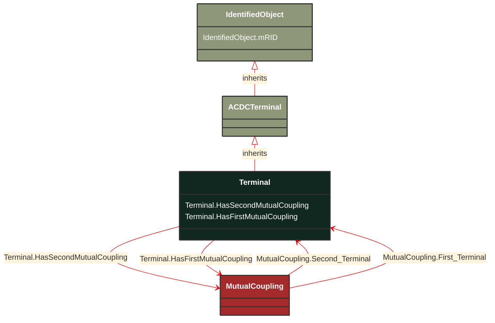

# Terminal

_An AC electrical connection point to a piece of conducting equipment. Terminals are connected at physical connection points called connectivity nodes._

**URI**: [cim:Terminal](http://iec.ch/TC57/CIM100#Terminal) 
**Type**: Class

## Inheritance
* [IdentifiedObject](/Models/Profiles/ShortCircuit/ConcreteClasses/IdentifiedObject/)
    * [ACDCTerminal](/Models/Profiles/ShortCircuit/ConcreteClasses/ACDCTerminal/)
        * **Terminal**

## Attributes
| Name | URI | Cardinality and Range | Description | Inheritance |
| ---  | --- | --- | --- | --- |
| HasSecondMutualCoupling | [cim:Terminal.HasSecondMutualCoupling](http://iec.ch/TC57/CIM100#Terminal.HasSecondMutualCoupling) | No cardinality available MutualCoupling | Mutual couplings with the branch associated as the first branch. | direct |
| HasFirstMutualCoupling | [cim:Terminal.HasFirstMutualCoupling](http://iec.ch/TC57/CIM100#Terminal.HasFirstMutualCoupling) | No cardinality available MutualCoupling | Mutual couplings associated with the branch as the first branch. | direct |
| mRID | [cim:IdentifiedObject.mRID](http://iec.ch/TC57/CIM100#IdentifiedObject.mRID) | No cardinality available string | Master resource identifier issued by a model authority. The mRID is unique within an exchange context. Global uniqueness is easily achieved by using a UUID, as specified in RFC 4122, for the mRID. The use of UUID is strongly recommended.
For CIMXML data files in RDF syntax conforming to IEC 61970-552, the mRID is mapped to rdf:ID or rdf:about attributes that identify CIM object elements. | IdentifiedObject |

### Schema Source
* from schema: [http://iec.ch/TC57/ns/CIM/ShortCircuit-EUPackage_ShortCircuitProfile](http://iec.ch/TC57/ns/CIM/ShortCircuit-EUPackage_ShortCircuitProfile)
